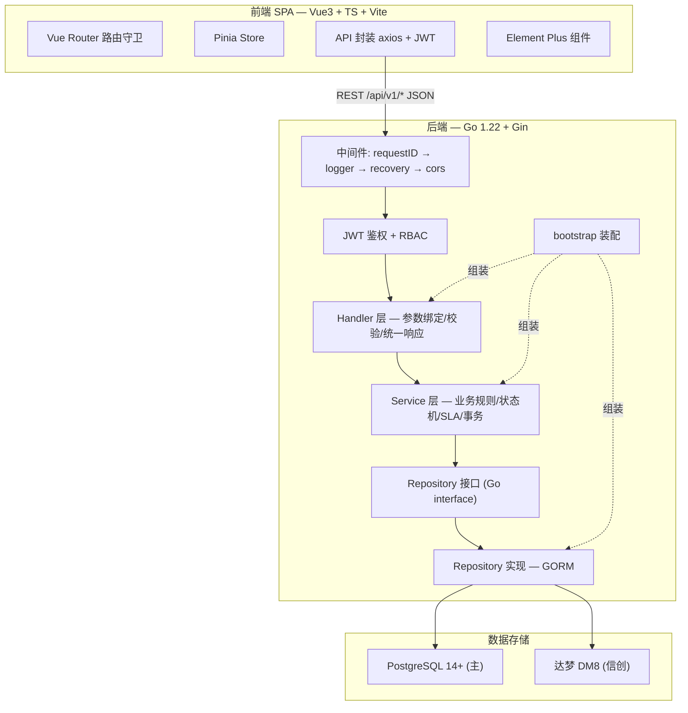

<div align="center">

# itsm-core

**轻量、可自托管、信创友好的 ITSM / ITIL 服务管理平台**

[](https://go.dev/)
[](./LICENSE)
[](https://vuejs.org/)
[](https://www.postgresql.org/)
[](https://www.dameng.com/)
[](https://gorm.io/)

一套覆盖 **工单 / 事件 / 问题 / 变更 / 服务目录 / 资产与配置（CMDB）** 六大 ITIL 核心流程的后端 + 前端一体化系统。
Go 后端零外部依赖可测、Vue 3 管理台开箱即用、PostgreSQL 与国产 **达梦 DM8** 双库一键切换。

</div>

---

## 目录

- [项目简介](#项目简介)
- [核心特性](#核心特性)
- [技术栈](#技术栈)
- [架构概览](#架构概览)
- [目录结构](#目录结构)
- [快速开始](#快速开始)
- [配置说明](#配置说明)
- [双数据库切换（PostgreSQL / 达梦 DM8）](#双数据库切换postgresql--达梦-dm8)
- [API 概览](#api-概览)
- [测试与覆盖率](#测试与覆盖率)
- [开发规范](#开发规范)
- [路线图（Roadmap）](#路线图roadmap)
- [贡献指南](#贡献指南)
- [许可证](#许可证)
- [致谢](#致谢)

---

## 项目简介

### ITSM / ITIL 是什么

**ITSM（IT Service Management，IT 服务管理）** 是企业 IT 团队提供日常 IT 服务所遵循的管理方法体系；**ITIL** 是其中应用最广泛的一套最佳实践框架。它把 IT 团队从一个"救火队"升级为"服务提供者"，用标准化流程管理"用户请求、故障、根因、变更、资产"等一切 IT 服务工作。

一个 ITIL 体系通常包含六大核心流程：

| 流程 | 解决什么问题 | 典型场景 |
| --- | --- | --- |
| **工单管理（Service Request）** | 用户请求的统一入口与流转 | "帮我开个 VPN 账号" |
| **事件管理（Incident）** | 快速恢复服务、降低业务中断 | "生产数据库宕机了，紧急处理" |
| **问题管理（Problem）** | 找到反复故障的根因、彻底消除 | "为什么数据库每月都宕一次？" |
| **变更管理（Change）** | 让任何改动都受控、可审批、可回滚 | "上线新版本，走 CAB 审批" |
| **服务目录（Service Catalog）** | 把 IT 服务产品化、可下单 | "申请一台开发服务器" |
| **资产与配置管理（CMDB）** | 摸清 IT 家底及其关系拓扑 | "这台服务器上跑了哪些系统？" |

### 本项目解决什么问题

- **商业 ITSM 昂贵且笨重**：ServiceNow、BMC 等面向大型企业，部署与授权成本高。itsm-core 提供可自托管、代码可读的轻量替代。
- **国产化 / 信创替代需求**：很多场景要求数据库自主可控。itsm-core 通过 `DB_DRIVER` 一键在 PostgreSQL 与 **达梦 DM8** 之间切换，无需改代码。
- **学习与二次开发成本高**：本项目采用清晰的分层架构（Handler → Service → Repository），`*gorm.DB` 严格收敛在 repository 层，业务逻辑纯 Go 可单测，适合作为团队内部平台底座或教学参考。

### 面向谁

- 需要**私有化部署** ITSM 的中小企业 IT 团队；
- 有**信创数据库（达梦 DM8）**落地要求的政企客户；
- 想学习 **Go + Vue 全栈 + DDD 分层 + 状态机**工程实践的开发者。

---

## 核心特性

### 工单管理（Ticket）

- 工单创建 / 编辑 / 软删除，支持标题、描述、多级分类、优先级（P1~P4）、请求人、来源（手动 / 服务目录下单）。
- **状态机驱动流转**：`new → assigned → in_progress → pending（挂起）→ resolved → closed`，另有 `draft → new`（提交）与 `cancelled` 分支；非法流转返回 `409`（`message` 内含 `非法流转 current=<from> -> target=<to>` 状态对）；支持 7 天内重开（`reopened`）。
- **SLA 计时**：按优先级匹配 SLA 策略，计算响应 / 解决截止时间，输出 `normal / warning / breached` 三档状态；挂起时暂停计时、恢复后回补。
- 公开评论 + 内部备注构成时间线；支持附件上传下载（单文件 ≤ 20MB，删除工单后附件不可下载）。
- 满意度评价（1~5 星，仅请求人且仅一次）。

### 事件管理（Incident）

- 故障上报：影响度 × 紧急度 → **9 宫格优先级矩阵**自动映射 P1~P4，支持人工覆盖并留痕（`priority_overridden`）。
- **一键转工单** / 关联已有工单，保留双向引用，重复转单返回 `409`。
- 事件升级：功能升级与层级升级，`escalation_level` 逐级递增并写入升级历史，越级被拒绝。
- 解决前强制填写解决方案（否则 `422`）；关联受影响 CI。

### 问题管理（Problem）

- 由 **≥1 个事件聚合**创建问题，或手动创建；同一事件不可重复挂载到多个未关闭问题。
- RCA 根因分析：结构化记录现象、分析过程、根本原因。
- **已知错误**标记需附带临时规避方案 `workaround`（否则 `422`）。
- 关联事件与变更；`resolved` 须关联至少一个已关闭变更或填写「无需变更原因」。

### 变更管理（Change）

- 变更申请（标准 / 普通 / 紧急）、风险评估、影响分析、实施计划与回滚方案。
- **CAB 审批流**：普通变更需 CAB 通过方可排期；驳回可修订重提；标准变更可预授权免审。
- **变更窗口**校验（结束 > 开始），窗口外实施可配置强制拒绝。
- 实施结果闭环：`implemented` / `rolled_back`，失败必须填写原因；实施后回顾。

### 服务目录（Service Catalog）

- 服务项定义：名称、描述、分类、SLA 策略、是否需审批、**动态表单字段定义（form_schema）**。
- 服务分类多级树，删除含子分类 / 服务项的分类被拒绝（`409`）。
- 服务项 `draft → pending_approval → published → offline → archived` 生命周期；终端用户接口仅返回 `published`。
- 用户侧按分类浏览下单，动态表单校验通过后**自动生成工单**并继承 SLA 策略。

### 资产与配置管理（CMDB + Asset）

- CI 建模：服务器 / 网络设备 / 数据库 / 应用 / 终端等类型 + 自定义属性（键值对，以 `TEXT` 存储）。
- CI 关系：`depends_on` / `contains` / `connects_to`，**禁止自环**（`400`），退役前须清理关系（`409`）。
- 拓扑展开：`GET /cis/:id/topology?depth=2&direction=both` 可视化上下游。
- 资产生命周期：`采购 → 入库 → 在用 → 维修 → 退役 → 报废`，每次流转写入历史；资产与 CI **1:1 绑定**。

### 平台与支撑能力

- **JWT 鉴权 + RBAC**：7 个内置角色、`perm.<domain>.<action>` 权限点矩阵，接口级鉴权 + service 层资源级鉴权。
- **审计日志**：所有写操作（含状态流转 / 删除 / 审批 / 升级）追加留痕，记录前后值、操作人、IP。
- **统一响应体**：`{code, message, data}`；统一错误码 ↔ HTTP 映射；列表统一分页结构。
- **软删除**：业务实体带 `deleted_at`，默认查询自动过滤，数据可追溯。
- **双数据库**：`DB_DRIVER=postgres|dameng` 运行时切换 Dialector，模型与查询不使用 PG 独有语法。
- **零外部依赖测试**：service 层依赖 repository 接口 + 内存 fake，`go test ./...` 无需 Docker / 数据库即可全绿。

---

## 技术栈

| 层 | 技术 | 版本 / 说明 |
| --- | --- | --- |
| 后端语言 | Go | `1.22`（`GOTOOLCHAIN=local`，锁定版本矩阵） |
| Web 框架 | Gin | `v1.10.0` |
| ORM | GORM | `v1.30.1`（≥1.30.1 满足达梦驱动要求） |
| 配置 | Viper | `v1.19.0`（环境变量 > 配置文件 > 默认值） |
| 日志 | zap | `v1.27.0` 结构化日志 |
| 鉴权 | golang-jwt/jwt v5 + bcrypt | `v5.2.1` / `golang.org/x/crypto v0.31.0` |
| 前端 | Vue 3 + TypeScript + Vite | `Vue 3.4` / `Vite 5` |
| 前端状态 | Pinia | `2.1` |
| 前端 UI | Element Plus | `2.7` |
| 前端路由 | Vue Router | `4.3` |
| 主数据库 | PostgreSQL | 14+（`postgres:16-alpine`） |
| 信创数据库 | 达梦 DM8 | `github.com/godoes/gorm-dameng v0.7.2`（**纯 Go，无 CGO**） |
| 部署 | Docker / docker compose | 多阶段构建，非 root 运行 |
| CI | GitHub Actions | Go 测试 + 前端构建 |

---

## 架构概览

采用 **分层架构 + 单域六件套**：每个业务域由 `model / dto / repository(接口) / repository_gorm(实现) / service / handler / routes` 组成，`bootstrap` 按依赖拓扑序装配。

请求链路：`HTTP → 中间件链(requestID/logger/recovery/CORS) → JWT/RBAC → Handler → Service → Repository 接口 → GORM 实现 → PostgreSQL / 达梦 DM8`。



> 完整分层职责、依赖方向（禁止循环依赖）、状态机与 SLA 计算方案见 [`docs/ARCHITECTURE.md`](./docs/ARCHITECTURE.md)。

**分层铁律**：

| 层 | 包路径 | 铁律 |
| --- | --- | --- |
| Cmd | `cmd/server` | 只做装配调用，无业务逻辑 |
| Bootstrap | `internal/bootstrap` | 唯一允许 import 全部业务域的地方 |
| Handler | `internal/domain/*/handler.go` | **禁止**出现 `*gorm.DB`；禁止业务判断 |
| Service | `internal/domain/*/service.go` | **只依赖 repository 接口**，禁止 import `gorm.io/gorm` |
| Repository 实现 | `internal/domain/*/repository_gorm.go` | **`*gorm.DB` 只允许出现在此文件**（及 `pkg/database`） |
| Kernel | `internal/pkg/*` | 无业务域依赖，可独立单测 |

---

## 目录结构

```
itsm-core/
├── cmd/
│   └── server/
│       └── main.go                    # 进程入口：配置→日志→连库→迁移→种子→Gin→优雅退出
├── configs/
│   └── config.yaml                    # 应用配置（环境变量可覆盖）
├── internal/
│   ├── bootstrap/
│   │   ├── bootstrap.go               # 装配：repository→service→handler→注册路由（拓扑序）
│   │   └── seed.go                    # 幂等种子数据（admin 账号 / SLA / 示例数据）
│   ├── config/
│   │   └── config.go                  # Viper 配置加载、默认值、校验
│   ├── domain/                        # 业务域（单域六件套）
│   │   ├── platform/                  # 共享内核：用户/角色/SLA策略/审计/评论/附件
│   │   ├── auth/                      # 登录鉴权（JWT 签发与校验）
│   │   ├── ticket/                    # 工单
│   │   ├── incident/                  # 事件
│   │   ├── problem/                   # 问题
│   │   ├── change/                    # 变更
│   │   ├── catalog/                   # 服务目录
│   │   ├── cmdb/                      # 配置管理（CI 与关系）
│   │   └── asset/                     # 资产（生命周期）
│   └── pkg/                           # 共享内核库（无业务域依赖）
│       ├── database/                  # Dialector 工厂、连接池、通用迁移、GORM 日志适配
│       ├── httpx/                     # 统一响应体、错误码、分页、参数绑定
│       ├── idgen/                     # 业务编号生成（TKT-YYYYMMDD-0001）
│       ├── logger/                    # zap 初始化
│       ├── middleware/                # requestID/logger/recovery/cors/jwt/rbac
│       ├── role/                      # 角色与权限点矩阵
│       ├── security/                  # bcrypt 密码 + JWT
│       ├── sla/                       # SLA 计算纯函数
│       └── statemachine/              # 通用状态机引擎
├── frontend/                          # Vue 3 管理台（SPA）
│   ├── src/
│   │   ├── api/                        # axios 封装层（按模块拆分）
│   │   ├── stores/                     # Pinia 状态（按模块拆分）
│   │   ├── router/                     # 路由表 + 角色守卫
│   │   ├── components/                 # 通用组件（StatusTag/SlaCountdown/Timeline…）
│   │   ├── types/                      # 与后端常量对齐的 TS 类型
│   │   ├── layouts/                    # 三区布局
│   │   └── views/                      # 各模块 List/Detail/Form 页面
│   ├── nginx.conf                     # 容器内 nginx：SPA 回落 + /api 反代到 app:8080
│   ├── Dockerfile                     # 前端镜像（Node 构建 → nginx 托管）
│   ├── package.json
│   └── vite.config.ts                 # 开发代理 /api → http://localhost:8080
├── scripts/                           # 运维脚本
│   ├── start.sh                       # 一键构建并启动（前后端 + 数据库）
│   ├── stop.sh                        # 停止（--purge 清数据卷，--vm 关 colima）
│   ├── status.sh                      # 状态、健康检查与接口探测
│   └── logs.sh                        # 日志查看
├── docs/
│   ├── PRD.md                         # 产品需求文档
│   ├── ARCHITECTURE.md                # 系统架构设计（施工图）
│   ├── TASKS.md                       # 任务分解
│   └── API.md                         # REST API 参考
├── docker-compose.yml                 # PostgreSQL + 后端 + 前端 编排
├── Dockerfile                         # 后端多阶段构建
├── .dockerignore                      # 后端构建上下文忽略（排除 node_modules 等）
├── Makefile                           # 常用开发命令
├── .github/workflows/ci.yml           # CI（后端测试 + 前端构建）
├── .env.example                       # 环境变量样例
├── .golangci.yml                      # 静态检查配置
├── .editorconfig                      # 编辑器约定
├── CHANGELOG.md
├── CONTRIBUTING.md
├── LICENSE
└── README.md
```

---

## 快速开始

> 目标：让一个从没接触过本项目的同学，在 **30 分钟内**跑通后端 API 与前端管理台。
>
> 提供两种方式，按需选择：
> **方式 A（推荐）** —— Docker Compose 一键起齐 PostgreSQL + 后端 + 前端，零本地依赖；
> **方式 B** —— 本地开发，前后端热重载，适合改代码。

### 前置要求

| 依赖 | 版本 | 方式 A | 方式 B |
| --- | --- | --- | --- |
| Docker + docker compose | 任意较新版本 | **必须** | 可选（仅用于起 PostgreSQL） |
| Go | 1.22+（实测 1.22.5） | 不需要 | **必须** |
| Node.js | 18+（推荐 22） | 不需要 | 必须 |
| PostgreSQL | 14+ | 容器内自动提供 | 可选（也可用 Docker） |
| 达梦 DM8 | DM8 | 可选（信创场景） | 可选（信创场景） |

> **没有数据库也能启动**：后端在连不上数据库时会以**降级模式**启动并打印 `WARN`（设计行为，不是故障）。此时 `/healthz` 与静态资源可用，业务接口因无 repo 而不可用。想要完整体验请先起一个 PostgreSQL。

---

### 方式 A：Docker Compose 一键启动（推荐）

只需三步。全部依赖封装在容器内，**宿主机无需安装 Go / Node / PostgreSQL**。

#### 第 1 步：获取代码

```bash
git clone https://github.com/chixiaowen/itsm-core.git
cd itsm-core
```

#### 第 2 步：一键启动

```bash
./scripts/start.sh
```

脚本会按顺序完成：检查 Docker（若装了 colima 且未运行会自动拉起）→ 构建前后端镜像 → 按 `healthcheck` 逐级启动 PostgreSQL → 后端 → 前端，并等待三者全部健康后打印访问地址。

可用参数：

| 命令 | 说明 |
| --- | --- |
| `./scripts/start.sh` | 构建并启动全部（默认） |
| `./scripts/start.sh --no-build` | 跳过构建，直接启动已有镜像 |
| `./scripts/start.sh --rebuild` | 忽略缓存强制重建镜像 |
| `./scripts/start.sh --api-only` | 只启动 PostgreSQL + 后端 |
| `./scripts/start.sh --db-only` | 只启动 PostgreSQL（配合方式 B 开发） |

#### 第 3 步：访问

| 入口 | 地址 |
| --- | --- |
| **前端管理台** | http://localhost:8081 |
| 后端 API | http://localhost:8080/api/v1 |
| 后端健康检查 | http://localhost:8080/healthz |
| PostgreSQL | `localhost:5432`（用户 `itsm` / 密码 `itsm` / 库 `itsm_core`） |

登录用下方「演示账号」中的任意一个（密码统一 `admin123`）。

#### 配套脚本

| 脚本 | 用途 |
| --- | --- |
| `./scripts/start.sh` | 构建并启动全部服务，等待健康后输出访问信息 |
| `./scripts/stop.sh` | 停止并移除容器（保留数据卷）；`--purge` 连数据卷一起删；`--vm` 顺带关掉 colima |
| `./scripts/status.sh` | 查看容器状态、健康检查、端口映射与接口连通性探测 |
| `./scripts/logs.sh [服务] [行数]` | 查看日志，如 `./scripts/logs.sh app 200` |

**端口冲突**：默认 `8081`（前端）/ `8080`（后端）/ `5432`（数据库）。如需修改，在项目根目录建 `.env` 并设置 `FRONTEND_PORT` / `API_PORT` / `POSTGRES_PORT`，或在命令前导出该变量。

**生产环境务必替换 `JWT_SECRET`**（默认值为占位符）：

```bash
JWT_SECRET="$(openssl rand -hex 32)" ./scripts/start.sh
```

---

### 方式 B：本地开发（前后端热重载）

适合需要改代码、看热更新的场景。

#### 第 1 步：获取代码

```bash
git clone https://github.com/chixiaowen/itsm-core.git
cd itsm-core
```

#### 第 2 步：启动 PostgreSQL

```bash
docker compose up -d postgres
```

> 若本机没有 Docker，可自行准备一个 PostgreSQL 14+ 实例，然后按下方「配置说明」调整连接参数或设置 `DB_DSN` 环境变量。

#### 第 3 步：启动后端

```bash
# 环境硬约束（重要）：默认 GOPROXY 不可达，必须使用中国镜像 + 锁定本地工具链
export GOTOOLCHAIN=local
export GOPROXY=https://goproxy.cn,direct

go mod download
go run ./cmd/server
```

首次启动会自动执行 **AutoMigrate 建表** 与 **幂等种子数据写入**，并打印：

```
数据库连接成功
platform 表迁移完成
已创建默认 admin 账号（请首次登录后修改密码）
默认 SLA 策略已就绪
种子数据初始化完成
HTTP 服务启动  addr=:8080
```

#### 第 4 步：启动前端

```bash
cd frontend
npm install
npm run dev
```

前端开发服务器默认运行在 `http://127.0.0.1:5173`，并将 `/api` 代理到后端 `http://localhost:8080`。

#### 第 5 步：访问并使用

- 浏览器打开 **http://127.0.0.1:5173**
- **演示账号**（开发默认值，密码统一 `admin123`，种子逻辑见 `internal/bootstrap/seed.go`）：

  | 用户名 | 密码 | 角色 | 用途 |
  | --- | --- | --- | --- |
  | `admin` | `admin123` | 系统管理员（admin） | 全部权限 |
  | `requestor01` | `admin123` | 终端用户（requestor） | 提单 / 评价 / 重开 |
  | `agent01` | `admin123` | 服务台坐席（agent） | 受理 / 指派 |
  | `resolver01` | `admin123` | 二线工程师（resolver） | 处理 / 解决 |
  | `pm01` | `admin123` | 问题经理（problem_manager） | 问题 / RCA |
  | `cm01` | `admin123` | 变更经理（change_manager） | CAB 审批（会签人 1） |
  | `cm02` | `admin123` | 变更经理（change_manager） | CAB 审批（会签人 2） |
  | `cmdb01` | `admin123` | 配置管理员（cmdb_manager） | CI / 资产 |

  > ⚠️ **以上账号仅用于本地开发 / 演示，生产环境务必删除或立即修改密码。**
  >
  > 种子数据在**首次启动时自动写入**（`FirstOrCreate` 幂等，重复启动不会重复创建）。其中 `admin` 账号 `Role=admin`、`Status=active`、邮箱 `admin@example.com`。
  >
  > **CAB 会签演示**：用 `cm01` 与 `cm02` **分别**审批同一张普通变更单（`POST /api/v1/changes/:id/approvals`），即可观察 CAB **会签（多审批人）**生效。
- 后端健康检查：`curl http://localhost:8080/healthz`
- 登录接口示例：

  ```bash
  curl -X POST http://localhost:8080/api/v1/auth/login \
    -H 'Content-Type: application/json' \
    -d '{"username":"admin","password":"admin123"}'
  ```

---

## 配置说明

配置优先级：**环境变量 > `configs/config.yaml` > 内置默认值**。
环境变量支持两种命名：`ITSM_` 前缀（`.` → `_`，如 `ITSM_DATABASE_DRIVER`）与直读常用变量（`DB_DRIVER` / `DB_DSN` / `JWT_SECRET` / `LOG_LEVEL`）。样例见 [`.env.example`](./.env.example)。

| 配置项 | 环境变量覆盖 | 默认值 | 说明 |
| --- | --- | --- | --- |
| `app.name` | `ITSM_APP_NAME` | `itsm-core` | 应用名 |
| `app.env` | `ITSM_APP_ENV` | `development` | `development` / `production`（production 时 Gin 进入 ReleaseMode） |
| `app.http_addr` | `ITSM_APP_HTTP_ADDR` | `:8080` | HTTP 监听地址 |
| `app.request_timeout_seconds` | `ITSM_APP_REQUEST_TIMEOUT_SECONDS` | `30` | 请求超时 |
| `app.max_upload_mb` | `ITSM_APP_MAX_UPLOAD_MB` | `20` | 附件上传上限（MB） |
| `app.upload_dir` | `ITSM_APP_UPLOAD_DIR` | `./data/uploads` | 上传目录 |
| `log.level` | `LOG_LEVEL` / `ITSM_LOG_LEVEL` | `info` | `debug` / `info` / `warn` / `error` |
| `log.format` | `ITSM_LOG_FORMAT` | `console` | `console` / `json` |
| `log.output` | `ITSM_LOG_OUTPUT` | `stdout` | `stdout` / `stderr` / 文件路径 |
| `database.driver` | `DB_DRIVER` / `ITSM_DATABASE_DRIVER` | `postgres` | `postgres` / `dameng` |
| `database.dsn` | `DB_DSN` / `ITSM_DATABASE_DSN` | `""` | 非空时直接使用，覆盖下方分库拼接 |
| `database.postgres.host` | `ITSM_DATABASE_POSTGRES_HOST` | `127.0.0.1` | PG 主机 |
| `database.postgres.port` | `ITSM_DATABASE_POSTGRES_PORT` | `5432` | PG 端口 |
| `database.postgres.user` | `ITSM_DATABASE_POSTGRES_USER` | `itsm` | PG 用户 |
| `database.postgres.password` | `ITSM_DATABASE_POSTGRES_PASSWORD` | `itsm` | PG 密码 |
| `database.postgres.dbname` | `ITSM_DATABASE_POSTGRES_DBNAME` | `itsm_core` | PG 库名 |
| `database.postgres.sslmode` | `ITSM_DATABASE_POSTGRES_SSLMODE` | `disable` | PG sslmode |
| `database.postgres.timezone` | `ITSM_DATABASE_POSTGRES_TIMEZONE` | `UTC` | PG 时区 |
| `database.postgres.max_open_conns` | `ITSM_DATABASE_POSTGRES_MAX_OPEN_CONNS` | `50` | 最大连接数（两库通用） |
| `database.postgres.max_idle_conns` | `ITSM_DATABASE_POSTGRES_MAX_IDLE_CONNS` | `10` | 空闲连接数 |
| `database.postgres.conn_max_lifetime_minutes` | `ITSM_DATABASE_POSTGRES_CONN_MAX_LIFETIME_MINUTES` | `60` | 连接最长存活（分钟） |
| `database.dameng.host` | `ITSM_DATABASE_DAMENG_HOST` | `127.0.0.1` | DM8 主机 |
| `database.dameng.port` | `ITSM_DATABASE_DAMENG_PORT` | `5236` | DM8 端口 |
| `database.dameng.user` | `ITSM_DATABASE_DAMENG_USER` | `SYSDBA` | DM8 用户 |
| `database.dameng.password` | `ITSM_DATABASE_DAMENG_PASSWORD` | `SYSDBA` | DM8 密码 |
| `database.dameng.schema` | `ITSM_DATABASE_DAMENG_SCHEMA` | `SYSDBA` | DM8 Schema |
| `database.dameng.varchar_size_is_char` | `ITSM_DATABASE_DAMENG_VARCHAR_SIZE_IS_CHAR` | `true` | VARCHAR 按字符长度 |
| `database.auto_migrate` | `ITSM_DATABASE_AUTO_MIGRATE` | `true` | 启动自动建表 |
| `database.seed` | `ITSM_DATABASE_SEED` | `true` | 启动幂等写种子数据 |
| `database.disable_ping` | `ITSM_DATABASE_DISABLE_PING` | `false` | 关闭启动探活（受限网络/启动即降级） |
| `auth.jwt_secret` | `JWT_SECRET` / `ITSM_AUTH_JWT_SECRET` | `change-me-in-production` | JWT 签名密钥（**生产必改**，为空则启动失败） |
| `auth.jwt_ttl_hours` | `ITSM_AUTH_JWT_TTL_HOURS` | `24` | Token 有效期（小时） |
| `auth.login_max_attempts` | `ITSM_AUTH_LOGIN_MAX_ATTEMPTS` | `5` | 登录失败上限 |
| `auth.login_lock_minutes` | `ITSM_AUTH_LOGIN_LOCK_MINUTES` | `10` | 锁定分钟数 |
| `change.enforce_window` | `ITSM_CHANGE_ENFORCE_WINDOW` | `false` | 窗口外实施是否强制拒绝 |
| `change.emergency_needs_confirm` | `ITSM_CHANGE_EMERGENCY_NEEDS_CONFIRM` | `true` | 紧急变更是否需二次确认 |
| `cors.allowed_origins` | — | `["http://localhost:5173"]` | 跨域白名单 |

---

## 双数据库切换（PostgreSQL / 达梦 DM8）

系统通过 `DB_DRIVER` 在运行时切换 GORM Dialector，业务代码零改动。

### PostgreSQL（默认，主库）

```bash
export DB_DRIVER=postgres
# 方式一：走分库拼接（推荐，字段见上表）
export ITSM_DATABASE_POSTGRES_HOST=127.0.0.1
export ITSM_DATABASE_POSTGRES_PORT=5432
# 方式二：直接给 DSN（优先级最高，非空即用）
export DB_DSN="host=127.0.0.1 port=5432 user=itsm password=itsm dbname=itsm_core sslmode=disable TimeZone=UTC"
```

### 达梦 DM8（信创）

```bash
export DB_DRIVER=dameng
export ITSM_DATABASE_DAMENG_HOST=127.0.0.1
export ITSM_DATABASE_DAMENG_PORT=5236
export ITSM_DATABASE_DAMENG_USER=SYSDBA
export ITSM_DATABASE_DAMENG_PASSWORD=SYSDBA
export ITSM_DATABASE_DAMENG_SCHEMA=SYSDBA
export ITSM_DATABASE_DAMENG_VARCHAR_SIZE_IS_CHAR=true
```

达梦连接串同样由 `internal/pkg/database/database.go` 通过
`dameng.BuildUrl(user, password, host, port, map[string]string{"schema": schema})` 构造；
若显式提供 `DB_DSN`，则直接使用（可覆盖为达梦原生连接串）。

**达梦驱动说明**：使用 [`github.com/godoes/gorm-dameng`](https://github.com/godoes/gorm-dameng) `v0.7.2`，
内部含**纯 Go** 的 `dm8` SQL 驱动（`DriverName = "dm"`），**无 CGO**，可在任意平台编译与测试。
其 `go.mod` 要求 `gorm.io/gorm ≥ v1.30.1`，故全工程 GORM 锁定 `v1.30.1`。

### 达梦需人工验证的清单

由于本机无达梦实例，以下项需在真实 DM8 环境下人工验证：

1. 准备 DM8 实例（Docker 镜像或信创环境），建库建用户 `SYSDBA`。
2. 设置上述 `DB_DRIVER=dameng` 及 DM8 连接参数。
3. `go run ./cmd/server`：确认 **AutoMigrate 建表成功**、**种子数据初始化成功**。
4. 手工走通：登录 → 建工单 → 指派 → 解决 → 关闭（含 SLA 展示）；建 CI → 建关系 → 拓扑；资产生命周期流转。
5. 校验无 `SERIAL / jsonb / ILIKE / ON CONFLICT / now()` 报错；**所有索引名 ≤ 30 字符**；`form_schema / attrs` 以 `TEXT` 正常存取。
6. 归档日志与截图到 `docs/`。

---

## API 概览

- **前缀**：`/api/v1`（`/healthz` 除外）。
- **鉴权**：除 `POST /api/v1/auth/login` 与 `GET /healthz` 外，全部需要 `Authorization: Bearer <jwt>`。
- **统一响应体**：`{ "code": 0, "message": "ok", "data": {...} }`。
- **列表响应**：`data` 固定为 `{ total, page, page_size, items }`；`page` 默认 1，`page_size` 默认 20、上限 100。

| 模块 | 主要端点（概览） | 参考 |
| --- | --- | --- |
| 认证 / 平台（SYS） | `POST /auth/login`、`GET /auth/me`、`/users`、`/roles`、`/sla-policies`、`/audit-logs`、`/comments`、`/attachments` | [docs/API.md §1](./docs/API.md) |
| 工单（TKT） | `/tickets`、`/tickets/:id/transition`、`/tickets/:id/assign`、`/tickets/:id/rating`、`/ticket-categories` | [docs/API.md §2](./docs/API.md) |
| 事件（INC） | `/incidents`、`/incidents/:id/transition`、`/incidents/:id/escalate`、`/incidents/:id/convert-to-ticket`、`/incidents/priority-matrix` | [docs/API.md §3](./docs/API.md) |
| 问题（PRB） | `/problems`、`/problems/:id/transition`、`/problems/:id/known-error`、`/problems/:id/changes` | [docs/API.md §4](./docs/API.md) |
| 变更（CHG） | `/changes`、`/changes/:id/transition`、`/changes/:id/approvals` | [docs/API.md §5](./docs/API.md) |
| 服务目录（CAT） | `/service-categories`、`/service-items`、`/catalog/categories`、`/catalog/items/:id/order` | [docs/API.md §6](./docs/API.md) |
| CMDB / 资产 | `/cis`、`/cis/:id/topology`、`/ci-types`、`/assets`、`/assets/:id/transition`、`/assets/:id/bind-ci` | [docs/API.md §7](./docs/API.md) |

> **完整端点清单、请求体、响应体、权限与错误码映射见 [`docs/API.md`](./docs/API.md)。**

---

## 测试与覆盖率

测试分两层，**均无需 Docker / 外部数据库**：

- **单元测试（内存 fake）**：service 层构造函数接收 **repository 接口**，单测在 `*_test.go` 内注入手写**内存 fake**，**绝不**触碰 GORM / 真实数据库；覆盖各模块业务规则、状态机与 SLA 计算。
- **端到端测试（嵌入式 SQLite）**：跨模块闭环（HTTP 路由 → 中间件 → service → repository）基于 `github.com/glebarez/sqlite`（纯 Go，**仅测试依赖**，不进入服务端二进制）运行，覆盖真实的 GORM 模型、自动迁移与查询编排。

> ⚠️ **覆盖边界（重要）**：上述测试**不覆盖达梦 DM8 与 PostgreSQL 的方言级行为**。
> 嵌入式 SQLite 只是 GORM 行为的**代理**，用于验证模型 / 迁移 / 查询 / 编排的正确性，
> **不能替代**两种生产数据库的方言验证（详见「[已知限制](#已知限制--known-limitations)」）。

```bash
# 全部测试
make test          # 等价：GOTOOLCHAIN=local GOPROXY=... go test ./... -count=1

# 覆盖率报告（写入 coverage.out 并打印函数级覆盖）
make test-cover

# 竞态检测（重点覆盖 idgen 并发编号）
make test-race

# 静态检查
make vet
```

测试矩阵（各包覆盖目标）见 [`docs/ARCHITECTURE.md` §12](./docs/ARCHITECTURE.md)。

---

## 开发规范

### 提交规范（Conventional Commits）

```
<type>(<scope>): <subject>
```

常用类型：`feat` / `fix` / `docs` / `test` / `refactor` / `chore` / `perf` / `style`。
示例：`feat(ticket): 支持工单 7 天内重开`。详见 [`CONTRIBUTING.md`](./CONTRIBUTING.md)。

### 目录分层约定

- 业务域代码一律放 `internal/domain/<domain>/`，遵循「单域六件套」（model / dto / repository / repository_gorm / service / handler + routes）。
- 共享内核放 `internal/pkg/`，**不得依赖任何业务域**。
- `bootstrap` 是唯一允许 import 全部业务域的包。

### `*gorm.DB` 使用铁律

> **`*gorm.DB` 只允许出现在 repository 层**（`internal/domain/*/repository_gorm.go` 与 `internal/pkg/database`）。
> Handler 层禁止 import GORM；Service 层只依赖 repository 接口，禁止 import `gorm.io/gorm`。

### 环境约定（重要）

- 必须 `GOTOOLCHAIN=local`；`go.mod` 声明 `go 1.22`。
- 默认 `proxy.golang.org` 不可达，必须使用 `GOPROXY=https://goproxy.cn,direct`。
- **严禁 `go get -u`**：不得升级 `golang.org/x/crypto ≥ v0.32` 或 `gin ≥ v1.11`（会破坏工具链约束）。

---

## 路线图（Roadmap）

以下为 PRD §4 需求池中标记为 **P1 / P2** 的能力，**计划中**（当前版本聚焦 P0 核心闭环）：

**P1（应该有）**

- 工单：关闭后 7 天内重开（`reopened`）。
- 事件：P1/P2 事件复盘（Post-Incident Review）闭环。
- 问题：手动创建问题；`resolved` 须关联已关闭变更或填写免变更原因。
- 变更：实施后回顾；标准变更预授权免 CAB。
- 服务目录：需审批服务项的审批流。
- CMDB：关系拓扑可视化增强。
- 平台：`/healthz` 健康检查（已实现）、登录失败锁定。

**P2（可以有）**

- 工单：模板预置、批量指派 / 批量关闭。
- 事件：事件看板统计。
- CMDB：资产批量导入（CSV）。
- 服务目录：服务项草稿与审核工作流。
- 平台：审计日志导出（CSV）。

---

## 已知限制 / Known Limitations

以下为本版本**真实存在**的限制，如实列出，不做美化。上生产前请逐条评估。

### 1. 达梦 DM8 未做方言级验证

- **限制**：代码层面已完成双库切换（`DB_DRIVER=dameng`，驱动 `github.com/godoes/gorm-dameng`，**纯 Go 无 CGO**），并遵守了 PRD §8.6 的十条兼容约束（禁 SERIAL / jsonb / ILIKE / ON CONFLICT / now()，索引名 ≤ 30 字符，JSON 一律 TEXT 等）。
- **影响**：**本项目未在真实达梦实例上运行过集成测试**——开发环境无达梦实例。
- **现状依据**：达梦路径仅通过编译、Dialector 构造与单元测试验证，**无端到端实证**。
- **上线前必做**：在达梦环境执行一次完整人工验证（建表 / 核心流程 / 分页 / 关键字查询），清单见 `docs/ARCHITECTURE.md` §11.2。

### 2. 嵌入式 SQLite 只用于测试，是方言行为代理

- **限制**：CI 与本地测试使用 `github.com/glebarez/sqlite`（纯 Go），它是**仅测试依赖**，**不进入服务端二进制**（生产仅 PostgreSQL / 达梦两选一）。
- **影响**：它验证的是 **GORM 模型、迁移、查询与服务编排**的正确性，**不能替代** PostgreSQL / 达梦的方言级验证。
- **现状依据**：核心业务规则由内存 fake 单测覆盖，跨模块闭环由 SQLite 端到端覆盖；两者都不触碰真实生产数据库方言。

### 3. SLA 采用 7×24 自然时间

- **限制**：SLA 计时按**自然时间**计算，**不扣除**非工作时段与节假日。
- **影响**：跨夜间 / 周末 / 假期的工单，其 SLA 剩余量与超期判定会偏严（把休息时间也计入）。
- **现状依据**：这是 PRD Q2 的**默认方案**；工作日历（工作时间 / 节假日）列为 **P1** 路线图项。

### 4. 通知能力有限

- **限制**：**未实现**邮件网关与站内信数据表。
- **影响**：SLA 预警、待审批提醒等无法主动推送，只能依赖顶部栏角标与列表筛选被动发现。
- **现状依据**：这是 PRD Q3 的**默认方案**（以看板/角标替代消息推送）。

### 5. 工单满意度评价无乐观锁

- **限制**：评分写入未加乐观锁 / 版本号控制。
- **影响**：同一用户并发双提交时理论上存在竞态（后果为**自己覆盖自己的评分**，无越权、影响低）。
- **现状依据**：列为 **P2** 路线图项（加唯一约束或乐观锁）。

### 6. 资产与 CI 为全局 1:1 唯一绑定

- **限制**：资产 `ci_id` 可空（资产可独立于 CI 存在），但**一个 CI 至多被一个资产绑定**（全局唯一）。
- **影响**：无法让多个资产共享同一 CI，也无法让一个资产绑定多个 CI。
- **现状依据**：这是 PRD Q4 的**决策**（资产 ↔ CI 一对一），非缺陷。

### 7. 单租户

- **限制**：**无多租户隔离**；鉴权为本地账号密码 + JWT，**未接入**第三方 SSO（OIDC / SAML / LDAP 等）。
- **影响**：一套部署服务一个组织，租户间隔离需部署多实例。
- **现状依据**：P0 范围边界（见 PRD §0）明确不做多租户与外部 SSO。

---

## 贡献指南

欢迎提交 Issue 与 PR。请先阅读 [`CONTRIBUTING.md`](./CONTRIBUTING.md) 了解分支模型、提交规范、代码风格与测试要求。

- 报告缺陷 / 提出需求：请使用仓库 Issues。
- 提交代码：从 `main` 切出 `feature/*` 或 `fix/*` 分支，附上测试，PR 描述关联 Issue。

---

## 许可证

本项目基于 **MIT License** 开源发布，详见 [`LICENSE`](./LICENSE)。

```
Copyright (c) 2026 chixiaowen
```

---

## 致谢

- [Gin](https://github.com/gin-gonic/gin)、[GORM](https://gorm.io/)、[Viper](https://github.com/spf13/viper)、[zap](https://github.com/uber-go/zap) —— 优秀的 Go 生态基础库。
- [godoes/gorm-dameng](https://github.com/godoes/gorm-dameng) —— 让达梦 DM8 接入 GORM 无需 CGO。
- [Vue 3](https://vuejs.org/)、[Vite](https://vitejs.dev/)、[Pinia](https://pinia.vuejs.org/)、[Element Plus](https://element-plus.org/) —— 高效的前端技术栈。
- 以及所有遵循 ITIL 实践、推动 IT 服务管理标准化的社区贡献者。
