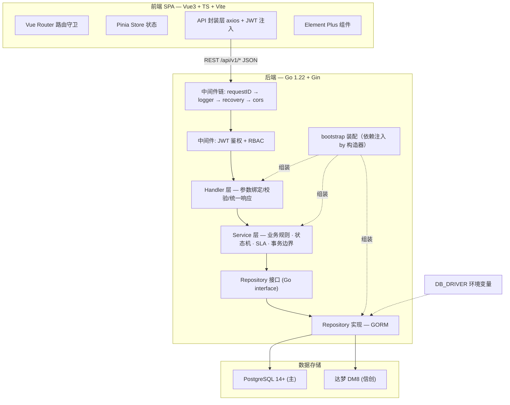
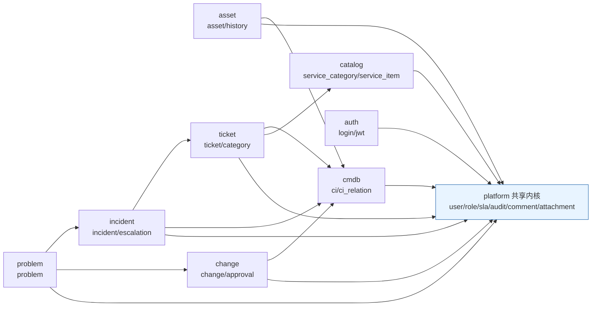
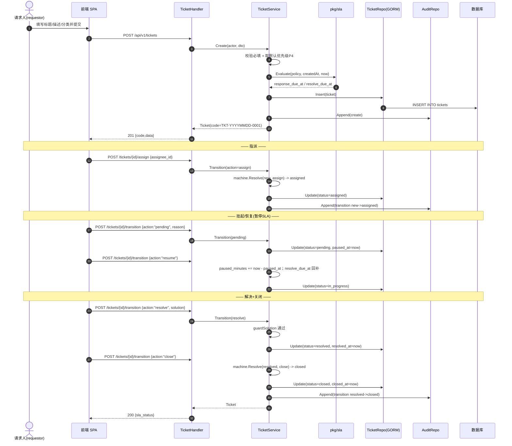
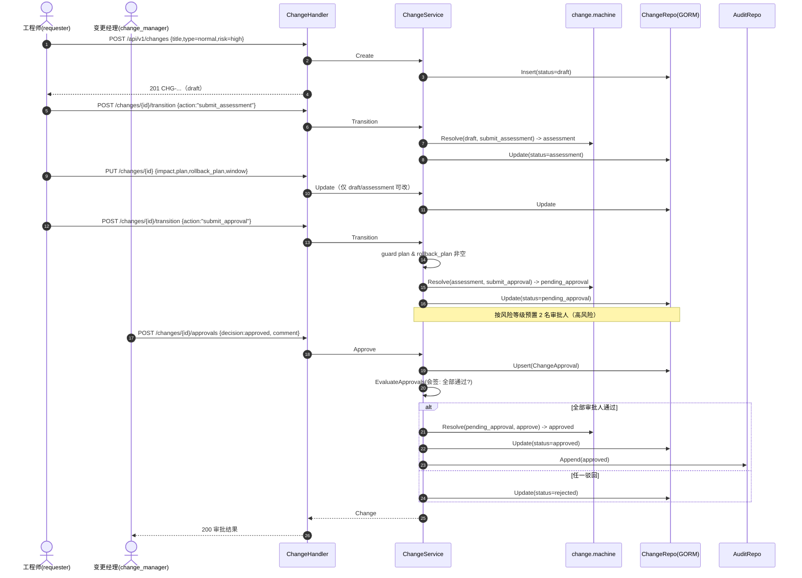
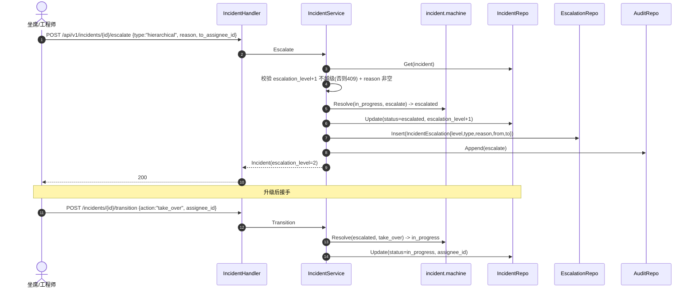
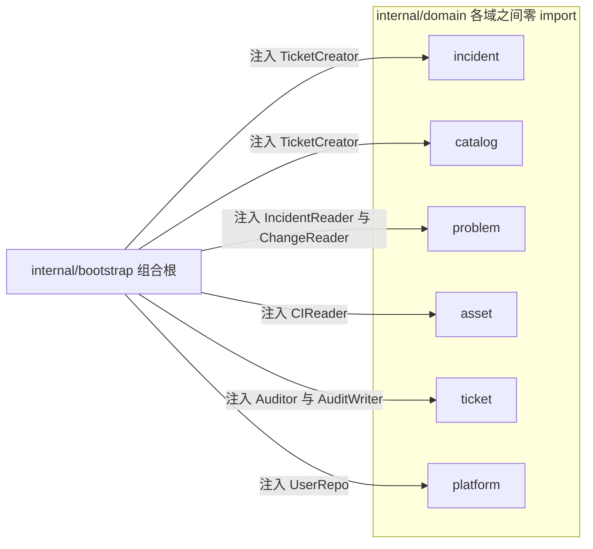

# itsm-core 系统架构设计文档

> 文档版本：v1.1　|　文档类型：架构设计（施工图）　|　编写人：架构师 高见远　|　状态：已交付（含实现期偏差附录 A）
> 上游输入：`docs/PRD.md` v1.0　|　技术栈：Go 1.22 + Gin + GORM + Viper + zap ／ Vue 3 + TS + Vite + Pinia + Element Plus
> Go module：`github.com/chixiaowen/itsm-core`　|　项目根：`/Users/chixiaowen/WorkBuddy/2026-09-16-09-52-19/itsm-core`

本文档是工程师的**唯一施工依据**。配合 `docs/PRD.md` 与 `docs/TASKS.md` 可直接编码，无需再行澄清。

---

## 0. 环境事实与关键约束（已实测确认）

| 项 | 实测结论 | 对架构的强制影响 |
| --- | --- | --- |
| Go 版本 | `go1.22.5 darwin/amd64` | `go.mod` 使用 `go 1.22`；不得引入要求 go ≥1.23 的依赖版本 |
| GOPROXY | 默认 `proxy.golang.org` **不可达（Bad Gateway）** | README/Makefile 必须内置 `GOPROXY=https://goproxy.cn,direct` 兜底；见 §0.1 |
| Docker / PostgreSQL | **本机均无** | `go test ./...` 必须在**零外部依赖**下全绿 → service 层依赖 repository 接口 + 内存 fake，禁止在测试中连真实库 |
| 达梦驱动 | `github.com/godoes/gorm-dameng@v0.7.2` **纯 Go 实现，无 CGO**，可编译 | 可安全引入；仅运行时连真实 DM8 需连接串，纳入人工验证清单 |
| 达梦驱动约束 | 其 go.mod 要求 `gorm.io/gorm ≥ v1.30.1` | 全工程 GORM 系版本锁定 `gorm v1.30.1` |
| 工具链外挂 | 最新 `golang.org/x/crypto@v0.57.0` 要求 go ≥1.26，会触发 toolchain 下载失败 | 必须锁定 `golang.org/x/crypto v0.31.0`（go 1.20），见 §0.1 |

### 0.1 依赖版本锁定矩阵（**已实测 `go build ./...` 通过，GOTOOLCHAIN=local，无 toolchain 升级**）

| 包 | 锁定版本 | go directive | 作用 |
| --- | --- | --- | --- |
| `github.com/gin-gonic/gin` | `v1.10.0` | 1.20 | HTTP 框架 |
| `gorm.io/gorm` | `v1.30.1` | 1.18 | ORM（≥1.30.1 满足达梦驱动要求） |
| `gorm.io/driver/postgres` | `v1.6.0` | 1.20 | PostgreSQL Dialector |
| `github.com/godoes/gorm-dameng` | `v0.7.2` | 1.20 | 达梦 DM8 Dialector（内部含纯 Go 驱动 `dm8` v8.1.4.80） |
| `github.com/spf13/viper` | `v1.19.0` | 1.20 | 配置管理 |
| `go.uber.org/zap` | `v1.27.0` | 1.19 | 结构化日志 |
| `github.com/golang-jwt/jwt/v5` | `v5.2.1` | 1.18 | JWT 签发/校验 |
| `github.com/google/uuid` | `v1.6.0` | — | 附件/文件名等 UUID |
| `golang.org/x/crypto` | `v0.31.0` | 1.20 | bcrypt 密码哈希 |
| `gopkg.in/yaml.v3` | 间接依赖 | — | Viper YAML 解析 |

> **红线**：`go.mod` 首行注释保留 `// toolchain: go1.22` 说明；禁止 `go get -u` 升级上述任一版本到 x/crypto ≥v0.32（需 go≥1.23）或 gin ≥v1.11。若需新增依赖，必须实测 `GOTOOLCHAIN=local go build ./...` 通过且 go directive ≤1.22。

### 0.2 达梦驱动最终选定方案（含降级路径）

- **主方案（已采用）**：`github.com/godoes/gorm-dameng v0.7.2`
  - API：`dameng.Open(dsn) gorm.Dialector` / `dameng.New(dameng.Config{...})` / `dameng.BuildUrl(user, pass, host, port, opts...) string`
  - `DriverName = "dm"`；`Initialize` 内部 `_ "github.com/godoes/gorm-dameng/dm8"` 注册纯 Go SQL 驱动
  - **无 CGO**，可在任意平台编译与 `go test`；`Config.VarcharSizeIsCharLength` 控制 VARCHAR 按字符长度
- **降级路径 A**：若上游包失联，改用 `go.mod` 的 `replace github.com/godoes/gorm-dameng => ./third_party/gorm-dameng`，将模块整仓 vendored 到本地 `third_party/`（源码已可下载，位于 `$GOMODCACHE`）
- **降级路径 B**：若达梦官方驱动包 `github.com/godoes/gorm-dameng/v2` 出现迁移，则新增替换并同步 §11 验证清单
- **不采用**：手工拷贝达梦 C 驱动源码（引入 CGO，破坏「零外部依赖测试」）

---

## 1. 总体架构

### 1.1 架构图



### 1.2 分层职责与铁律

| 层 | 包路径 | 职责 | 铁律 |
| --- | --- | --- | --- |
| Cmd | `cmd/server` | 进程入口：读配置 → 建 logger → 连库 → 迁移 → 种子 → 建 Gin → 优雅退出 | 只做装配调用，无业务逻辑 |
| Bootstrap | `internal/bootstrap` | 构造 repository 实现 → service → handler → 注册路由 | 唯一允许 import 全部业务域的地方 |
| Middleware | `internal/pkg/middleware` | requestID/日志/恢复/CORS/JWT/RBAC | 不依赖任何业务域 |
| Handler | `internal/domain/*/handler.go` | 参数绑定、DTO 校验、调用 service、渲染统一响应 | **禁止**出现 `*gorm.DB`；禁止业务判断 |
| Service | `internal/domain/*/service.go` | 业务规则、状态机、SLA、事务边界、审计写入 | **只依赖 repository 接口**，禁止 import `gorm.io/gorm` |
| Repository 接口 | `internal/domain/*/repository.go` | 定义持久化契约（Go interface） | 参数/返回值不带 GORM 类型 |
| Repository 实现 | `internal/domain/*/repository_gorm.go` | GORM 查询、`*gorm.DB` 使用、软删除、分页 | **GORM 耦合只允许出现在此文件** |
| Model | `internal/domain/*/model.go` | GORM 实体 + 状态/动作常量 | 双库通用类型（§8.6） |
| Kernel | `internal/pkg/*` | 状态机引擎、SLA 计算、编号生成、错误码、响应体、分页、安全 | 无业务域依赖，可独立单测 |

> **可测试性铁律**：`service` 层构造函数接收 **interface**（如 `ticket.Repository`）。单元测试在 `*_test.go` 内注入手写内存 fake，**绝不**触碰 GORM / 真实数据库，从而满足「零外部依赖 `go test ./...` 全绿」。

### 1.3 依赖方向（禁止循环依赖）



**依赖规则**：

1. 所有业务域均可依赖 `platform`（共享内核）与 `internal/pkg/*`。
2. `ticket` 可依赖 `catalog`、`cmdb`；`catalog`、`cmdb` **禁止**反向依赖 `ticket`。
3. `incident` 可依赖 `ticket`、`cmdb`；**`ticket` 禁止依赖 `incident`**（工单仅保留 `source_incident_id` 列，不 import）。
4. `problem` 可依赖 `incident`、`change`；后两者**禁止**依赖 `problem`（事件/变更仅保留 `problem_id` 列）。
5. `asset` 可依赖 `cmdb`；`cmdb` **禁止**依赖 `asset`。
6. 单向箭头集合构成 **DAG**，`bootstrap` 按拓扑序装配。
7. 跨模块「写」由上层发起（如 `problem` 聚合事件时由 problem service 更新 `incident.problem_id`）；跨模块「读」优先走本模块 repository 的 JOIN 或在 bootstrap 注入 consumer 接口。

---

## 2. 完整目录树（后端施工图 · 精确到文件）

```
itsm-core/
├── go.mod                                   # module github.com/chixiaowen/itsm-core / go 1.22 / 依赖锁定矩阵
├── go.sum                                   # 依赖校验和
├── Makefile                                 # make run/test/build/lint/frontend
├── .gitignore                               # 忽略 bin/ node_modules/ dist/ *.log .env
├── .env.example                             # 环境变量样例（DB_DRIVER/DSN/JWT_SECRET 等）
├── .golangci.yml                            # （可选）静态检查配置
├── README.md                                # 项目说明/快速开始/配置/API 概览/双库切换
├── LICENSE                                  # MIT
├── CONTRIBUTING.md                          # 贡献指南 + Conventional Commits
├── CHANGELOG.md                             # 变更日志
├── docker-compose.yml                       # 起 PostgreSQL 14
├── Dockerfile                               # 后端多阶段构建镜像
├── .github/workflows/ci.yml                 # GitHub Actions：go vet + go test + 前端 build
├── configs/
│   └── config.yaml                          # 全部配置项（§9）
├── docs/
│   ├── PRD.md                               # （已有）产品需求文档
│   ├── ARCHITECTURE.md                      # 本文档
│   ├── TASKS.md                             # 任务分解
│   ├── API.md                               # REST API 明细（由 §5 导出，随代码维护）
│   ├── class-diagram.mermaid                # 类图（本文件导出）
│   └── sequence-diagram.mermaid             # 时序图（本文件导出）
├── cmd/
│   └── server/
│       └── main.go                          # 入口：加载配置→logger→DB→AutoMigrate→seed→Gin→graceful shutdown
├── internal/
│   ├── config/
│   │   └── config.go                        # Viper 加载 config.yaml + 环境变量覆盖 + 默认值 + 校验
│   ├── bootstrap/
│   │   ├── bootstrap.go                     # 装配：repo→service→handler→路由；返回 *gin.Engine
│   │   ├── routes.go                        # 将各域 routes.Register(rg) 挂到 /api/v1
│   │   └── seed.go                          # 幂等种子：admin/角色/SLA 策略/服务目录示例/CI 分类
│   ├── pkg/                                 # 与业务无关的通用能力（可独立单测）
│   │   ├── httpx/
│   │   │   ├── response.go                  # {code,message,data} 统一响应 OK/Created/NoContent
│   │   │   ├── errors.go                    # AppError 类型 + 业务错误码常量 + HTTP 状态映射
│   │   │   ├── pagination.go                # PageQuery 归一化 + PageResult[T] 泛型
│   │   │   └── bind.go                      # ShouldBindJSON + 校验错误 → AppError(400)
│   │   ├── middleware/
│   │   │   ├── requestid.go                 # 生成/透传 X-Request-ID 注入 context 与响应头
│   │   │   ├── logger.go                    # 结构化访问日志（方法/路径/状态/耗时/requestID/actor）
│   │   │   ├── recovery.go                  # panic 恢复 → 500 统一响应 + 堆栈日志
│   │   │   ├── cors.go                      # 前端开发跨域（可配置白名单）
│   │   │   ├── auth.go                      # 解析 Bearer JWT → 注入 Actor 到 context；401
│   │   │   └── rbac.go                      # 按权限点校验角色；403
│   │   ├── database/
│   │   │   ├── database.go                  # Dialector 工厂（postgres/dameng）+ gorm.Open + 连接池
│   │   │   └── migrate.go                   # AutoMigrate 全部实体 + 通用索引（索引名 ≤30）
│   │   ├── logger/
│   │   │   └── logger.go                    # zap 构造（json/console、level、输出）
│   │   ├── security/
│   │   │   ├── password.go                  # bcrypt Hash/Compare
│   │   │   └── jwt.go                       # JWT 签发/解析（userID/role/exp）
│   │   ├── role/
│   │   │   └── role.go                      # 7 角色常量 + 权限点常量 + 角色→权限点矩阵
│   │   ├── statemachine/
│   │   │   ├── statemachine.go              # 通用状态机引擎 Table/Transition/Guard + Resolve
│   │   │   └── statemachine_test.go         # 引擎单测
│   │   ├── sla/
│   │   │   ├── calc.go                      # 纯函数：DueAt/Elapsed/Evaluate/Status
│   │   │   └── calc_test.go                 # SLA 计算单测（边界/暂停回补/三档）
│   │   └── idgen/
│   │       ├── code.go                      # 编号生成 TKT-/INC-/PRB-/CHG-YYYYMMDD-0001
│   │       └── code_test.go                 # 编号格式与并发安全单测
│   └── domain/                              # 业务域（每域 6 文件）
│       ├── platform/
│       │   ├── model.go                     # User/SLAPolicy/AuditLog/Comment/Attachment 实体 + 常量
│       │   ├── repository.go                # UserRepo/SLARepo/AuditRepo/CommentRepo/AttachmentRepo 接口
│       │   ├── repository_gorm.go           # 上述仓储的 GORM 实现
│       │   ├── service.go                   # 用户/角色/SLA 策略配置/审计查询/评论/附件 业务
│       │   ├── handler.go                   # 用户、SLA、审计、评论、附件 HTTP 处理
│       │   ├── routes.go                    # 注册 platform 路由 + 权限点
│       │   ├── dto.go                       # 请求/响应 DTO + 校验
│       │   ├── service_test.go              # 服务层单测（内存 fake repo）
│       │   └── repository_fake_test.go      # 内存 fake repo（测试专用）
│       ├── auth/
│       │   ├── service.go                   # 登录校验、签发 JWT、当前用户
│       │   ├── handler.go                   # /auth/login /auth/me /auth/logout
│       │   ├── routes.go                    # 注册 auth 路由（登录免鉴权）
│       │   ├── dto.go                       # LoginReq/LoginResp
│       │   └── service_test.go              # 登录单测（正确/错误密码/禁用账号）
│       ├── ticket/
│       │   ├── model.go                     # Ticket/TicketCategory 实体 + 状态/动作常量
│       │   ├── repository.go                # TicketRepo/CategoryRepo 接口
│       │   ├── repository_gorm.go           # GORM 实现（筛选/分页/软删除）
│       │   ├── service.go                   # 创建/指派/流转/SLA/挂起恢复/评价/重开/时间线
│       │   ├── machine.go                   # ticketMachine 状态机表 + guard 函数
│       │   ├── handler.go                   # 工单 HTTP 处理
│       │   ├── routes.go                    # 注册 ticket 路由 + 权限点
│       │   ├── dto.go                       # CreateTicketReq/TransitionReq/RatingReq...
│       │   ├── service_test.go              # 状态机全路径 + SLA + 权限单测
│       │   └── repository_fake_test.go      # 内存 fake repo
│       ├── incident/
│       │   ├── model.go                     # Incident/IncidentEscalation 实体 + 常量
│       │   ├── repository.go                # IncidentRepo/EscalationRepo 接口
│       │   ├── repository_gorm.go
│       │   ├── service.go                   # 上报/优先级矩阵/转工单/升级/解决/复盘
│       │   ├── machine.go                   # incidentMachine + guard
│       │   ├── priority.go                  # 影响度×紧急度 9 宫格矩阵（纯函数）
│       │   ├── handler.go
│       │   ├── routes.go
│       │   ├── dto.go
│       │   ├── service_test.go
│       │   ├── priority_test.go             # 优先级矩阵单测（9 组合）
│       │   └── repository_fake_test.go
│       ├── problem/
│       │   ├── model.go                     # Problem 实体 + 常量
│       │   ├── repository.go                # ProblemRepo + ProblemChange/IncidentReader(消费接口)
│       │   ├── repository_gorm.go
│       │   ├── service.go                   # 聚合/RCA/已知错误/关联变更/解决约束
│       │   ├── machine.go
│       │   ├── handler.go
│       │   ├── routes.go
│       │   ├── dto.go
│       │   ├── service_test.go
│       │   └── repository_fake_test.go
│       ├── change/
│       │   ├── model.go                     # Change/ChangeApproval 实体 + 常量
│       │   ├── repository.go
│       │   ├── repository_gorm.go
│       │   ├── service.go                   # 申请/风险/计划/提交审批/CAB 会签/实施回滚/回顾
│       │   ├── machine.go
│       │   ├── handler.go
│       │   ├── routes.go
│       │   ├── dto.go
│       │   ├── service_test.go
│       │   └── repository_fake_test.go
│       ├── catalog/
│       │   ├── model.go                     # ServiceCategory/ServiceItem 实体 + 常量
│       │   ├── repository.go
│       │   ├── repository_gorm.go
│       │   ├── service.go                   # 分类树/服务项 CRUD/发布下线/动态表单校验/下单
│       │   ├── machine.go
│       │   ├── formschema.go                # form_schema 解析与校验（JSON 字符串）
│       │   ├── handler.go
│       │   ├── routes.go
│       │   ├── dto.go
│       │   ├── service_test.go
│       │   └── repository_fake_test.go
│       ├── cmdb/
│       │   ├── model.go                     # CI/CIRelation 实体 + 常量（CI 类型/关系类型）
│       │   ├── repository.go
│       │   ├── repository_gorm.go
│       │   ├── service.go                   # CI CRUD/关系增删/自环与重复校验/退役校验/拓扑
│       │   ├── graph.go                     # 拓扑 BFS 展开 N 层（纯函数）
│       │   ├── handler.go
│       │   ├── routes.go
│       │   ├── dto.go
│       │   ├── service_test.go
│       │   └── repository_fake_test.go
│       └── asset/
│           ├── model.go                     # Asset/AssetHistory 实体 + 常量
│           ├── repository.go
│           ├── repository_gorm.go
│           ├── service.go                   # 资产生命周期流转/绑定 CI（1:1）/历史
│           ├── machine.go
│           ├── handler.go
│           ├── routes.go
│           ├── dto.go
│           ├── service_test.go
│           └── repository_fake_test.go
└── frontend/                                # Vue3 SPA（§14）
```

**后端源文件计数**：约 100 个 `.go` 文件（含测试）。其中 `repository_gorm.go` 是**唯一**允许出现 `gorm.io/gorm` 的业务文件。

---

## 3. 模块化设计

### 3.1 单域六件套职责边界

| 文件 | 允许 import | 禁止 | 职责 |
| --- | --- | --- | --- |
| `model.go` | `time`, `gorm.io/gorm`(仅 DeletedAt) | 其它业务域 | GORM 实体、状态/动作/枚举常量、`TableName()` |
| `repository.go` | `context`, `model.go` 类型 | `gorm.io/gorm` | 定义 Go interface 契约 |
| `repository_gorm.go` | `gorm.io/gorm`, `pkg/database` | 其它业务域 service | 实现契约、构建查询、软删除、分页 |
| `machine.go` | `pkg/statemachine`, `pkg/role`, `pkg/httpx` | 持久化 | 声明本域状态机表与 guard |
| `service.go` | `repository.go` 接口, `machine.go`, `pkg/*` | `gorm.io/gorm`、handler | 业务规则、事务编排、审计 |
| `handler.go` | `service.go`, `dto.go`, `pkg/httpx` | `repository`、GORM | 绑定/校验/调用/渲染 |
| `routes.go` | `handler`, `pkg/middleware`, `pkg/role` | — | 注册路由与权限点 |
| `dto.go` | 纯结构体 + 校验标签 | GORM | 入参/出参契约 |

### 3.2 各域对外能力

| 域 | 对外提供 | 依赖 |
| --- | --- | --- |
| platform | 用户/角色查询、SLA 策略 CRUD、审计写入与查询、评论、附件 | `pkg/*` |
| auth | 登录、签发 JWT、当前用户 | platform.UserRepo |
| ticket | 工单全生命周期；对外暴露 `TicketCreator`（供 incident 转单） | platform, catalog, cmdb |
| incident | 事件全生命周期；优先级矩阵；升级历史 | platform, ticket, cmdb |
| problem | 问题聚合/RCA/已知错误；消费 `IncidentReader`/`ChangeReader` | platform, incident, change |
| change | 变更全生命周期；CAB 会签 | platform, cmdb |
| catalog | 服务分类树、服务项、动态表单、下单转工单 | platform；**下单时通过 consumer 接口调用 ticket** |
| cmdb | CI/关系/拓扑 | platform |
| asset | 资产生命周期、绑定 CI | platform, cmdb |

> **catalog → ticket 的处理**：catalog 下单需要创建工单。为避免 `catalog → ticket` 反向依赖造成与 `ticket → catalog` 成环，**catalog 定义 consumer 接口 `TicketCreator interface { CreateFromServiceItem(...) }`，由 bootstrap 注入 ticket service 实现**。这是全工程跨模块「向上调用」的统一模式。

---

## 4. 数据模型（GORM Struct 全量定义）

### 4.1 通用约定

- 主键：`uint64` + `gorm:"primaryKey;autoIncrement"`（禁用 `SERIAL`）。
- 软删除：业务实体带 `DeletedAt gorm.DeletedAt`（审计日志除外）。
- 时间：`time.Time`，DB 列类型 `TIMESTAMP`；RFC3339 UTC 由 Go 层写入，**不使用 `now()`**。
- JSON：`form_schema` / `attrs` / `before_value` / `after_value` 均为 `type:text` 的 JSON 字符串。
- 枚举：`varchar`，Go 侧常量声明，**不使用数据库 enum**。
- 索引名：**≤30 字符**，手工指定，禁用 GORM 自动命名外键（`DisableForeignKeyConstraintWhenMigrating: true`）。
- 金额/比率类：`NUMERIC`（本工程暂未使用）。

### 4.2 platform/model.go

```go
package platform

import (
	"time"
	"gorm.io/gorm"
)

// User 系统用户（单租户）
type User struct {
	ID           uint64         `gorm:"primaryKey;autoIncrement" json:"id"`
	Username     string         `gorm:"type:varchar(64);not null;uniqueIndex:idx_usr_username" json:"username"`
	DisplayName  string         `gorm:"type:varchar(128);not null" json:"display_name"`
	Role         string         `gorm:"type:varchar(32);not null;index:idx_usr_role" json:"role"`
	PasswordHash string         `gorm:"type:varchar(255);not null" json:"-"`
	Email        string         `gorm:"type:varchar(128)" json:"email"`
	Status       string         `gorm:"type:varchar(16);not null;index:idx_usr_status" json:"status"` // active/disabled
	CreatedAt    time.Time      `json:"created_at"`
	UpdatedAt    time.Time      `json:"updated_at"`
	DeletedAt    gorm.DeletedAt `gorm:"index:idx_usr_deleted" json:"-"`
}

func (User) TableName() string { return "users" }

// SLAPolicy 按优先级定义的 SLA 策略（(priority) 唯一）
type SLAPolicy struct {
	ID              uint64         `gorm:"primaryKey;autoIncrement" json:"id"`
	Name            string         `gorm:"type:varchar(64);not null" json:"name"`
	Priority        string         `gorm:"type:varchar(8);not null;uniqueIndex:idx_sla_priority" json:"priority"` // P1..P4
	ResponseMinutes int            `gorm:"not null" json:"response_minutes"`
	ResolveMinutes  int            `gorm:"not null" json:"resolve_minutes"`
	PauseOnPending  bool           `gorm:"not null" json:"pause_on_pending"`
	CreatedAt       time.Time      `json:"created_at"`
	UpdatedAt       time.Time      `json:"updated_at"`
	DeletedAt       gorm.DeletedAt `gorm:"index:idx_sla_deleted" json:"-"`
}

func (SLAPolicy) TableName() string { return "sla_policies" }

// AuditLog 审计日志（只追加，不软删除）
type AuditLog struct {
	ID          uint64    `gorm:"primaryKey;autoIncrement" json:"id"`
	ActorID     uint64    `gorm:"not null;index:idx_audit_actor" json:"actor_id"`
	Action      string    `gorm:"type:varchar(64);not null;index:idx_audit_action" json:"action"`
	BizType     string    `gorm:"type:varchar(32);not null;index:idx_audit_biz" json:"biz_type"`
	BizID       uint64    `gorm:"not null;index:idx_audit_biz" json:"biz_id"`
	FromStatus  string    `gorm:"type:varchar(32)" json:"from_status"`
	ToStatus    string    `gorm:"type:varchar(32)" json:"to_status"`
	BeforeValue string    `gorm:"type:text" json:"before_value"`
	AfterValue  string    `gorm:"type:text" json:"after_value"`
	ClientIP    string    `gorm:"type:varchar(64)" json:"client_ip"`
	CreatedAt   time.Time `gorm:"index:idx_audit_created" json:"created_at"`
}

func (AuditLog) TableName() string { return "audit_logs" }

// Comment 评论（多态：biz_type + biz_id）
type Comment struct {
	ID         uint64         `gorm:"primaryKey;autoIncrement" json:"id"`
	BizType    string         `gorm:"type:varchar(32);not null;index:idx_cmt_biz" json:"biz_type"` // ticket/incident/problem/change
	BizID      uint64         `gorm:"not null;index:idx_cmt_biz" json:"biz_id"`
	AuthorID   uint64         `gorm:"not null;index:idx_cmt_author" json:"author_id"`
	Content    string         `gorm:"type:text;not null" json:"content"`
	IsInternal bool           `gorm:"not null" json:"is_internal"`
	CreatedAt  time.Time      `json:"created_at"`
	UpdatedAt  time.Time      `json:"updated_at"`
	DeletedAt  gorm.DeletedAt `gorm:"index:idx_cmt_deleted" json:"-"`
}

func (Comment) TableName() string { return "comments" }

// Attachment 附件（多态）
type Attachment struct {
	ID         uint64         `gorm:"primaryKey;autoIncrement" json:"id"`
	BizType    string         `gorm:"type:varchar(32);not null;index:idx_att_biz" json:"biz_type"`
	BizID      uint64         `gorm:"not null;index:idx_att_biz" json:"biz_id"`
	Filename   string         `gorm:"type:varchar(255);not null" json:"filename"`
	FilePath   string         `gorm:"type:varchar(512);not null" json:"file_path"`
	Size       int64          `gorm:"not null" json:"size"`
	MimeType   string         `gorm:"type:varchar(128)" json:"mime_type"`
	UploaderID uint64         `gorm:"not null;index:idx_att_uploader" json:"uploader_id"`
	CreatedAt  time.Time      `json:"created_at"`
	DeletedAt  gorm.DeletedAt `gorm:"index:idx_att_deleted" json:"-"`
}

func (Attachment) TableName() string { return "attachments" }
```

### 4.3 ticket/model.go

```go
package ticket

import (
	"time"
	"gorm.io/gorm"
)

type Ticket struct {
	ID               uint64         `gorm:"primaryKey;autoIncrement" json:"id"`
	Code             string         `gorm:"type:varchar(32);not null;uniqueIndex:idx_tkt_code" json:"code"`
	Title            string         `gorm:"type:varchar(255);not null" json:"title"`
	Description      string         `gorm:"type:text" json:"description"`
	Status           string         `gorm:"type:varchar(32);not null;index:idx_tkt_status" json:"status"`
	Priority         string         `gorm:"type:varchar(8);not null;index:idx_tkt_priority" json:"priority"` // P1..P4
	Type             string         `gorm:"type:varchar(16);not null;index:idx_tkt_type" json:"type"`         // manual/service/incident
	CategoryID       *uint64        `gorm:"index:idx_tkt_category" json:"category_id"`
	RequesterID      uint64         `gorm:"not null;index:idx_tkt_requester" json:"requester_id"`
	AssigneeID       *uint64        `gorm:"index:idx_tkt_assignee" json:"assignee_id"`
	ServiceItemID    *uint64        `gorm:"index:idx_tkt_service_item" json:"service_item_id"`
	SourceIncidentID *uint64        `gorm:"index:idx_tkt_src_inc" json:"source_incident_id"`
	SLAPolicyID      *uint64        `json:"sla_policy_id"`
	FormData         string         `gorm:"type:text" json:"form_data"` // 服务目录动态表单快照(JSON 字符串)
	Solution         string         `gorm:"type:text" json:"solution"`
	PausedMinutes    int            `gorm:"not null" json:"paused_minutes"`
	PausedAt         *time.Time     `json:"paused_at"`
	FirstRespondedAt *time.Time     `json:"first_responded_at"`
	ResponseDueAt    *time.Time     `json:"response_due_at"`
	ResolveDueAt     *time.Time     `json:"resolve_due_at"`
	ResolvedAt       *time.Time     `json:"resolved_at"`
	ClosedAt         *time.Time     `json:"closed_at"`
	ReopenedAt       *time.Time     `json:"reopened_at"`
	Rating           *int           `json:"rating"`         // 1..5，仅可写一次
	RatingComment    string         `gorm:"type:varchar(500)" json:"rating_comment"`
	RatedAt          *time.Time     `json:"rated_at"`
	CreatedAt        time.Time      `gorm:"index:idx_tkt_created" json:"created_at"`
	UpdatedAt        time.Time      `json:"updated_at"`
	DeletedAt        gorm.DeletedAt `gorm:"index:idx_tkt_deleted" json:"-"`
	SLAStatus        string         `gorm:"-" json:"sla_status"`       // 计算字段（非持久化）
	SLA                     // 计算字段挂载（内嵌，见 §7）
}

func (Ticket) TableName() string { return "tickets" }

// TicketCategory 工单分类（多级树）
type TicketCategory struct {
	ID        uint64         `gorm:"primaryKey;autoIncrement" json:"id"`
	Name      string         `gorm:"type:varchar(128);not null" json:"name"`
	ParentID  *uint64        `gorm:"index:idx_tktcat_parent" json:"parent_id"`
	SortOrder int            `gorm:"not null" json:"sort_order"`
	CreatedAt time.Time      `json:"created_at"`
	UpdatedAt time.Time      `json:"updated_at"`
	DeletedAt gorm.DeletedAt `gorm:"index:idx_tktcat_deleted" json:"-"`
}

func (TicketCategory) TableName() string { return "ticket_categories" }

// TicketCI 工单↔CI 多对多
type TicketCI struct {
	ID       uint64 `gorm:"primaryKey;autoIncrement" json:"id"`
	TicketID uint64 `gorm:"not null;uniqueIndex:idx_tktci_uq" json:"ticket_id"`
	CIID     uint64 `gorm:"not null;uniqueIndex:idx_tktci_uq" json:"ci_id"`
}

func (TicketCI) TableName() string { return "ticket_cis" }
```

**ticket 状态/动作常量**（同文件声明）：

```go
const (
	StatusDraft      = "draft"
	StatusNew        = "new"
	StatusAssigned   = "assigned"
	StatusInProgress = "in_progress"
	StatusPending    = "pending"
	StatusResolved   = "resolved"
	StatusClosed     = "closed"
	StatusReopened   = "reopened"
	StatusCancelled  = "cancelled"
)
const (
	ActionSubmit = "submit"; ActionCancel = "cancel"; ActionAssign = "assign"
	ActionStart  = "start";  ActionReturn = "return"; ActionPending = "pending"
	ActionResume = "resume"; ActionResolve = "resolve"; ActionClose = "close"
	ActionReopen = "reopen"
)
```

### 4.4 incident/model.go

```go
package incident

const (
	StatusReported   = "reported"
	StatusTriage     = "triage"
	StatusInProgress = "in_progress"
	StatusEscalated  = "escalated"
	StatusPending    = "pending"
	StatusResolved   = "resolved"
	StatusClosed     = "closed"
	StatusCancelled  = "cancelled"
)
const (
	ImpactHigh = "high"; ImpactMedium = "medium"; ImpactLow = "low"
	UrgencyHigh = "high"; UrgencyMedium = "medium"; UrgencyLow = "low"
	EscFunc = "functional"; EscHier = "hierarchical"
)

type Incident struct {
	ID               uint64         `gorm:"primaryKey;autoIncrement" json:"id"`
	Code             string         `gorm:"type:varchar(32);not null;uniqueIndex:idx_inc_code" json:"code"`
	Title            string         `gorm:"type:varchar(255);not null" json:"title"`
	Description      string         `gorm:"type:text" json:"description"`
	Status           string         `gorm:"type:varchar(32);not null;index:idx_inc_status" json:"status"`
	Impact           string         `gorm:"type:varchar(16);not null" json:"impact"`
	Urgency          string         `gorm:"type:varchar(16);not null" json:"urgency"`
	Priority         string         `gorm:"type:varchar(8);not null;index:idx_inc_priority" json:"priority"`
	PriorityOverridden bool         `gorm:"not null" json:"priority_overridden"`
	EscalationLevel  int            `gorm:"not null" json:"escalation_level"` // 0..3
	ReporterID       uint64         `gorm:"not null;index:idx_inc_reporter" json:"reporter_id"`
	AssigneeID       *uint64        `gorm:"index:idx_inc_assignee" json:"assignee_id"`
	ProblemID        *uint64        `gorm:"index:idx_inc_problem" json:"problem_id"`
	TicketID         *uint64        `gorm:"index:idx_inc_ticket" json:"ticket_id"`
	SLAPolicyID      *uint64        `json:"sla_policy_id"`
	Solution         string         `gorm:"type:text" json:"solution"`
	ReviewConclusion string         `gorm:"type:text" json:"review_conclusion"`
	OccurredAt       *time.Time     `json:"occurred_at"`
	ResolvedAt       *time.Time     `json:"resolved_at"`
	ClosedAt         *time.Time     `json:"closed_at"`
	ResponseDueAt    *time.Time     `json:"response_due_at"`
	ResolveDueAt     *time.Time     `json:"resolve_due_at"`
	CreatedAt        time.Time      `gorm:"index:idx_inc_created" json:"created_at"`
	UpdatedAt        time.Time      `json:"updated_at"`
	DeletedAt        gorm.DeletedAt `gorm:"index:idx_inc_deleted" json:"-"`
	SLAStatus        string         `gorm:"-" json:"sla_status"`
}

func (Incident) TableName() string { return "incidents" }

type IncidentEscalation struct {
	ID          uint64    `gorm:"primaryKey;autoIncrement" json:"id"`
	IncidentID  uint64    `gorm:"not null;index:idx_esc_incident" json:"incident_id"`
	Level       int       `gorm:"not null" json:"level"`
	Type        string    `gorm:"type:varchar(16);not null" json:"type"` // functional/hierarchical
	Reason      string    `gorm:"type:text;not null" json:"reason"`
	FromAssignee *uint64  `json:"from_assignee_id"`
	ToAssignee   *uint64  `json:"to_assignee_id"`
	ActorID     uint64    `gorm:"not null" json:"actor_id"`
	CreatedAt   time.Time `json:"created_at"`
}

func (IncidentEscalation) TableName() string { return "incident_escalations" }

type IncidentCI struct {
	ID         uint64 `gorm:"primaryKey;autoIncrement" json:"id"`
	IncidentID uint64 `gorm:"not null;uniqueIndex:idx_incci_uq" json:"incident_id"`
	CIID       uint64 `gorm:"not null;uniqueIndex:idx_incci_uq" json:"ci_id"`
}

func (IncidentCI) TableName() string { return "incident_cis" }
```

### 4.5 problem/model.go

```go
package problem

const (
	StatusNew           = "new"
	StatusTriage        = "triage"
	StatusInvestigating = "investigating"
	StatusKnownError    = "known_error"
	StatusResolved      = "resolved"
	StatusClosed        = "closed"
	StatusCancelled     = "cancelled"
)

type Problem struct {
	ID             uint64         `gorm:"primaryKey;autoIncrement" json:"id"`
	Code           string         `gorm:"type:varchar(32);not null;uniqueIndex:idx_prb_code" json:"code"`
	Title          string         `gorm:"type:varchar(255);not null" json:"title"`
	Description    string         `gorm:"type:text" json:"description"`
	Status         string         `gorm:"type:varchar(32);not null;index:idx_prb_status" json:"status"`
	Source         string         `gorm:"type:varchar(16);not null" json:"source"` // aggregate/manual
	RootCause      string         `gorm:"type:text" json:"root_cause"`
	Analysis       string         `gorm:"type:text" json:"analysis"`
	Symptom        string         `gorm:"type:text" json:"symptom"`
	Workaround     string         `gorm:"type:text" json:"workaround"`
	NoChangeReason string         `gorm:"type:text" json:"no_change_reason"`
	AssigneeID     *uint64        `gorm:"index:idx_prb_assignee" json:"assignee_id"`
	CreatorID      uint64         `gorm:"not null" json:"creator_id"`
	ResolvedAt     *time.Time     `json:"resolved_at"`
	ClosedAt       *time.Time     `json:"closed_at"`
	CreatedAt      time.Time      `gorm:"index:idx_prb_created" json:"created_at"`
	UpdatedAt      time.Time      `json:"updated_at"`
	DeletedAt      gorm.DeletedAt `gorm:"index:idx_prb_deleted" json:"-"`
}

func (Problem) TableName() string { return "problems" }

// ProblemChange 问题↔变更 多对多
type ProblemChange struct {
	ID        uint64 `gorm:"primaryKey;autoIncrement" json:"id"`
	ProblemID uint64 `gorm:"not null;uniqueIndex:idx_prbchg_uq" json:"problem_id"`
	ChangeID  uint64 `gorm:"not null;uniqueIndex:idx_prbchg_uq" json:"change_id"`
}

func (ProblemChange) TableName() string { return "problem_changes" }
```

> 事件↔问题为 **1:N**，由 `incidents.problem_id` 承载，无需连接表。

### 4.6 change/model.go

```go
package change

const (
	StatusDraft           = "draft"
	StatusAssessment      = "assessment"
	StatusPendingApproval = "pending_approval"
	StatusApproved        = "approved"
	StatusRejected        = "rejected"
	StatusScheduled       = "scheduled"
	StatusImplementing    = "implementing"
	StatusImplemented     = "implemented"
	StatusReview          = "review"
	StatusClosed          = "closed"
	StatusRolledBack      = "rolled_back"
	StatusCancelled       = "cancelled"
)
const (
	TypeStandard = "standard"; TypeNormal = "normal"; TypeEmergency = "emergency"
	RiskHigh = "high"; RiskMedium = "medium"; RiskLow = "low"
	DecisionApprove = "approved"; DecisionReject = "rejected"
)

type Change struct {
	ID              uint64         `gorm:"primaryKey;autoIncrement" json:"id"`
	Code            string         `gorm:"type:varchar(32);not null;uniqueIndex:idx_chg_code" json:"code"`
	Title           string         `gorm:"type:varchar(255);not null" json:"title"`
	Description     string         `gorm:"type:text" json:"description"`
	ChangeType      string         `gorm:"type:varchar(16);not null;index:idx_chg_type" json:"change_type"`
	Status          string         `gorm:"type:varchar(32);not null;index:idx_chg_status" json:"status"`
	RiskLevel       string         `gorm:"type:varchar(16);not null;index:idx_chg_risk" json:"risk_level"`
	ImpactAnalysis  string         `gorm:"type:text" json:"impact_analysis"`
	Plan            string         `gorm:"type:text" json:"plan"`
	RollbackPlan    string         `gorm:"type:text" json:"rollback_plan"`
	ImplementResult string         `gorm:"type:text" json:"implement_result"`
	RollbackReason  string         `gorm:"type:text" json:"rollback_reason"`
	ReviewConclusion string        `gorm:"type:text" json:"review_conclusion"`
	RequesterID     uint64         `gorm:"not null;index:idx_chg_requester" json:"requester_id"`
	ManagerID       *uint64        `gorm:"index:idx_chg_manager" json:"manager_id"`
	PreAuthorized   bool           `gorm:"not null" json:"pre_authorized"` // 标准变更预授权
	WindowStart     *time.Time     `json:"window_start"`
	WindowEnd       *time.Time     `json:"window_end"`
	ClosedAt        *time.Time     `json:"closed_at"`
	CreatedAt       time.Time      `gorm:"index:idx_chg_created" json:"created_at"`
	UpdatedAt       time.Time      `json:"updated_at"`
	DeletedAt       gorm.DeletedAt `gorm:"index:idx_chg_deleted" json:"-"`
}

func (Change) TableName() string { return "changes" }

type ChangeApproval struct {
	ID         uint64         `gorm:"primaryKey;autoIncrement" json:"id"`
	ChangeID   uint64         `gorm:"not null;index:idx_apv_change" json:"change_id"`
	ApproverID uint64         `gorm:"not null;index:idx_apv_approver" json:"approver_id"`
	Decision   string         `gorm:"type:varchar(16)" json:"decision"` // 空=待审
	Comment    string         `gorm:"type:text" json:"comment"`
	DecidedAt  *time.Time     `json:"decided_at"`
	CreatedAt  time.Time      `json:"created_at"`
	DeletedAt  gorm.DeletedAt `gorm:"index:idx_apv_deleted" json:"-"`
}

func (ChangeApproval) TableName() string { return "change_approvals" }
```

### 4.7 catalog/model.go

```go
package catalog

const (
	StatusDraft           = "draft"
	StatusPendingApproval = "pending_approval"
	StatusPublished       = "published"
	StatusOffline         = "offline"
	StatusArchived        = "archived"
)

type ServiceCategory struct {
	ID        uint64         `gorm:"primaryKey;autoIncrement" json:"id"`
	Name      string         `gorm:"type:varchar(128);not null" json:"name"`
	ParentID  *uint64        `gorm:"index:idx_scat_parent" json:"parent_id"`
	SortOrder int            `gorm:"not null" json:"sort_order"`
	CreatedAt time.Time      `json:"created_at"`
	UpdatedAt time.Time      `json:"updated_at"`
	DeletedAt gorm.DeletedAt `gorm:"index:idx_scat_deleted" json:"-"`
}

func (ServiceCategory) TableName() string { return "service_categories" }

type ServiceItem struct {
	ID               uint64         `gorm:"primaryKey;autoIncrement" json:"id"`
	Name             string         `gorm:"type:varchar(128);not null" json:"name"`
	Description      string         `gorm:"type:text" json:"description"`
	Status           string         `gorm:"type:varchar(32);not null;index:idx_sitm_status" json:"status"`
	CategoryID       uint64         `gorm:"not null;index:idx_sitm_category" json:"category_id"`
	SLAPolicyID      *uint64        `json:"sla_policy_id"`
	DefaultPriority  string         `gorm:"type:varchar(8)" json:"default_priority"`
	RequiresApproval bool           `gorm:"not null" json:"requires_approval"`
	FormSchema       string         `gorm:"type:text" json:"form_schema"` // JSON 字符串
	CreatedAt        time.Time      `gorm:"index:idx_sitm_created" json:"created_at"`
	UpdatedAt        time.Time      `json:"updated_at"`
	DeletedAt        gorm.DeletedAt `gorm:"index:idx_sitm_deleted" json:"-"`
}

func (ServiceItem) TableName() string { return "service_items" }
```

### 4.8 cmdb/model.go

```go
package cmdb

const (
	StatusPlanned  = "planned"
	StatusInStock  = "in_stock"
	StatusInUse    = "in_use"
	StatusMaintain = "maintenance"
	StatusRetired  = "retired"
	StatusDisposed = "disposed"
)
const (
	CITypeServer = "server"; CITypeNetwork = "network"; CITypeDatabase = "database"
	CITypeApp = "application"; CITypeTerminal = "terminal"; CITypeOther = "other"
	RelationDependsOn  = "depends_on"
	RelationContains   = "contains"
	RelationConnectsTo = "connects_to"
)

type CI struct {
	ID        uint64         `gorm:"primaryKey;autoIncrement" json:"id"`
	Code      string         `gorm:"type:varchar(64);not null;uniqueIndex:idx_ci_code" json:"code"`
	Name      string         `gorm:"type:varchar(255);not null" json:"name"`
	CIType    string         `gorm:"type:varchar(32);not null;index:idx_ci_type" json:"ci_type"`
	Status    string         `gorm:"type:varchar(16);not null;index:idx_ci_status" json:"status"`
	Attrs     string         `gorm:"type:text" json:"attrs"` // 自定义属性 JSON 字符串
	OwnerID   *uint64        `gorm:"index:idx_ci_owner" json:"owner_id"`
	CreatedAt time.Time      `gorm:"index:idx_ci_created" json:"created_at"`
	UpdatedAt time.Time      `json:"updated_at"`
	DeletedAt gorm.DeletedAt `gorm:"index:idx_ci_deleted" json:"-"`
}

func (CI) TableName() string { return "cis" }

type CIRelation struct {
	ID           uint64    `gorm:"primaryKey;autoIncrement" json:"id"`
	SourceCIID   uint64    `gorm:"not null;uniqueIndex:idx_cirel_uq;index:idx_cirel_source" json:"source_ci_id"`
	TargetCIID   uint64    `gorm:"not null;uniqueIndex:idx_cirel_uq;index:idx_cirel_target" json:"target_ci_id"`
	RelationType string    `gorm:"type:varchar(16);not null" json:"relation_type"`
	CreatedAt    time.Time `json:"created_at"`
}

func (CIRelation) TableName() string { return "ci_relations" }
```

### 4.9 asset/model.go

```go
package asset

const (
	StatusPlanned     = "planned"
	StatusInStock     = "in_stock"
	StatusInUse       = "in_use"
	StatusMaintenance = "maintenance"
	StatusRetired     = "retired"
	StatusDisposed    = "disposed"
)

type Asset struct {
	ID           uint64         `gorm:"primaryKey;autoIncrement" json:"id"`
	AssetNo      string         `gorm:"type:varchar(64);not null;uniqueIndex:idx_ast_no" json:"asset_no"`
	Name         string         `gorm:"type:varchar(255);not null" json:"name"`
	Category     string         `gorm:"type:varchar(32);not null;index:idx_ast_category" json:"category"`
	Status       string         `gorm:"type:varchar(16);not null;index:idx_ast_status" json:"status"`
	CIID         *uint64        `gorm:"uniqueIndex:idx_ast_ci" json:"ci_id"` // 可空 1:1
	UserID       *uint64        `gorm:"index:idx_ast_user" json:"user_id"`
	Location     string         `gorm:"type:varchar(128)" json:"location"`
	Vendor       string         `gorm:"type:varchar(128)" json:"vendor"`
	PurchaseDate *time.Time     `json:"purchase_date"`
	WarrantyEnd  *time.Time     `json:"warranty_end"`
	CreatedAt    time.Time      `gorm:"index:idx_ast_created" json:"created_at"`
	UpdatedAt    time.Time      `json:"updated_at"`
	DeletedAt    gorm.DeletedAt `gorm:"index:idx_ast_deleted" json:"-"`
}

func (Asset) TableName() string { return "assets" }

type AssetHistory struct {
	ID        uint64    `gorm:"primaryKey;autoIncrement" json:"id"`
	AssetID   uint64    `gorm:"not null;index:idx_asth_asset" json:"asset_id"`
	FromStatus string   `gorm:"type:varchar(16)" json:"from_status"`
	ToStatus  string    `gorm:"type:varchar(16);not null" json:"to_status"`
	Remark    string    `gorm:"type:text" json:"remark"`
	ActorID   uint64    `gorm:"not null" json:"actor_id"`
	CreatedAt time.Time `json:"created_at"`
}

func (AssetHistory) TableName() string { return "asset_histories" }
```

### 4.10 索引名长度自检（§8.6 约束：≤30 字符）

| 索引名 | 长度 | 索引名 | 长度 |
| --- | --- | --- | --- |
| `idx_usr_username` | 16 | `idx_tkt_service_item` | 20 |
| `idx_sla_priority` | 16 | `idx_tkt_src_inc` | 15 |
| `idx_cirel_uq` | 12 | `idx_incci_uq` | 11 |
| `idx_prbchg_uq` | 12 | `idx_apv_approver` | 16 |
| `idx_audit_created` | 17 | `idx_sitm_status` | 15 |

> 全部索引名 ≤20 字符，**通过 §8.6 校验**。`bootstrap/migrate.go` 中禁用外键自动迁移（`DisableForeignKeyConstraintWhenMigrating: true`），外键语义由 service 层保证，避免达梦 30 字符外键名超限。

---

## 5. REST API 接口清单

**通用**：前缀 `/api/v1`；除 `/api/v1/auth/login` 与 `/healthz` 外全部需 `Authorization: Bearer <jwt>`；列表响应统一 `{code,message,data:{total,page,page_size,items}}`。

**错误码 ↔ HTTP 映射**（PRD §5 开头 + §8.2）：

| code | HTTP | 含义 |
| --- | --- | --- |
| 0 | 200 | 成功 |
| 10001 | 400 | 参数校验失败 |
| 10002 | 400 | 自环/非法关系等业务参数错误 |
| 20001 | 401 | 未登录 / token 无效或过期 |
| 20003 | 403 | 越权 |
| 30001 | 404 | 资源不存在 |
| 40001 | 409 | **状态冲突 / 非法流转 / 重复操作** |
| 40002 | 422 | **业务前置条件不满足** |
| 50000 | 500 | 服务器内部错误 |

### 5.1 auth / platform（SYS）

| 方法 路径 | 用途 | 权限 | 请求体 | 响应 data | 需求 |
| --- | --- | --- | --- | --- | --- |
| POST `/auth/login` | 登录签发 JWT | 公开 | `{username,password}` | `{token,expires_at,user}` | SYS-001 |
| GET `/auth/me` | 当前用户 | 登录 | — | `User` | SYS-001 |
| POST `/auth/logout` | 登出（前端清 token） | 登录 | — | `null` | SYS-001 |
| GET `/users` | 用户列表 | admin | `?page&page_size&role&keyword` | 分页 `User` | SYS-002 |
| POST `/users` | 新建用户 | admin | `{username,display_name,role,password,email}` | `User` | SYS-002 |
| GET `/users/:id` | 用户详情 | admin | — | `User` | SYS-002 |
| PUT `/users/:id` | 编辑用户（含改角色/密码） | admin | `{display_name?,role?,password?,status?}` | `User` | SYS-002 |
| DELETE `/users/:id` | 软删除用户 | admin | — | `null` | SYS-002/004 |
| GET `/roles` | 角色与权限点矩阵 | admin | — | `[{role,name,permissions[]}]` | SYS-002 |
| GET `/sla-policies` | SLA 策略列表 | admin | — | `[SLAPolicy]` | TKT-005 |
| POST `/sla-policies` | 新建策略 | admin | `{name,priority,response_minutes,resolve_minutes,pause_on_pending}` | `SLAPolicy` | TKT-005 |
| PUT `/sla-policies/:id` | 编辑策略 | admin | 同上 | `SLAPolicy` | TKT-005 |
| DELETE `/sla-policies/:id` | 删除策略 | admin | — | `null` | TKT-005 |
| GET `/audit-logs` | 审计查询 | admin | `?actor_id&biz_type&action&from&to&page` | 分页 `AuditLog` | SYS-003 |
| GET `/comments` | 评论/时间线（按 biz） | 登录 | `?biz_type&biz_id&include_internal` | `[Comment]` | TKT-006 |
| POST `/comments` | 新增评论/内部备注 | 登录 | `{biz_type,biz_id,content,is_internal}` | `Comment` | TKT-006 |
| POST `/attachments` | 上传附件（multipart） | 登录 | `file` + `biz_type,biz_id` | `Attachment`（≤20MB） | TKT-010 |
| GET `/attachments/:id/download` | 下载附件 | 登录（软删除实体拦截） | — | 文件流 | TKT-010 |
| DELETE `/attachments/:id` | 删除附件 | 上传者/admin | — | `null` | TKT-010 |

### 5.2 ticket（TKT）

| 方法 路径 | 用途 | 权限 | 请求体（关键） | 需求 |
| --- | --- | --- | --- | --- |
| GET `/tickets` | 列表（状态/优先级/分类/指派/时间/超期/关键字） | 登录（requestor 仅本人） | `?status&priority&category_id&assignee_id&sla_status&from&to&keyword&page&sort_by&order` | TKT-011 |
| POST `/tickets` | 创建工单 | 登录 | `{title,description,category_id,priority?,requester_id?,source?}` → 返回 `code` | TKT-001 |
| GET `/tickets/:id` | 详情（含时间线/CI/附件/服务项） | 登录（本人或坐席） | — | TKT-003/005/006 |
| PUT `/tickets/:id` | 编辑（draft/new/assigned 可改字段） | 坐席/admin/本人 | `{title?,description?,category_id?,priority?}` | TKT-002/003 |
| DELETE `/tickets/:id` | 软删除 | admin | — | SYS-004 |
| POST `/tickets/:id/transition` | **统一状态流转**（action） | 见 §6 | `{action, solution?, reason?, assignee_id?, priority?}` | TKT-007/008/012 |
| POST `/tickets/:id/assign` | 指派（快捷） | agent/admin | `{assignee_id}` | TKT-004 |
| POST `/tickets/:id/rating` | 满意度评价（仅一次） | requestor | `{rating,comment?}` | TKT-009 |
| POST `/tickets/:id/comment` | 公开回复（触发首次响应时间） | 登录 | `{content,is_internal}` | TKT-006 |
| POST `/tickets/:id/cis` | 关联 CI | agent/resolver | `{ci_ids[]}` | CMDB-006 |
| DELETE `/tickets/:id/cis/:ciId` | 解除 CI | agent/resolver | — | CMDB-006 |
| GET `/ticket-categories` | 分类树 | 登录 | — | TKT-002 |
| POST `/ticket-categories` | 新建分类 | admin | `{name,parent_id?,sort_order}` | TKT-002 |
| PUT `/ticket-categories/:id` | 编辑分类 | admin | 同上 | TKT-002 |
| DELETE `/ticket-categories/:id` | 删除分类（含子/含工单拒绝 409） | admin | — | TKT-002 |

### 5.3 incident（INC）

| 方法 路径 | 用途 | 权限 | 请求体 | 需求 |
| --- | --- | --- | --- | --- |
| GET `/incidents` | 列表 | 登录 | `?status&priority&impact&urgency&escalation_level&from&to&page` | INC-008 |
| POST `/incidents` | 上报 | 登录 | `{title,description,impact,urgency,occurred_at,ci_ids[]}` | INC-001 |
| GET `/incidents/:id` | 详情（含升级历史/关联工单/CI） | 登录 | — | INC-003/004/005 |
| PUT `/incidents/:id` | 编辑 | agent/admin | `{title?,description?,impact?,urgency?}` | INC-001 |
| DELETE `/incidents/:id` | 软删除 | admin | — | SYS-004 |
| POST `/incidents/:id/transition` | 状态流转 | 见 §6 | `{action, solution?, reason?}` | INC-006 |
| POST `/incidents/:id/priority` | 人工覆盖优先级 | agent+ | `{priority}` → `priority_overridden=true` | INC-002 |
| POST `/incidents/:id/escalate` | 升级（功能/层级，+1） | agent/resolver/problem_manager/admin | `{type, reason, to_assignee_id?}` | INC-005 |
| POST `/incidents/:id/convert-to-ticket` | 一键转工单 | agent/resolver/admin | `{title?}` → 返回 ticket | INC-003 |
| POST `/incidents/:id/link-ticket` | 关联已有工单 | agent/resolver | `{ticket_id}` | INC-004 |
| POST `/incidents/:id/cis` | 关联 CI | agent/resolver | `{ci_ids[]}` | CMDB-006 |
| GET `/incidents/priority-matrix` | 9 宫格矩阵（前端展示） | 登录 | — | INC-002 |
| GET `/incidents/stats` | 看板统计（P2） | 登录 | — | INC-008 |

### 5.4 problem（PRB）

| 方法 路径 | 用途 | 权限 | 请求体 | 需求 |
| --- | --- | --- | --- | --- |
| GET `/problems` | 列表 | problem_manager/admin（△ resolver 只读） | `?status&assignee_id&known_error&page` | PRB-003 |
| POST `/problems` | 新建/聚合 | problem_manager/admin | `{title,description,source,incident_ids[]}` | PRB-001/005 |
| GET `/problems/:id` | 详情（RCA/关联事件/关联变更） | 登录只读 | — | PRB-002/004 |
| PUT `/problems/:id` | 编辑/RCA | problem_manager/admin | `{title?,description?,symptom?,analysis?,root_cause?}` | PRB-002 |
| DELETE `/problems/:id` | 软删除 | admin | — | SYS-004 |
| POST `/problems/:id/transition` | 流转 | 见 §6 | `{action, workaround?, no_change_reason?, reason?}` | PRB-003/006 |
| POST `/problems/:id/known-error` | 标记已知错误 | problem_manager/admin | `{root_cause,workaround}` → 422 if 空 | PRB-003 |
| POST `/problems/:id/changes` | 关联变更 | problem_manager/admin | `{change_ids[]}` | PRB-004 |
| DELETE `/problems/:id/changes/:changeId` | 解除关联 | problem_manager/admin | — | PRB-004 |
| GET `/problems/aggregate-suggestions` | 「建议聚合」提示 | problem_manager/admin | `?ci_id&days=30` | PRB-001 |

### 5.5 change（CHG）

| 方法 路径 | 用途 | 权限 | 请求体 | 需求 |
| --- | --- | --- | --- | --- |
| GET `/changes` | 列表 | 登录 | `?status&change_type&risk_level&manager_id&window_from&window_to&page` | CHG-003 |
| POST `/changes` | 提交申请 | 登录（工程师） | `{title,description,change_type,risk_level}` | CHG-001/002 |
| GET `/changes/:id` | 详情（含审批记录/时间线） | 登录 | — | CHG-005 |
| PUT `/changes/:id` | 编辑（仅 draft） | requester/change_manager | `{title?,description?,change_type?,risk_level?,impact_analysis?,plan?,rollback_plan?,window_start?,window_end?}` | CHG-002/003/004/006 |
| DELETE `/changes/:id` | 软删除 | admin | — | SYS-004 |
| POST `/changes/:id/transition` | 流转 | 见 §6 | `{action, result?, reason?, window_start?, window_end?, confirm_out_of_window?}` | CHG-004~009 |
| POST `/changes/:id/approvals` | CAB 审批 | change_manager/admin | `{decision,comment}` | CHG-005 |
| GET `/changes/:id/approvals` | 审批记录 | 登录 | — | CHG-005 |

### 5.6 catalog（CAT）

| 方法 路径 | 用途 | 权限 | 请求体 | 需求 |
| --- | --- | --- | --- | --- |
| GET `/service-categories` | 分类树 | 登录 | — | CAT-002 |
| POST `/service-categories` | 新建分类 | admin | `{name,parent_id?,sort_order}` | CAT-002 |
| PUT `/service-categories/:id` | 编辑/排序 | admin | 同上 | CAT-002 |
| DELETE `/service-categories/:id` | 删除（含子/含服务项 409） | admin | — | CAT-002 |
| GET `/service-items` | 服务项列表（管理台） | admin | `?status&category_id&page` | CAT-001 |
| POST `/service-items` | 新建服务项 | admin | `{name,description,category_id,sla_policy_id,default_priority,requires_approval,form_schema}` | CAT-001 |
| GET `/service-items/:id` | 详情 | 登录 | — | CAT-001 |
| PUT `/service-items/:id` | 编辑（published 编辑即退回 draft） | admin | 同 POST | CAT-003 |
| DELETE `/service-items/:id` | 归档（draft/offline→archived；否则 409） | admin | — | CAT-003 |
| POST `/service-items/:id/publish` | 发布/重新上架 | admin | — | CAT-003 |
| POST `/service-items/:id/offline` | 下线 | admin | — | CAT-003 |
| GET `/catalog/categories` | 用户侧分类（仅含 published） | 登录 | — | CAT-003 |
| GET `/catalog/items` | 用户侧服务项（仅 published） | 登录 | `?category_id&keyword` | CAT-003 |
| POST `/catalog/items/:id/order` | 下单（动态表单校验→生成工单） | 登录 | `{form_data:{...}, title?}` → 返回 ticket | CAT-004/005/006 |

### 5.7 cmdb / asset（CMDB）

| 方法 路径 | 用途 | 权限 | 请求体 | 需求 |
| --- | --- | --- | --- | --- |
| GET `/cis` | CI 列表 | cmdb_manager/admin | `?ci_type&status&owner_id&keyword&page` | CMDB-001 |
| POST `/cis` | 新建 CI | cmdb_manager/admin | `{code,name,ci_type,status,owner_id,attrs{}}` | CMDB-001 |
| GET `/cis/:id` | CI 详情（含关系/关联工单事件） | 登录只读 | — | CMDB-002 |
| PUT `/cis/:id` | 编辑 CI | cmdb_manager/admin | 同 POST | CMDB-001 |
| DELETE `/cis/:id` | 软删除（有未清关系 409） | cmdb_manager/admin | — | CMDB-003 |
| GET `/cis/:id/topology` | 拓扑展开 | 登录 | `?depth=2&direction=both` | CMDB-007 |
| POST `/cis/:id/relations` | 新增关系（自环 400 / 重复 409） | cmdb_manager/admin | `{target_ci_id,relation_type}` | CMDB-002/003 |
| DELETE `/cis/:id/relations/:relId` | 删除关系 | cmdb_manager/admin | — | CMDB-002 |
| GET `/ci-types` | CI 类型枚举 | 登录 | — | CMDB-001 |
| GET `/assets` | 资产台账 | cmdb_manager/admin | `?category&status&user_id&warranty_before&page` | CMDB-003 |
| POST `/assets` | 新建资产 | cmdb_manager/admin | `{asset_no,name,category,vendor,purchase_date,warranty_end}` | CMDB-003 |
| GET `/assets/:id` | 详情（含生命周期历史/绑定 CI） | cmdb_manager/admin | — | CMDB-003 |
| PUT `/assets/:id` | 编辑资产 | cmdb_manager/admin | 同上 | CMDB-003 |
| DELETE `/assets/:id` | 软删除 | cmdb_manager/admin | — | SYS-004 |
| POST `/assets/:id/transition` | 生命周期流转 | cmdb_manager/admin | `{action, remark?, user_id?, location?, ci_id?}` | CMDB-004 |
| GET `/assets/:id/history` | 生命周期历史 | cmdb_manager/admin | — | CMDB-004 |
| POST `/assets/:id/bind-ci` | 绑定 CI（1:1） | cmdb_manager/admin | `{ci_id}` | CMDB-005 |
| DELETE `/assets/:id/bind-ci` | 解绑 | cmdb_manager/admin | — | CMDB-005 |
| GET `/healthz` | 探活（含 DB ping） | 公开 | — | SYS-009 |

---

## 6. 状态机实现方案

### 6.1 通用引擎（`internal/pkg/statemachine`）

```go
package statemachine

import "context"

// Actor 当前操作者
type Actor struct {
	UserID uint64
	Role   string
}

// GuardInput 前置校验入参
type GuardInput struct {
	Ctx    context.Context
	Actor  Actor
	Entity any            // 当前实体指针（如 *ticket.Ticket）
	Params map[string]any // 请求附加参数（solution/reason/assignee_id...）
	Now    time.Time
}

// Guard 前置校验；返回非 nil 表示拒绝（由 service 转成 422）
type Guard func(in GuardInput) error

// Transition 一条允许的流转
type Transition struct {
	To    string   // 目标状态
	Roles []string // 允许角色；空=不限制
	Guard Guard    // 可选前置校验
}

// Table from -> action -> Transition
type Table map[string]map[string]Transition

// Resolve 查询允许流转；ok=false 表示非法流转（service 转 409）
func (t Table) Resolve(from, action string) (Transition, bool) {
	byAction, ok := t[from]
	if !ok {
		return Transition{}, false
	}
	tr, ok := byAction[action]
	return tr, ok
}

// Allows 角色校验；roles 为空视为放行
func (tr Transition) Allows(role string) bool {
	if len(tr.Roles) == 0 {
		return true
	}
	for _, r := range tr.Roles {
		if r == role {
			return true
		}
	}
	return false
}
```

### 6.2 service 层统一流转骨架（每域复用）

```go
func (s *TicketService) Transition(ctx context.Context, actor Act, id uint64, action string, p TransitionParams) (*Ticket, error) {
	tk, err := s.repo.Get(ctx, id)
	if err != nil {
		return nil, err // 404
	}
	if !canAccess(actor, tk) {
		return nil, httpx.ErrForbidden           // 403：资源级鉴权
	}
	tr, ok := ticketMachine.Resolve(tk.Status, action)
	if !ok {
		return nil, httpx.ErrConflict(           // 409：非法流转
			fmt.Sprintf("非法流转 %s -> %s", tk.Status, action))
	}
	if !tr.Allows(actor.Role) {
		return nil, httpx.ErrForbidden           // 403
	}
	if tr.Guard != nil {
		if err := tr.Guard(statemachine.GuardInput{...}); err != nil {
			return nil, err                      // 422：前置条件不满足
		}
	}
	from := tk.Status
	s.applyTransition(tk, action, tr.To, p)      // 写时间戳/paused_minutes/solution/等
	if err := s.repo.Update(ctx, tk); err != nil {
		return nil, err
	}
	s.audit.Write(ctx, actor.UserID, "transition", "ticket", tk.ID, from, tr.To, ip)
	return tk, nil
}
```

### 6.3 六张流转表（PRD §5 逐条落地）

> 以下为**后端允许流转集合**的权威定义；未列出者一律 `409`。

#### 6.3.1 Ticket（`ticket/machine.go`）

| from | action | to | 角色 | Guard（不满足→422/409） |
| --- | --- | --- | --- | --- |
| draft | submit | new | agent, admin | 必填字段完整 |
| draft | cancel | cancelled | agent, admin | — |
| new | assign | assigned | agent, admin | assignee 有效 |
| new | cancel | cancelled | requestor | 仅本人（否则 403） |
| assigned | start | in_progress | agent, resolver, admin | 本人或 admin |
| assigned | return | new | agent, resolver, admin | 本人或 admin；清空 assignee |
| in_progress | pending | pending | agent, resolver, admin | pause_reason 非空；写 paused_at |
| pending | resume | in_progress | agent, resolver, admin | 累计 paused_minutes 并回补 due_at |
| in_progress/pending | resolve | resolved | agent, resolver, admin | solution 非空；写 resolved_at |
| resolved | close | closed | requestor, agent, admin | 写 closed_at |
| resolved | reopen | reopened | requestor | resolved_at 距今 ≤7 天，否则 409 |
| reopened | assign | assigned | agent, admin | assignee 有效 |
| reopened | start | in_progress | agent, resolver, admin | 本人或 admin |

> `closed` / `cancelled` **无表项 → 全部拒绝**。`new → in_progress`、`draft → resolved`、`resolved → assigned`、`closed → *` 均不在表内 → 409（满足 PRD 非法流转示例）。

#### 6.3.2 Incident（`incident/machine.go`）

| from | action | to | 角色 | Guard |
| --- | --- | --- | --- | --- |
| reported | triage | triage | agent, admin | — |
| reported | cancel | cancelled | requestor | 仅本人 |
| triage | confirm | in_progress | agent, admin | assignee 非空 |
| triage | false_positive | resolved | agent, admin | solution 非空 |
| triage | cancel | cancelled | agent, admin | reason 非空 |
| in_progress | escalate | escalated | agent, resolver, problem_manager, admin | level+1 不可越级(409)；reason 非空 |
| escalated | take_over | in_progress | assignee, admin | 记录新 assignee |
| in_progress | pending | pending | agent, resolver, admin | reason 非空 |
| pending | resume | in_progress | agent, resolver, admin | — |
| in_progress/pending | resolve | resolved | agent, resolver, admin | solution 非空；P1/P2 影响与恢复说明非空 |
| resolved | close | closed | agent, admin | P1/P2 复盘结论非空 |
| resolved | revert | in_progress | agent, admin | 距 resolved_at ≤24h，否则 409 |

#### 6.3.3 Problem（`problem/machine.go`）

| from | action | to | 角色 | Guard |
| --- | --- | --- | --- | --- |
| new | triage | triage | problem_manager, admin | — |
| new/triage | cancel | cancelled | problem_manager, admin | reason 非空 |
| triage | investigate | investigating | problem_manager, admin | assignee 非空 |
| investigating | mark_known_error | known_error | problem_manager, admin | root_cause & workaround 非空 |
| known_error | update_workaround | known_error | problem_manager, admin | 自环更新（写审计） |
| investigating/known_error | resolve | resolved | problem_manager, admin | 关联 ≥1 个 closed 变更 或 no_change_reason 非空 |
| resolved | close | closed | problem_manager, admin | — |
| resolved | recur | investigating | problem_manager, admin | reason 非空 |

#### 6.3.4 Change（`change/machine.go`）

| from | action | to | 角色 | Guard |
| --- | --- | --- | --- | --- |
| draft | submit_assessment | assessment | requester, admin | title/type/risk 非空 |
| draft | pre_authorize | approved | requester, admin | change_type=standard 否则 409 |
| draft/assessment | cancel | cancelled | requester, change_manager, admin | — |
| assessment | submit_approval | pending_approval | requester, change_manager | plan & rollback_plan 非空 |
| pending_approval | approve | approved | change_manager, admin | 会签：全部指定审批人通过（见 §6.4） |
| pending_approval | reject | rejected | change_manager, admin | comment 非空 |
| rejected | revise | draft | requester | 保留审批历史 |
| approved | schedule | scheduled | change_manager, admin | window_start < window_end |
| scheduled | start_implement | implementing | resolver, admin | 若强制窗口，则 now ∈ [start,end] 否则 409 |
| scheduled | cancel | cancelled | change_manager, admin | — |
| implementing | complete | implemented | resolver, admin | result 非空 |
| implementing | rollback | rolled_back | resolver, admin | reason 非空 |
| implemented | review | review | change_manager, admin | — |
| review | close | closed | change_manager, admin | conclusion 非空 |
| review | rollback | rolled_back | change_manager, admin | reason 非空 |
| rolled_back | resubmit | draft | requester | 关联原变更 |

#### 6.3.5 ServiceItem（`catalog/machine.go`）

| from | action | to | 角色 | Guard |
| --- | --- | --- | --- | --- |
| draft | submit_review | pending_approval | admin | name/category/sla/form_schema 完整 |
| draft | archive | archived | admin | — |
| pending_approval | publish | published | admin | — |
| pending_approval | reject | draft | admin | reason 非空 |
| published | edit | draft | admin | 编辑即退回草稿 |
| published | offline | offline | admin | — |
| offline | republish | published | admin | — |
| offline | archive | archived | admin | — |

#### 6.3.6 Asset（`asset/machine.go`）

| from | action | to | 角色 | Guard |
| --- | --- | --- | --- | --- |
| planned | stock_in | in_stock | cmdb_manager, admin | asset_no/category/purchase 信息 |
| in_stock | deploy | in_use | cmdb_manager, admin | user_id/location 非空 |
| in_stock | retire | retired | cmdb_manager, admin | reason 非空 |
| in_use | maintain | maintenance | cmdb_manager, admin | remark 非空 |
| maintenance | finish_maintain | in_use | cmdb_manager, admin | 维修结论非空 |
| in_use | retire | retired | cmdb_manager, admin | 退役前清理 CI 关系（否则 409） |
| retired | dispose | disposed | cmdb_manager, admin | 处置方式非空 |

> CI 与 Asset 的状态机**共用状态枚举**（planned/in_stock/in_use/maintenance/retired/disposed）；CI 退役校验在 cmdb service 内实现。

### 6.4 CAB 会签规则（PRD Q1 默认方案）

- 变更进入 `pending_approval` 时，按风险等级预置审批人：高风险默认 **2 名** `change_manager`，中/低风险默认 **1 名**。
- `POST /changes/:id/approvals` 记录每人的 `decision`；**全部已指定审批人均为 `approved` 才置 `approved`**；任一 `rejected` 立即置 `rejected`。
- 紧急变更（`emergency`）走 ECAB：**至少 1 人通过即通过**。
- 会签判定为纯函数：`change.EvaluateApprovals(changeType string, approvals []ChangeApproval) (decision string)`，可独立单测。

### 6.5 Go 代码骨架（Ticket 状态机表）

```go
package ticket

import (
	"time"

	"github.com/chixiaowen/itsm-core/internal/pkg/httpx"
	"github.com/chixiaowen/itsm-core/internal/pkg/role"
	"github.com/chixiaowen/itsm-core/internal/pkg/statemachine"
)

var ticketMachine = statemachine.Table{
	StatusDraft: {
		ActionSubmit: {To: StatusNew, Roles: role.Agents, Guard: guardRequiredFields},
		ActionCancel: {To: StatusCancelled, Roles: role.Agents},
	},
	StatusNew: {
		ActionAssign: {To: StatusAssigned, Roles: role.Agents, Guard: guardAssigneeValid},
		ActionCancel: {To: StatusCancelled, Roles: []string{role.Requestor}, Guard: guardOwner},
	},
	StatusAssigned: {
		ActionStart:  {To: StatusInProgress, Roles: role.Resolvers, Guard: guardAssigneeOrAdmin},
		ActionReturn: {To: StatusNew, Roles: role.Resolvers, Guard: guardAssigneeOrAdmin},
	},
	StatusInProgress: {
		ActionPending: {To: StatusPending, Roles: role.Resolvers, Guard: guardPauseReason},
		ActionResolve: {To: StatusResolved, Roles: role.Resolvers, Guard: guardSolution},
	},
	StatusPending: {
		ActionResume:  {To: StatusInProgress, Roles: role.Resolvers},
		ActionResolve: {To: StatusResolved, Roles: role.Resolvers, Guard: guardSolution},
	},
	StatusResolved: {
		ActionClose:  {To: StatusClosed, Roles: []string{role.Requestor, role.Agent, role.Admin}},
		ActionReopen: {To: StatusReopened, Roles: []string{role.Requestor}, Guard: guardReopenWindow},
	},
	StatusReopened: {
		ActionAssign: {To: StatusAssigned, Roles: role.Agents, Guard: guardAssigneeValid},
		ActionStart:  {To: StatusInProgress, Roles: role.Resolvers, Guard: guardAssigneeOrAdmin},
	},
	// closed / cancelled 不出现在表中 → 全部流转被 409 拒绝
}

func guardRequiredFields(in statemachine.GuardInput) error {
	tk := in.Entity.(*Ticket)
	if tk.Title == "" || tk.RequesterID == 0 {
		return httpx.ErrPrecondition("标题与请求人必填")
	}
	return nil
}

func guardSolution(in statemachine.GuardInput) error {
	if s, _ := in.Params["solution"].(string); s == "" {
		return httpx.ErrPrecondition("解决方案必填")
	}
	return nil
}

func guardReopenWindow(in statemachine.GuardInput) error {
	tk := in.Entity.(*Ticket)
	if tk.ResolvedAt == nil || in.Now.Sub(*tk.ResolvedAt) > 7*24*time.Hour {
		return httpx.ErrConflict("超过 7 天不可重开，请新建工单")
	}
	return nil
}
```

---

## 7. SLA 计算方案

### 7.1 计时口径（PRD §5.2.1）

| 指标 | 起点 | 终点 | 暂停 |
| --- | --- | --- | --- |
| 响应 Response | `created_at` | 首次 `assigned` 或首条坐席公开回复（`first_responded_at`） | 不暂停 |
| 解决 Resolution | `created_at` | `resolved_at` | `pending` 期间暂停 |
| 关闭 Closure | `created_at` | `closed_at` | 同解决 |

- 实际耗时 = 终点 − 起点 − `paused_minutes`。
- `due_at` = 起点 + 策略 `resolve_minutes`（7×24 自然时间）。
- 三档：`normal`（剩余 > 20% 目标）／`warning`（剩余 ≤ 20%）／`breached`（`now > due_at` 且未达终点）。
- 默认策略：P1 响应15m/解决4h，P2 30m/8h，P3 2h/24h，P4 8h/72h。

### 7.2 纯函数实现（`internal/pkg/sla/calc.go`）

```go
package sla

import "time"

type Policy struct {
	Priority        string
	ResponseMinutes int
	ResolveMinutes  int
	PauseOnPending  bool
}

type Status string

const (
	Normal   Status = "normal"
	Warning  Status = "warning"
	Breached Status = "breached"
)

// Due 计算截止时间：start + minutes（分钟）
func Due(start time.Time, minutes int) time.Time {
	return start.Add(time.Duration(minutes) * time.Minute)
}

// Elapsed 计算净耗时 = end - start - paused（end 为 nil 时用 now）
func Elapsed(start time.Time, end *time.Time, now time.Time, pausedMinutes int) time.Duration {
	ref := now
	if end != nil {
		ref = *end
	}
	d := ref.Sub(start) - time.Duration(pausedMinutes)*time.Minute
	if d < 0 {
		return 0
	}
	return d
}

// StatusOf 判定 SLA 三档
//   - breached: 未达成且 now > dueAt（或已达成但 end > dueAt）
//   - warning : 剩余 <= 20% 目标时长
//   - normal  : 其余
func StatusOf(start time.Time, targetMinutes int, end *time.Time, now time.Time, pausedMinutes int) Status {
	dueAt := Due(start, targetMinutes)
	if end != nil { // 已达成：是否按期
		if end.After(dueAt) {
			return Breached
		}
		return Normal
	}
	if now.After(dueAt) {
		return Breached
	}
	remaining := dueAt.Sub(now)
	threshold := time.Duration(float64(targetMinutes)*0.2) * time.Minute
	if remaining <= threshold {
		return Warning
	}
	return Normal
}

// Evaluate 汇总工单/事件的 SLA 展示数据（service 与前端共用）
type View struct {
	ResponseDueAt *time.Time
	ResolveDueAt  *time.Time
	ResponseStatus Status
	ResolveStatus  Status
	SLAStatus      Status // 综合：取响应/解决中更严重者
	Remaining      time.Duration
}

func Evaluate(p Policy, createdAt, now time.Time, firstRespondedAt, resolvedAt *time.Time, pausedMinutes int) View
```

### 7.3 复用方式

- **service 层**：`ticket.service.Create` 计算并落库 `response_due_at`/`resolve_due_at`；`Transition` 在 `resume` 时按新增暂停时长回补 `resolve_due_at += 本次暂停`；在 `resolve`/`close` 写入 `resolved_at`/`closed_at`。
- **列表/详情响应**：service 调 `sla.Evaluate(...)` 得到 `View`，注入到实体的 `gorm:"-"` 计算字段（`response_due_at`/`resolve_due_at`/`sla_status`），**不落库**，保证「修改优先级后 SLA 重算」（TKT-003）即时生效。
- **可测试性**：`sla` 包为**纯函数、零依赖**，`calc_test.go` 覆盖：
  1. 截止时间计算（P1~P4 四组）；
  2. `pending` 暂停后回补后仍 `normal`；
  3. 剩余 ≤20% → `warning`；
  4. 超 `due_at` 未解决 → `breached`；
  5. 按期解决 → `normal`、超期解决 → `breached`；
  6. `pausedMinutes` 大于总时长时 `Elapsed` 归零。

---

## 8. 横切关注点（Cross-Cutting Concerns）

### 8.1 统一响应体（`pkg/httpx/response.go`）

```go
type Body struct { Code int `json:"code"`; Message string `json:"message"`; Data any `json:"data"` }
func OK(c *gin.Context, data any)                 // {0,"ok",data}
func Created(c *gin.Context, data any)            // 201
func NoContent(c *gin.Context)                     // 204（DELETE）
func Fail(c *gin.Context, err error)               // 按 AppError 渲染
```

分页 `data` 固定：`{"total":n,"page":p,"page_size":s,"items":[...]}`。

### 8.2 错误类型与错误码（`pkg/httpx/errors.go`）

```go
type AppError struct { Code int; Message string; HTTP int }
func (e *AppError) Error() string { return e.Message }

func ErrBadRequest(msg string) *AppError   { return &AppError{10001, msg, 400} }
func ErrInvalidRelation(msg string) *AppError { return &AppError{10002, msg, 400} }
func ErrUnauthorized(msg string) *AppError { return &AppError{20001, msg, 401} }
func ErrForbidden(msg string) *AppError    { return &AppError{20003, msg, 403} }
func ErrNotFound(msg string) *AppError     { return &AppError{30001, msg, 404} }
func ErrConflict(msg string) *AppError     { return &AppError{40001, msg, 409} }       // 非法流转/重复
func ErrPrecondition(msg string) *AppError { return &AppError{40002, msg, 422} }       // 前置条件不满足
func ErrInternal(msg string) *AppError     { return &AppError{50000, msg, 500} }
```

Handler 统一 `Fail(c, err)`：若 `errors.As(&AppError)` 命中则按其 HTTP 渲染（并附 `current_status`/`target_status` 供前端展示），否则 500 + 仅回显通用信息、详细堆栈只入日志。

### 8.3 分页规范（`pkg/httpx/pagination.go`）

```go
type PageQuery struct { Page, PageSize int; SortBy, Order string }
func ParsePage(c *gin.Context) PageQuery     // page 默认 1；page_size 默认 20，>100 截断为 100
func (q PageQuery) Offset() int
func (q PageQuery) NormalizeSort(allowed map[string]bool, fallback string) PageQuery
type PageResult[T any] struct { Total int64; Page, PageSize int; Items []T }
func NewPageResult[T any](items []T, total int64, page, size int) PageResult[T]
```

### 8.4 JWT 鉴权中间件（`pkg/middleware/auth.go`）

- 白名单：`POST /api/v1/auth/login`、`GET /healthz`。
- 解析 `Authorization: Bearer`，校验签名与 `exp`，将 `statemachine.Actor{UserID, Role}` 写入 `gin.Context`（key `actor`）。
- 失败 → `401 / 20001`。
- `pkg/security/jwt.go`：`Issue(userID, role string, ttl)` / `Parse(token)`，HS256，`JWT_SECRET` 来自配置。

### 8.5 RBAC 权限点（`pkg/middleware/rbac.go` + `pkg/role/role.go`）

- 角色常量：`requestor / agent / resolver / problem_manager / change_manager / cmdb_manager / admin`。
- **权限点只挂在独立端点上**：本项目的 transition 类动作统一走通用端点 `POST /<域>/:id/transition`，而路由级权限点无法针对单个动作区分（一个端点只能挂一组中间件）。因此**不为单个 transition 动作单列权限点**——那会产生「声明了却永不生效」的**失效权限点**，反而给人"已被保护"的错觉。**transition 的授权由状态机的 `Roles`（+ 必要的 `Guard`）表达**（见 §6）。据此，`perm.ticket.close`、`perm.ticket.view_own`、`perm.ticket.reopen`、`perm.change.implement` 均已删除。
- 权限点常量（示例）：`perm.ticket.create / perm.ticket.assign / perm.incident.escalate / perm.change.approve / perm.catalog.manage / perm.cmdb.manage / perm.asset.manage / perm.sla.manage / perm.user.manage / perm.audit.view`。
- `role.go` 内维护 `map[role][]perm` 矩阵（**与 PRD §2.2 逐条对齐**），中间件 `RequirePerm(p)` 校验，越权 → `403 / 20003`。
- **权限模型为「两集合 + withheld 例外」**（详见附录 A · D10）：`AllPermissions`（19 项，系统定义的**全部**权限点，是**不变量**，新增权限点必须加入）与 `AdminPermissions`（18 项，admin **实际持有** = 全集去掉刻意保留项）。当前**唯一**的刻意保留项是 `perm.ticket.rate`——依据 PRD §2.2，admin 对「满意度评价」为 **✗**（评价语义是"请求人对解决结果的确认"，不应由管理员代持，否则可自评自结、评价数据失去意义）。
- **资源级鉴权**（`requestor` 仅本人数据、`resolver` 仅被指派数据）在 service 层 `canAccess` 实现。

### 8.6 审计日志写入点（`platform` 域）

- 所有写操作（创建/更新/删除/**状态流转**）由 service 调用 `auditRepo.Append(...)`。
- 记录字段：`actor_id, action, biz_type, biz_id, from_status, to_status, before_value(JSON), after_value(JSON), client_ip`。
- **强制留痕**：变更审批、事件升级、变更回滚、CI 关系变更、工单指派。
- 客户端 IP 由中间件写入 context；审计**只追加**，无删除接口。

### 8.7 软删除

- 业务实体统一 `gorm.DeletedAt`，GORM 默认查询自动过滤。
- 附件下载前二次校验业务实体未软删除（删除工单后附件不可下载，TKT-010）。
- 关联校验（删除含服务项的分类、退役带关系的 CI）基于未删除数据判断。

### 8.8 请求日志与 request-id

- `requestid.go`：读取或生成 `X-Request-ID`，写入 context 与响应头。
- `logger.go`：访问日志字段 `method,path,status,latency,request_id,actor_id,client_ip`。
- `recovery.go`：panic → 500 统一响应 + zap 堆栈。
- `cors.go`：开发环境放行前端 origin（配置白名单）。

### 8.9 时间与命名规范

- 时间统一 RFC3339 UTC 存储与传输；前端按本地时区展示。
- 编号：`TKT-YYYYMMDD-0001`（`pkg/idgen`，按 biz 前缀 + 日期 + 当日序号，使用库内 `MAX(code)` 后 +1，配合唯一索引兜底）。
- JSON 字段：`snake_case`；Go 导出字段 `PascalCase`。
- 提交规范：Conventional Commits（`feat:` `fix:` `docs:` `test:` `chore:`）。

---

## 9. 配置设计

### 9.1 `configs/config.yaml`

```yaml
app:
  name: itsm-core
  env: development          # development|production
  http_addr: ":8080"
  request_timeout_seconds: 30
  max_upload_mb: 20

log:
  level: info               # debug|info|warn|error
  format: console           # console|json
  output: stdout            # stdout|文件路径

database:
  driver: postgres          # postgres|dameng   ← DB_DRIVER 可覆盖
  postgres:
    host: 127.0.0.1
    port: 5432
    user: itsm
    password: itsm
    dbname: itsm_core
    sslmode: disable
    timezone: UTC
    max_open_conns: 50
    max_idle_conns: 10
  dameng:
    host: 127.0.0.1
    port: 5236
    user: SYSDBA
    password: SYSDBA
    schema: SYSDBA
    varchar_size_is_char: true
  auto_migrate: true
  seed: true

auth:
  jwt_secret: "change-me-in-production"
  jwt_ttl_hours: 24
  login_max_attempts: 5       # P1
  login_lock_minutes: 10      # P1

change:
  enforce_window: false        # 窗口外实施是否强制拒绝（REQ-CHG-006）
  emergency_needs_confirm: true

cors:
  allowed_origins:
    - "http://localhost:5173"
```

### 9.2 Viper 覆盖规则与默认值

- 文件名 `config`，搜索路径 `./configs`、`/etc/itsm-core`；支持 `--config` 指定。
- 环境变量前缀 `ITSM_`，`.` → `_`（如 `ITSM_DATABASE_DRIVER`），并**单独支持** `DB_DRIVER`、`DB_DSN`、`JWT_SECRET`、`LOG_LEVEL` 四个常用变量直读。
- 全部键设 `SetDefault`：`http_addr=:8080`、`log.level=info`、`database.driver=postgres`、`auth.jwt_ttl_hours=24`、`app.max_upload_mb=20`。
- 启动时校验：`jwt_secret` 不得为空、`database.driver ∈ {postgres,dameng}`，否则退出并打印明确错误。

### 9.3 连接池与超时

- GORM `sql.DB`：`SetMaxOpenConns/SetMaxIdleConns/SetConnMaxLifetime` 取自配置。
- 慢查询阈值 200ms 记为 warn（GORM logger 适配 zap）。

---

## 10. 数据库初始化

### 10.1 AutoMigrate 策略（`pkg/database/migrate.go`）

```go
func AutoMigrate(db *gorm.DB) error {
	return db.AutoMigrate(
		// platform
		&platform.User{}, &platform.SLAPolicy{}, &platform.AuditLog{}, &platform.Comment{}, &platform.Attachment{},
		// ticket
		&ticket.TicketCategory{}, &ticket.Ticket{}, &ticket.TicketCI{},
		// incident
		&incident.Incident{}, &incident.IncidentEscalation{}, &incident.IncidentCI{},
		// problem
		&problem.Problem{}, &problem.ProblemChange{},
		// change
		&change.Change{}, &change.ChangeApproval{},
		// catalog
		&catalog.ServiceCategory{}, &catalog.ServiceItem{},
		// cmdb / asset
		&cmdb.CI{}, &cmdb.CIRelation{}, &asset.Asset{}, &asset.AssetHistory{},
	)
}
```

- `gorm.Config{ DisableForeignKeyConstraintWhenMigrating: true }`：避免 GORM 自动外键名超 30 字符（达梦限制），外键语义由 service 保证。
- 迁移仅使用通用类型与显式索引名，**不含方言专属 DDL**。
- 非 AutoMigrate 环境（生产）可改为 `atlas`/手写迁移，但 P0 采用 AutoMigrate。

### 10.2 种子数据（`bootstrap/seed.go`，**幂等**）

| 序号 | 内容 | 判重键 |
| --- | --- | --- |
| 1 | 7 个内置角色说明 + `admin` 账号（`admin/admin123`，bcrypt，首次登录强制改密提示） | `users.username='admin'` |
| 2 | 4 条默认 SLA 策略（P1 15m/240m，P2 30m/480m，P3 120m/1440m，P4 480m/4320m，`pause_on_pending=true`） | `sla_policies.priority` |
| 3 | 服务分类示例：`办公支持`、`账号与权限`、`网络与连接`、`硬件与设备` | `service_categories`(name+parent) |
| 4 | 6 个 CI 类型枚举 + 示例 CI：`srv-app-01`(server)、`db-pg-01`(database)、`net-core-01`(network) 及 2 条关系 | `cis.code` |
| 5 | 示例工单分类树：`硬件故障/软件问题/账号问题` | `ticket_categories`(name+parent) |

- 实现方式：`FirstOrCreate`（**不使用 ON CONFLICT**，满足 §8.6 双库约束），重复启动不产生重复数据。
- 由 `config.database.seed=true` 开关控制。

---

## 11. 双库切换与验证清单

### 11.1 Dialector 工厂（`pkg/database/database.go`）

```go
func Open(cfg config.Database) (*gorm.DB, error) {
	var dialector gorm.Dialector
	switch cfg.Driver {
	case "postgres":
		dsn := fmt.Sprintf("host=%s port=%d user=%s password=%s dbname=%s sslmode=%s TimeZone=%s",
			cfg.Postgres.Host, cfg.Postgres.Port, cfg.Postgres.User, cfg.Postgres.Password,
			cfg.Postgres.DBName, cfg.Postgres.SSLMode, cfg.Postgres.TimeZone)
		dialector = postgres.Open(dsn)
	case "dameng":
		dsn := dameng.BuildUrl(cfg.Dameng.User, cfg.Dameng.Password, cfg.Dameng.Host, cfg.Dameng.Port,
			map[string]string{"schema": cfg.Dameng.Schema})
		dialector = dameng.New(dameng.Config{
			DriverName: "dm", DSN: dsn,
			VarcharSizeIsCharLength: cfg.Dameng.VarcharSizeIsChar,
		})
	default:
		return nil, fmt.Errorf("unsupported DB_DRIVER: %s", cfg.Driver)
	}
	return gorm.Open(dialector, &gorm.Config{
		DisableForeignKeyConstraintWhenMigrating: true,
		Logger: gormzap.New(...),
	})
}
```

### 11.2 达梦人工验证步骤（交付清单）

1. 准备 DM8 实例（Docker 镜像或信创环境），建库建用户 `SYSDBA`。
2. 设置 `DB_DRIVER=dameng`，`ITSM_DATABASE_DAMENG_HOST/PORT/USER/PASSWORD`。
3. `go run ./cmd/server`：观察 AutoMigrate 建表成功、种子初始化成功。
4. 手工走通：登录 → 建工单 → 指派 → 解决 → 关闭（含 SLA 展示）；建 CI → 建关系 → 拓扑；资产生命周期流转。
5. 校验项：无 `SERIAL/jsonb/ILIKE/ON CONFLICT/now()` 报错；索引名均 ≤30；`form_schema/attrs` 以 `TEXT` 正常存取。
6. 截图/日志归档到 `docs/`。

### 11.3 §8.6 十条硬约束落地对照

| PRD 约束 | 落地实现 | 位置 |
| --- | --- | --- |
| 仅通用字段类型 | 全部 model 显式 `type:varchar/text/timestamp`，`bool`/`int`/`int64` | §4 各 model |
| 禁 SERIAL | `primaryKey;autoIncrement` | §4 各 model |
| JSON 用 TEXT | `form_schema/attrs/before_value/after_value` = `type:text` | §4.2/4.5/4.7/4.8 |
| 禁 ILIKE | service 层 `strings.ToLower` + `LIKE` | ticket/incident 搜索 |
| LIMIT/OFFSET | `pkg/httpx/pagination` | §8.3 |
| 禁 ON CONFLICT | 先查后写 + 唯一索引兜底（`FirstOrCreate`） | seed、编号生成 |
| 禁 now() | 时间全部由 Go 传入 | §8.9 |
| 迁移无方言 DDL | AutoMigrate + 禁用自动外键 | §10.1 |
| 索引名 ≤30 | 手工短索引名（§4.10 自检） | §4 各 model |
| DB_DRIVER 切换 | Dialector 工厂 | §11.1 |

---

## 12. 测试策略

### 12.1 测试矩阵

| 包 | 测试类型 | 依赖 | 覆盖目标 | 关键用例 |
| --- | --- | --- | --- | --- |
| `pkg/statemachine` | 单测 | 无 | 100% | Resolve 命中/未命中、Allows 角色 |
| `pkg/sla` | 单测 | 无 | ≥95% | 四优先级 due、暂停回补、三档边界 |
| `pkg/idgen` | 单测 | 无 | ≥90% | 格式、序号递增、并发 |
| `pkg/httpx` | 单测 | 无 | ≥80% | 分页归一化（0/负/超100）、错误码映射 |
| `pkg/security` | 单测 | 无 | ≥90% | bcrypt 往返、JWT 签发解析/过期 |
| `internal/domain/ticket` | 单测（fake repo） | 无 | ≥70% | 状态机全路径 + 非法流转 409 + 解决 422 + 重开窗口 409 + SLA |
| `internal/domain/incident` | 单测 | 无 | ≥70% | 9 宫格矩阵 + 升级越级 409 + 转单重复 409 |
| `internal/domain/problem` | 单测 | 无 | ≥65% | known_error 422 + resolve 变更约束 422 |
| `internal/domain/change` | 单测 | 无 | ≥70% | 标准免审、CAB 会签、窗口校验、类型锁 |
| `internal/domain/catalog` | 单测 | 无 | ≥65% | 动态表单必填 400、下单生成工单 |
| `internal/domain/cmdb` | 单测 | 无 | ≥70% | 自环 400、重复 409、退役带关系 409 |
| `internal/domain/asset` | 单测 | 无 | ≥65% | 生命周期流转、1:1 绑定冲突 |
| `internal/domain/platform` | 单测 | 无 | ≥60% | 用户 CRUD、SLA 唯一性、审计追加 |
| `internal/domain/auth` | 单测 | 无 | ≥80% | 错误密码 401、禁用账号 401 |
| `internal/bootstrap`（HTTP 层） | 集成（httptest） | 内存 fake | 冒烟 | 关键路由 200/401/403/404/409/422 端到端 |

- **不引入** mockgen / testify 之外的框架；断言用标准库 `testing` + `net/http/httptest`。
- 内存 fake 放置在每域 `repository_fake_test.go`，实现该域 `repository.go` 接口。
- **`go test ./...` 必须在无 Docker、无数据库下全绿**（CI 与本地一致）。

### 12.2 `make test` 行为

```makefile
test:        ## 运行全部单测（零外部依赖）
	GOTOOLCHAIN=local GOPROXY=https://goproxy.cn,direct go test ./... -count=1
test-cover:  ## 覆盖率报告
	GOTOOLCHAIN=local go test ./... -coverprofile=coverage.out && go tool cover -func=coverage.out
test-race:   ## 竞态检测（idgen/并发）
	GOTOOLCHAIN=local go test ./... -race
lint:        ## go vet（不引入 golangci-lint 作为硬依赖）
	go vet ./...
build:       ## 编译后端
	GOTOOLCHAIN=local go build -o bin/server ./cmd/server
run:         ## 本地启动
	GOTOOLCHAIN=local go run ./cmd/server
frontend:    ## 前端构建
	cd frontend && npm ci && npm run build
```

---

## 13. 时序图

### 13.1 工单创建到关闭（含 SLA 计费）



### 13.2 变更申请到 CAB 审批通过



### 13.3 事件升级



---

## 14. 前端架构（Vue 3 + TS + Vite + Pinia + Element Plus）

### 14.1 目录结构

```
frontend/
├── package.json / vite.config.ts / tsconfig.json / index.html
├── .env.development / .env.production
└── src/
    ├── main.ts                     # 挂载 Vue + Pinia + Router + Element Plus
    ├── App.vue
    ├── api/
    │   ├── http.ts                 # axios 实例：baseURL、JWT 注入、401 跳登录、错误统一提示
    │   ├── auth.ts  ticket.ts  incident.ts  problem.ts  change.ts
    │   ├── catalog.ts  cmdb.ts  asset.ts  platform.ts
    ├── router/index.ts             # 路由表 + 角色守卫(meta.roles)
    ├── stores/
    │   ├── user.ts                 # token/用户信息/权限点
    │   ├── ticket.ts  incident.ts  problem.ts  change.ts
    │   ├── catalog.ts  cmdb.ts  asset.ts
    ├── layouts/DefaultLayout.vue   # 三区布局（侧边菜单+顶栏+内容区）
    ├── components/
    │   ├── StatusTag.vue           # 状态色板映射
    │   ├── PriorityTag.vue         # 优先级色板
    │   ├── SlaCountdown.vue        # SLA 剩余/超期
    │   ├── Timeline.vue            # 通用时间线
    │   ├── DynamicForm.vue         # 服务项动态表单渲染器
    │   ├── CiTopology.vue          # CI 拓扑图
    │   └── PageTable.vue           # 列表页骨架（筛选+工具栏+分页）
    ├── types/                      # 与后端常量对齐的 TS 联合类型
    │   ├── ticket.ts  incident.ts  problem.ts  change.ts
    │   ├── catalog.ts  cmdb.ts  asset.ts  common.ts
    └── views/
        ├── login/Login.vue
        ├── dashboard/Workbench.vue
        ├── ticket/{List,Detail,Form}.vue
        ├── incident/{List,Detail,Form}.vue
        ├── problem/{List,Detail,Form}.vue
        ├── change/{List,Detail,Form}.vue
        ├── catalog/Portal.vue  catalog/{ItemList,ItemForm,CategoryTree}.vue
        ├── cmdb/{CiList,CiDetail,CiTopology,AssetList,AssetDetail}.vue
        └── admin/{Users,Roles,SlaPolicies,AuditLogs}.vue
```

### 14.2 路由表（关键）

| path | 组件 | meta.roles |
| --- | --- | --- |
| `/login` | Login | 公开 |
| `/` | Workbench | 全部 |
| `/tickets` `/tickets/:id` `/tickets/new` | Ticket List/Detail/Form | 全部（列表按角色过滤） |
| `/incidents` `/incidents/:id` | Incident | agent/resolver/problem_manager/change_manager/admin |
| `/problems` `/problems/:id` | Problem | problem_manager/admin（只读可放开） |
| `/changes` `/changes/:id` | Change | 全部（审批按钮按角色） |
| `/catalog` `/catalog/:itemId/order` | 自助门户/下单 | 全部 |
| `/admin/service-items` `/admin/categories` | 服务项/分类管理 | admin |
| `/cmdb/cis` `/cmdb/cis/:id` `/cmdb/topology` | CI | cmdb_manager/admin |
| `/cmdb/assets` `/cmdb/assets/:id` | 资产 | cmdb_manager/admin |
| `/admin/users` `/admin/roles` `/admin/sla` `/admin/audit` | 管理台 | admin |

- 全局前置守卫：无 token → `/login`；`meta.roles` 不含当前角色 → 403 页；登录后拉 `/auth/me` 填充 store。

### 14.3 Pinia Store 划分

| store | state | actions |
| --- | --- | --- |
| `user` | token, profile, permissions[] | login, logout, fetchMe, hasPerm |
| `ticket` | list, current, query, total | fetchList, fetchDetail, create, transition, assign, rate, addComment |
| `incident` | list, current, matrix | fetchList, report, escalate, convertToTicket, transition |
| `problem` | list, current | fetchList, create, rca, markKnownError, transition, linkChanges |
| `change` | list, current, approvals | fetchList, create, update, transition, approve |
| `catalog` | categories, items(public/admin), current | fetchTree, fetchItems, saveItem, publish, offline, order |
| `cmdb` | cis, relations, topology, assets | fetchCis, saveCi, addRelation, topology, fetchAssets, assetTransition |
| `asset` | list, current, history | fetchList, create, transition, bindCi |

### 14.4 API 封装层约定

- `http.ts`：`axios.create({ baseURL: import.meta.env.VITE_API_BASE ?? '/api/v1' })`；请求拦截注入 `Authorization`；响应拦截：`code===0` 返回 `data`，否则 `ElMessage.error(message)` 并 reject；`401` 清 token 跳登录。
- 每个域一个 `api/xxx.ts`，函数签名与 §5 接口一一对应，返回类型引用 `types/`。

### 14.5 Element Plus 组件复用约定

- 列表骨架 `PageTable.vue`：`el-collapse`(筛选) + `el-table`(固定左侧编号/标题列、右侧操作列) + `el-pagination`。
- 状态操作：详情页右上 `el-dropdown`「操作」按钮组，仅渲染状态机允许的 action（前端按 `types` 的允许表与后端保持同源，**后端仍强校验**）。
- 危险操作（删除/归档/回滚）→ `ElMessageBox.confirm` 二次确认。
- 表单校验：`el-form` rules；动态表单由 `DynamicForm.vue` 按 `form_schema` 渲染 `text/number/select/date/textarea`。

### 14.6 状态色板映射（与 PRD §7.2 一致）

| 语义 | 值 → 颜色 | 组件 |
| --- | --- | --- |
| 工单/通用状态 | `new`蓝 / `in_progress`橙 / `pending`灰 / `resolved`绿 / `closed`灰绿 / `cancelled`灰 | `StatusTag.vue` |
| SLA 状态 | `normal`灰字 / `warning`橙字+图标 / `breached`红字加粗 | `SlaCountdown.vue` |
| 优先级 | P1红 / P2橙 / P3蓝 / P4灰 | `PriorityTag.vue` |
| 风险 | high红 / medium橙 / low蓝 | `StatusTag.vue` |

---

## 附录 · 与 PRD 的偏差与风险提示

| # | 事项 | 说明 |
| --- | --- | --- |
| R1 | Go 依赖需锁定旧版本 | 最新 `x/crypto`/`gin` 要求 Go ≥1.23/1.26，本机 Go 1.22.5 会导致 toolchain 下载失败。**已锁定 §0.1 矩阵**，工程师不得 `go get -u`。 |
| R2 | GOPROXY 默认不可达 | 必须使用 `https://goproxy.cn,direct`；Makefile / CI / README 已内置。 |
| R3 | 达梦驱动要求 gorm ≥1.30.1 | 全工程 GORM 锁定 v1.30.1；该版本 `go directive=1.18`，兼容 Go 1.22。 |
| R4 | PRD §8.6 约束「索引名 ≤30」 | 采用手工短索引名 + 禁用 GORM 自动外键迁移满足。 |
| R5 | CAB 会签 / SLA 自然时间 / 站内待办 等 Q1~Q6 | 按 PRD §9「当前默认方案」实现，已在 §6.4/§7/§14 固化。 |
| R6 | 「事件→问题」「catalog→ticket」跨模块调用 | 通过 bootstrap 注入 consumer 接口，保证无循环依赖（§3.2）。 |
| R7 | PRD erDiagram 未列连接表 | 我补充了 `ticket_cis`/`incident_cis`/`problem_changes`/`incident_escalations`/`asset_histories`/`ticket_categories`，属实现必需。 |

---

## 附录 A：实现期偏差记录（Implementation Deviations）

> **交付状态**：全模块 `go build ./...` 与 `go vet ./...` 干净；20 个包测试全绿；总语句覆盖率 **73.1%**；端到端集成测试通过。
> **阅读指引**：正文 §1–§14 记录的是**设计意图**；本附录记录的是**实现事实**。二者表述冲突时，**以本附录与代码为准**（正文未删改，仅追加，以免丢失设计演进痕迹）。

### A.0 偏差总览

| # | 偏差主题 | 类型 | 影响面 |
| --- | --- | --- | --- |
| D1 | 迁移注册改为「各域自带 `Migrate`」 | 架构修正（团队负责人） | 迁移入口 |
| D2 | 跨域耦合统一为「消费者侧接口 + 装配层适配」 | 架构修正 | 全模块边界 |
| D3 | `catalog.TicketCreator` 签名漂移，装配层适配器收口 | 有意决策（非遗留问题） | catalog ↔ ticket 集成 |
| D4 | 新增 3 个端点（§5 API 表未列） | 功能补充 | REST API |
| D5 | `GET /audit-logs` 访问控制细化 | 安全修正 | 审计读取 |
| D6 | CAB 会签加固（集成阶段发现的真实风控缺陷） | 缺陷修复 | 变更审批 |
| D7 | 种子数据扩展为 8 个分角色演示账号 | 交付增强 | 种子数据 |
| D8 | 端到端测试引入嵌入式 SQLite（测试专用依赖） | 测试策略补充 | 测试依赖 |
| D9 | 资产 ↔ CI 绑定确认为**全局** 1:1 唯一 | 语义澄清 | CMDB / 资产 |
| D10 | 权限点收敛：删除失效 transition 权限点，确立「两集合 + withheld」模型 | 权限模型修正 | RBAC |

### D1 · 迁移注册改为各域自带 `Migrate`

- **偏差**：`internal/pkg/database/migrate.go` **只提供通用** `AutoMigrate(db, models ...any)`，**不含任何业务实体**；每个业务域在自己包内导出 `func Migrate(db *gorm.DB) error`，由 `internal/bootstrap` 按拓扑序调用：`platform → cmdb → asset → catalog → ticket → incident → change → problem`。
  > 与正文 §10.1 的差异：原文让 `migrate.go` 集中登记 T04–T10 全部实体。
- **为什么**：集中登记会使 `migrate.go` 成为 7 个并行开发模块的**共享编辑点**，必然产生合并冲突。
- **影响**：新增业务模块只需改「自己域 + 装配层」，不再触碰共享文件；迁移顺序在装配层显式可见。

### D2 · 跨域耦合统一为「消费者侧接口 + 装配层适配」

- **偏差**：`internal/domain/*` 之间**零 `import`**。各域在自己的包内声明所需的最小接口（`incident.TicketCreator`、`catalog.TicketCreator`、`problem.IncidentReader`、`problem.ChangeReader`、`asset.CIReader`、各域 `Auditor`/`AuditWriter` 等），由 `internal/bootstrap` 注入真实实现。
  > 与正文 §3.2 的差异：原文示例是「catalog 定义 consumer 接口、bootstrap 注入」，实现将其推广为**全模块统一模式**，并新增 12 条编译期接口断言。
- **为什么**：从机制上根除循环依赖，且让接口漂移在**编译期**暴露而非运行期。
- **影响**：装配层放置 **12 条编译期断言**（`var _ catalog.TicketCreator = ...` 形式，见 `internal/bootstrap/bootstrap.go` 尾部），接口一旦漂移即**编译失败**。



### D3 · `catalog.TicketCreator` 签名漂移，装配层适配器收口

- **偏差**：`catalog.TicketCreator` 声明为 `CreateFromServiceItem(ctx, req catalog.TicketFromServiceItem) (uint64, error)`；而 `ticket.Service.CreateFromServiceItem` 的实际签名为 8 个位置参数 `(ctx, title, description, requesterID, categoryID, serviceItemID, priority, formData) (uint64, string, error)`，二者不匹配。
- **为什么**：**不改任何域签名**，在 `internal/bootstrap/bootstrap.go`（`:261-300`）以 `ticketCreatorAdapter` 适配。适配器本属组合根职责；若改 `ticket` 签名会连带 `ticket / incident / problem / catalog / bootstrap` 五个包及其测试，风险大于收益。
- **影响**：**这是有意决策，不是遗留问题**；后续如需统一签名，应在专门的重构批次中整体处理，而非零散修改。

### D4 · 新增 3 个端点（§5 API 表未列）

| 端点 | 说明 | 权限 |
| --- | --- | --- |
| `GET /api/v1/users/options` | 用户下拉选项，支持 `?role=`；响应仅 `{id, display_name, role}`（**SQL 级脱敏**） | 任意已登录用户（**不挂权限点**） |
| `POST /api/v1/service-items/:id/transition` | 暴露服务项状态机人工流转（含 `reject`） | `perm.catalog.manage` |
| `DELETE /api/v1/incidents/:id/cis/:ciId` | 解除事件与 CI 关联 | **角色级** `RequireRole(agent, resolver, admin)`（非权限点） |

- **为什么**：`GET /users` 仅 admin 可访问，而下拉选择候选人（指派、审批人、处理人）需要普通角色可用的轻量接口。
- **影响**：`docs/API.md` 已补入并留痕；§5 主表以本附录为准。

### D5 · `GET /audit-logs` 访问控制细化

- **偏差**：正文 §5.1 让该端点统一挂 `RequirePerm(perm.audit.view)`；该权限**仅 admin 拥有**，而工单/事件等详情页需普通角色读取**本实体**状态流转历史 → 必然 403。实现改为 `internal/domain/platform/routes.go` 的包内中间件 `auditAccess()`：**同时**提供 `entity_type`（或别名 `biz_type`）**且** `entity_id`（或别名 `biz_id`）时任意登录用户可读；不带实体范围的全局审计浏览仍要求 `perm.audit.view`。
- **为什么**：实体范围开放满足详情页需求，全局范围仍收权，避免越权浏览全表。
- **影响**：判定**必须是 `&&` 而非 `||`**，否则仅带其中一个参数即可**枚举全表审计流**；后续维护者修改此处务必保留 `&&` 语义。

### D6 · CAB 会签加固（集成阶段发现的真实风控缺陷）

- **偏差/缺陷**：原实现存在**风控绕过** —— `ChangeApproval` 的 `(change_id, approver_id)` 无唯一约束、`RecordApproval` 无重复投票校验、`EvaluateApprovals` 按**行数**计数 → **同一审批人连投两次即可满足 2 票会签**。
- **修复（三层）**：
  1. 复合唯一索引 `idx_apv_change_approver`（23 字符，满足双库索引名 ≤30 约束）；
  2. `RecordApproval` 先查后写（`FindByChangeAndApprover`），重复投票返回 **409**；
  3. `EvaluateApprovals` 按 `ApproverID` **去重计数**。
  附带修复：`Transition` 进入 `pending_approval` 时调用 `DeleteByChange` 清空上一轮审批（该方法此前已定义但从未被调用），既防旧票混入新一轮，又避免唯一索引阻断重投。
- **影响**：会签结论现在**不可被单人多票操纵**；`(change_id, approver_id)` 唯一约束已生效。

### D7 · 种子数据扩展为 8 个分角色演示账号

- **偏差**：在 `admin` 之外新增 `requestor01 / agent01 / resolver01 / pm01 / cm01 / cm02 / cmdb01`（密码统一 `admin123`）。
  > 与正文 §10.2 的差异：原文仅 `admin` 单账号。
- **为什么**：CAB **会签**需 2 名审批人，仅 1 个账号无法演示；**其中 `cm02` 为会签演示所必需**。
- **影响**：演示与集成测试可覆盖会签路径。另记录一处**已修缺陷**：原种子用 `Where(字符串条件).Attrs(...).FirstOrCreate` 导致 GORM 不把字符串条件字段写入 INSERT，`username` 落为空串 → admin 无法登录且第二条记录触发唯一键冲突；已改为显式「先查后建」。

### D8 · 端到端测试引入嵌入式 SQLite（测试专用依赖）

- **偏差**：新增**仅测试用**依赖 `github.com/glebarez/sqlite v1.11.0`（纯 Go，无 CGO）；`internal/bootstrap/integration_test.go` 用它跑真实 HTTP + 真实 GORM + 全量 `Migrate` 的跨模块闭环。
  > 与正文 §12.1 的差异：原文测试策略全部注入内存 fake。
- **为什么**：原先全部测试注入内存 fake，**GORM 模型与 `AutoMigrate` 从未被真实执行过**，而双库支持是核心卖点。
- **效力边界（必须明确）**：SQLite 是 PostgreSQL/达梦的**行为代理**，用于验证**模型 / 迁移 / 查询 / 编排正确性**，**不替代**方言级验证（达梦仍按 §11.2 人工清单验证）。已确认 `go list -deps ./cmd/server` 中 sqlite **计数为 0**，未污染生产二进制；CI 另有 PostgreSQL job（`ITSM_TEST_DSN` 存在时切换真实 PG）。

### D9 · 资产 ↔ CI 绑定确认为全局 1:1 唯一

- **偏差**：实现为 `ci_id` **全局唯一**（可空，符合 PRD Q4「资产可独立存在、已绑定保持 1:1」）。
- **为什么**：全局唯一索引即可在数据库层兜底，无需附加「在用资产」状态条件判断。
- **影响**：正文 §4 旧表述「仅限制在用资产」**已作废**，以本附录为准。

### D10 · 权限点收敛：删除失效 transition 权限点，确立「两集合 + withheld」模型

- **偏差（一）删除失效权限点**：`perm.ticket.close`、`perm.ticket.view_own`、`perm.ticket.reopen`、`perm.change.implement` **已从权限点集合中删除**（正文 §8.5 的权限点示例清单已同步订正）。
  - **为什么**：本项目 transition 类动作统一走**一个通用端点** `POST /<域>/:id/transition`，而路由级权限点**无法针对单个动作区分**（一个端点只能挂一组中间件）。为单个 transition 动作单列权限点会得到「声明了却永不生效」的**失效权限点**，反而给人"已被保护"的错觉。
  - **影响/结论**：**路由级权限点只覆盖独立端点**；transition 类动作的授权由**状态机的 `Roles` + 必要的 `Guard`** 表达（§6）。新增权限点前须先确认它挂在**独立端点**上。
- **偏差（二）权限模型为「两集合 + withheld 例外」**：
  - `AllPermissions`（**19 项**）= 系统定义的**全部**权限点，是**不变量**（新增权限点必须加入）；
  - `AdminPermissions`（**18 项**）= admin **实际拥有**的集合 = 全集去掉"刻意保留项"（`withheld`）；
  - **目前唯一的刻意保留项是 `perm.ticket.rate`**：依据 **PRD §2.2，admin 对「满意度评价」为 ✗**——评价语义是"请求人对解决结果的确认"，不应由管理员代持（否则管理员可自评自结，评价数据失去意义）。
  - **规则（后续维护者必读）**：**新增权限点默认授予 admin；若 PRD §2.2 判定 admin 为 ✗，则加入 `withheld` 集合，而非从 `AllPermissions` 中删除。** 修改 `AllPermissions` 与 `AdminPermissions` 时，**必须同步** `internal/pkg/role/role_test.go` 中两条**相反命题**的断言：「全集包含 `perm.ticket.rate`」与「admin 不持有 `perm.ticket.rate`」。
  - **影响**：`withheld` 使"权限点存在"与"admin 拥有"解耦，避免误删权限点导致其它角色矩阵失效；两条反向断言可防止任一侧被单方面改动。

