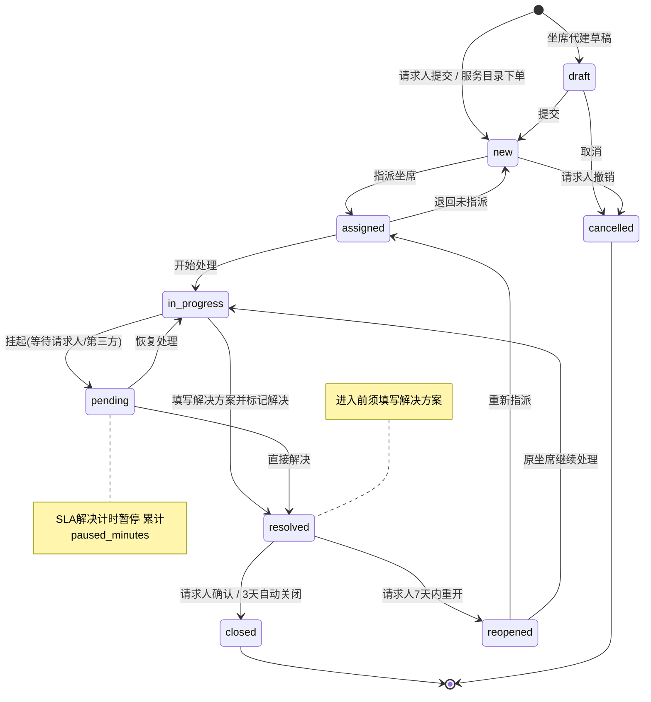
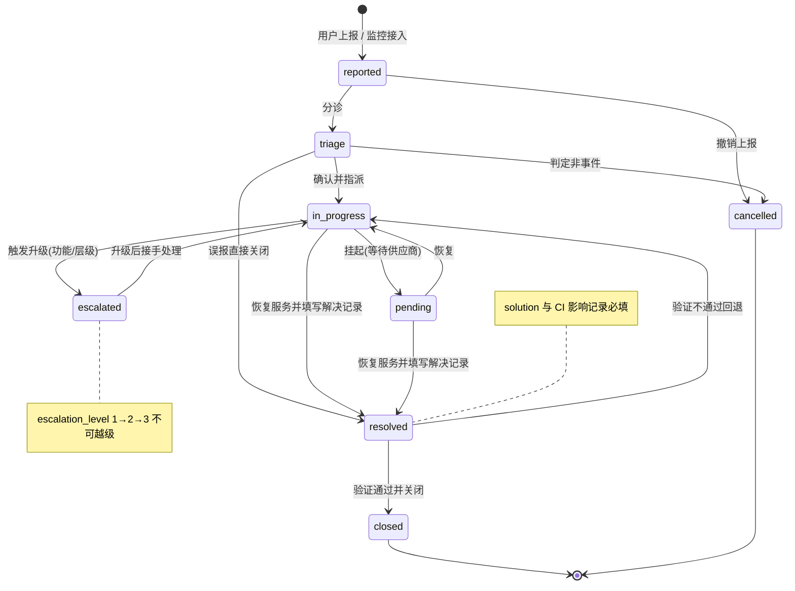
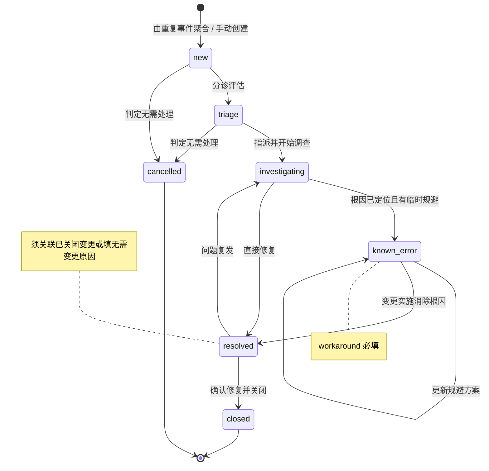
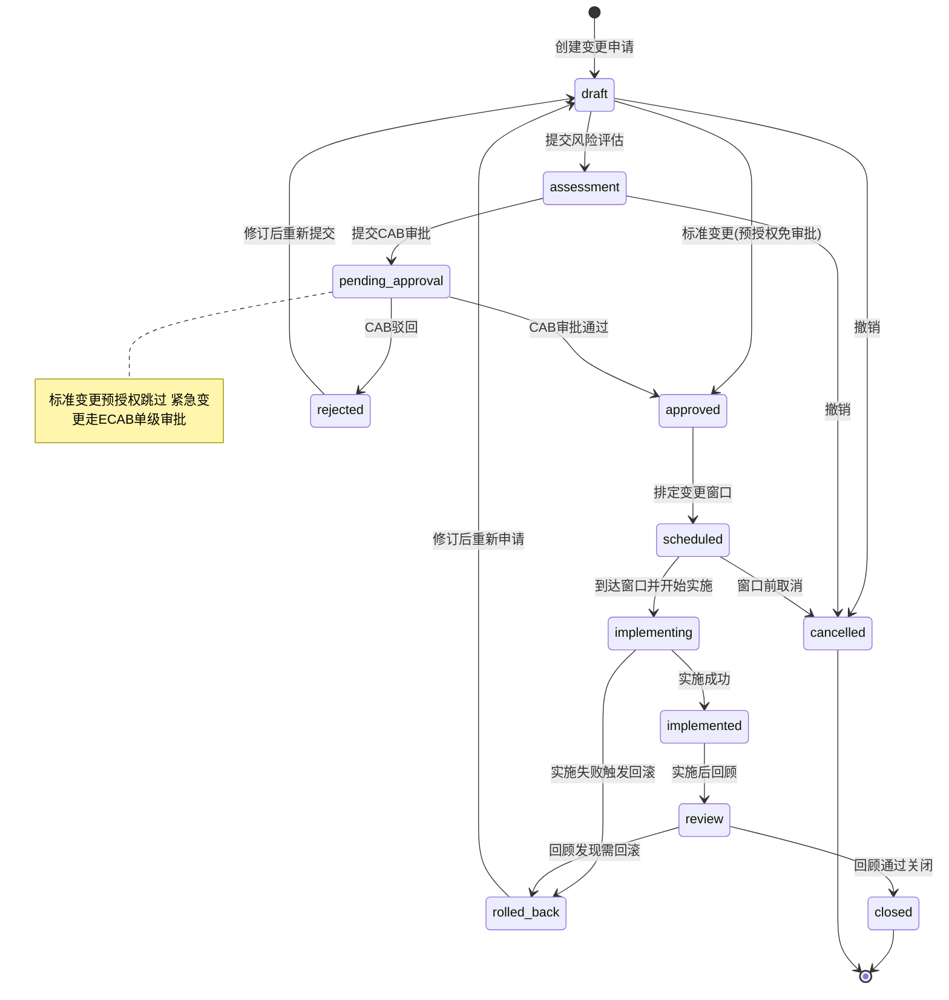
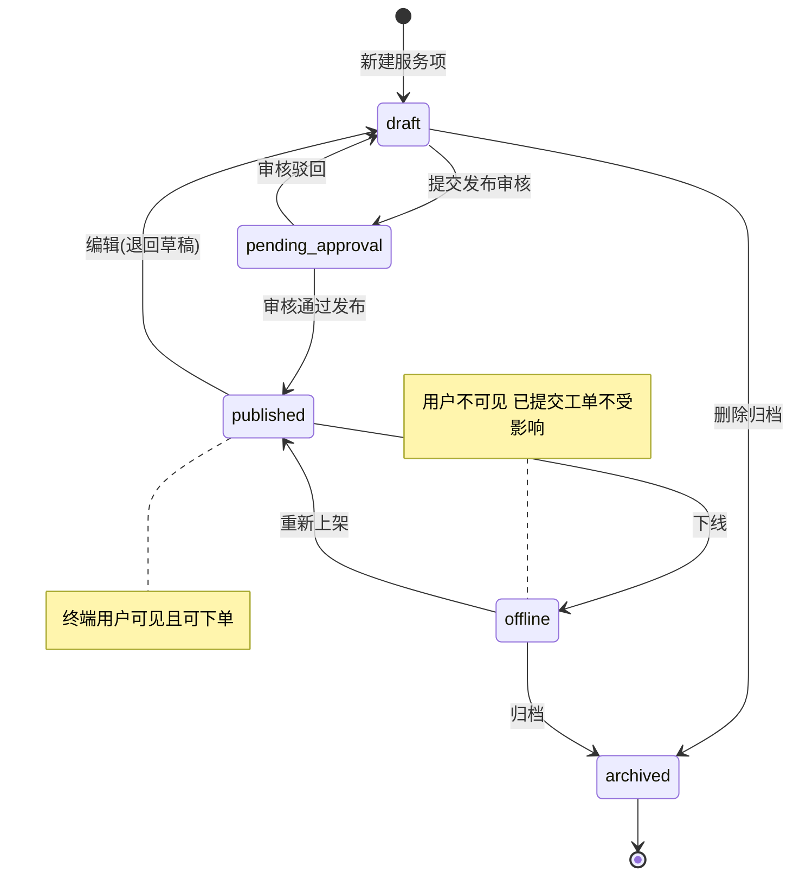
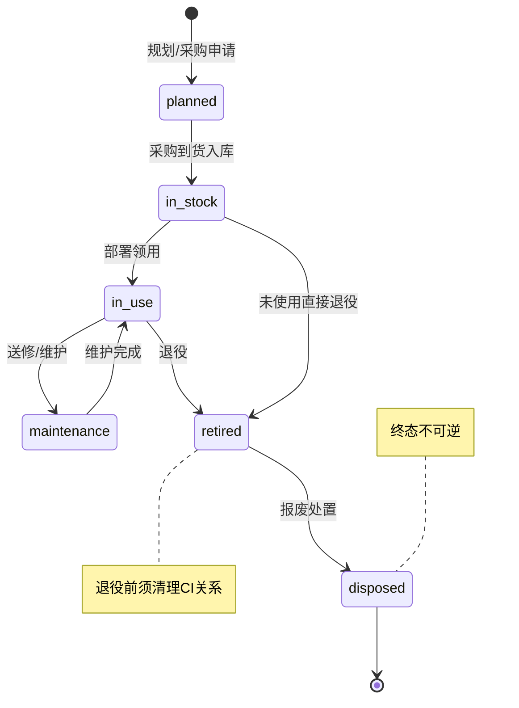
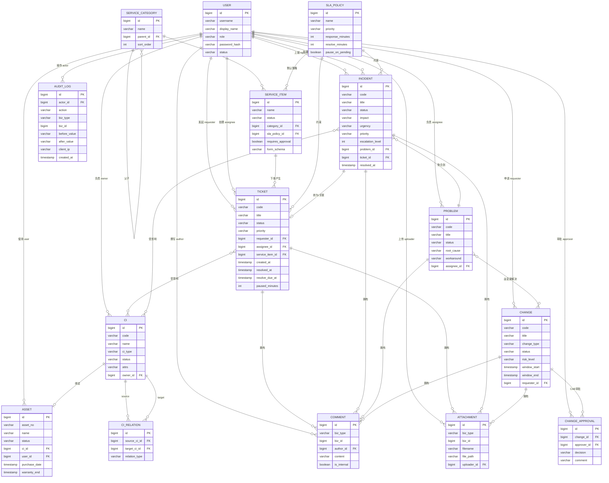

# itsm-core 产品需求文档（PRD）

> 文档版本：v1.0　|　文档类型：简单 PRD　|　编写人：产品经理 许清楚　|　状态：待评审

---

## 0. 项目信息

| 项 | 内容 |
| --- | --- |
| 产品代号 | itsm-core |
| 文档语言 | 简体中文 |
| 许可证 | MIT（开源） |
| 前端技术栈 | Vue 3 + TypeScript + Vite + Pinia + Element Plus |
| 后端技术栈 | Go 1.22 + Gin + GORM + Viper + zap |
| 数据库 | PostgreSQL（主）/ 达梦 DM8（信创，GORM Dialector 抽象切换，驱动 `github.com/godoes/gorm-dameng`） |
| 部署 | Docker Compose 启动 PostgreSQL；后端支持本地 `go run` 启动 |
| 交付形态 | REST API 后端 + SPA 前端管理台；单租户 |
| 鉴权 | 本地账号密码 + JWT（不接第三方 SSO） |

### 原始需求复述

> 面向开源社区研发一款 ITSM（IT 服务管理）软件，代号 itsm-core，MIT 许可开源。目标用户为需要自建 IT 服务台的中小企业 IT 运维团队，以及希望学习 ITIL 落地的开发者。需覆盖工单、事件、问题、变更、服务目录、资产与配置管理（CMDB）六大核心模块的完整闭环，提供 REST API 后端与 SPA 前端管理台，代码模块化、含单元测试、README 文档与开源许可证。

### P0 范围边界（明确不做）

为避免过度设计，以下内容**不在本期 P0 范围**：多租户、通用工作流引擎、邮件网关、报表 BI/数据大屏、第三方 SSO、多语言国际化、移动端 App、工作日历/节假日表（SLA 采用 7×24 自然时间，工作日历列为 P1）。以上均可作为后续版本演进方向。

---

## 1. 产品定位与目标

### 1.1 一句话定位

**itsm-core 是一款轻量、可自托管、双数据库兼容（PostgreSQL / 达梦 DM8）的开源 IT 服务管理平台，让中小企业在半天内拥有符合 ITIL 实践标准的服务台。**

### 1.2 产品目标

| 编号 | 目标 | 可验证标准 |
| --- | --- | --- |
| G1 | 六大 ITIL 模块全部具备端到端核心闭环 | 工单/事件/问题/变更/服务目录/CMDB 六个模块的「创建 → 流转 → 关闭」主链路均可通过管理台完成，且每条主链路有对应 REST API 与单元测试覆盖 |
| G2 | 双数据库零改动切换 | 同一份 GORM 模型与业务代码，仅通过配置项切换 PostgreSQL 与达梦 DM8，两个环境均可完成完整 CRUD 与状态流转，无 PostgreSQL 独有语法 |
| G3 | 30 分钟可跑起来 | 新用户在只有 Docker 的环境下，按 README 执行 `docker compose up -d` + `go run ./cmd/server` 可在 30 分钟内登录管理台并创建第一条工单 |
| G4 | SLA 可视化与可考核 | 工单与事件均带 SLA 目标时间、剩余时间与超期状态，列表页可直观区分正常/预警/超期，服务台可据此考核响应与解决时效 |
| G5 | 开源可协作 | 仓库含 MIT LICENSE、README（快速开始 + 配置说明 + API 说明）、模块化目录结构，外部开发者可独立跑通并提交 PR |

---

## 2. 目标用户与角色

### 2.1 角色定义

| 角色 | 英文标识 | 说明 | 主要诉求 |
| --- | --- | --- | --- |
| 终端用户 | `requestor` | 提出服务请求或上报故障的业务人员 | 快速提单、能看到进度、能评价 |
| 服务台坐席 | `agent` | 一线服务台，负责受理、分诊、指派、跟踪 | 快速处理、SLA 不超期、批量操作 |
| 二线工程师 | `resolver` | 具体解决工单/事件的技术人员 | 清晰的处理上下文、时间线、关联 CI |
| 问题经理 | `problem_manager` | 负责根因分析与已知错误治理 | 事件聚合、RCA 记录、规避方案沉淀 |
| 变更经理 | `change_manager` | 负责变更审批与风险管控 | CAB 审批流、变更窗口、回滚方案 |
| 配置管理员 | `cmdb_manager` | 负责 CI 建模与资产台账 | CI 关系维护、资产生命周期 |
| 系统管理员 | `admin` | 系统配置与用户权限管理 | 用户/角色管理、SLA 策略、审计日志 |

### 2.2 角色-权限矩阵

图例：`✓` 允许　`△` 部分允许（仅自己相关/需审批）　`✗` 禁止

| 权限项 | requestor | agent | resolver | problem_manager | change_manager | cmdb_manager | admin |
| --- | :---: | :---: | :---: | :---: | :---: | :---: | :---: |
| 提交工单/服务请求 | ✓ | ✓ | ✓ | ✓ | ✓ | ✓ | ✓ |
| 上报事件 | ✓ | ✓ | ✓ | ✓ | ✓ | ✓ | ✓ |
| 查看工单（全部） | ✗ | ✓ | ✓ | ✓ | ✓ | ✓ | ✓ |
| 查看工单（仅自己） | ✓ | ✓ | ✓ | ✓ | ✓ | ✓ | ✓ |
| 受理/指派工单 | ✗ | ✓ | △ | ✗ | ✗ | ✗ | ✓ |
| 处理工单（状态流转） | ✗ | ✓ | ✓ | ✗ | ✗ | ✗ | ✓ |
| 关闭工单 | ✗ | ✓ | ✓ | ✗ | ✗ | ✗ | ✓ |
| 重开工单 | ✓ | ✗ | ✗ | ✗ | ✗ | ✗ | ✓ |
| 满意度评价 | ✓ | ✗ | ✗ | ✗ | ✗ | ✗ | ✗ |
| 事件升级（Escalation） | ✗ | ✓ | ✓ | ✓ | ✗ | ✗ | ✓ |
| 事件一键转工单 | ✗ | ✓ | ✓ | ✗ | ✗ | ✗ | ✓ |
| 创建/聚合问题 | ✗ | △ | △ | ✓ | ✗ | ✗ | ✓ |
| 填写 RCA / 已知错误 | ✗ | ✗ | △ | ✓ | ✗ | ✗ | ✓ |
| 提交变更申请 | ✗ | ✓ | ✓ | ✓ | ✓ | ✓ | ✓ |
| CAB 审批 | ✗ | ✗ | ✗ | △ | ✓ | ✗ | ✓ |
| 实施/回滚变更 | ✗ | ✗ | ✓ | ✗ | △ | ✗ | ✓ |
| 服务项目录维护/发布 | ✗ | ✗ | ✗ | ✗ | ✗ | ✗ | ✓ |
| 服务项下单 | ✓ | ✓ | ✓ | ✓ | ✓ | ✓ | ✓ |
| CI 建模与关系维护 | ✗ | ✗ | △ | △ | ✗ | ✓ | ✓ |
| 资产台账维护 | ✗ | ✗ | ✗ | ✗ | ✗ | ✓ | ✓ |
| SLA 策略配置 | ✗ | ✗ | ✗ | ✗ | ✗ | ✗ | ✓ |
| 用户/角色管理 | ✗ | ✗ | ✗ | ✗ | ✗ | ✗ | ✓ |
| 审计日志查看 | ✗ | ✗ | ✗ | ✗ | ✗ | ✗ | ✓ |

> 说明：`resolver` 的 `△` 表示仅能操作被指派给自己的工单/事件；`change_manager` 的 `△` 表示可审批但不能自行实施同一变更（职责分离）。

---

## 3. 用户故事

### 3.1 工单管理

| 编号 | 用户故事 | 优先级 |
| --- | --- | --- |
| US-TKT-01 | 作为**终端用户**，我希望填写标题、描述、分类后一键提交服务请求，以便快速把问题交给 IT 团队 | P0 |
| US-TKT-02 | 作为**服务台坐席**，我希望在工单列表中按状态/优先级/SLA 超期筛选并指派坐席，以便高效分诊 | P0 |
| US-TKT-03 | 作为**二线工程师**，我希望在工单详情页看到完整的处理时间线与附件，以便接续上下文继续处理 | P0 |
| US-TKT-04 | 作为**终端用户**，我希望工单解决后能收到确认入口并进行满意度评价，以便反馈服务质量 | P0 |
| US-TKT-05 | 作为**服务台坐席**，我希望把等待用户补充信息的工单挂起并暂停 SLA 计时，以便不因外部等待而影响考核 | P1 |

### 3.2 事件管理

| 编号 | 用户故事 | 优先级 |
| --- | --- | --- |
| US-INC-01 | 作为**终端用户**，我希望上报故障并描述影响范围，以便 IT 快速评估严重程度 | P0 |
| US-INC-02 | 作为**服务台坐席**，我希望系统根据影响度×紧急度自动给出优先级，以便统一分级标准 | P0 |
| US-INC-03 | 作为**服务台坐席**，我希望把事件一键转为工单并保留双向关联，以便按流程跟踪处置 | P0 |
| US-INC-04 | 作为**二线工程师**，我希望在 SLA 即将超期时升级事件并通知上级，以便调动更多资源 | P0 |
| US-INC-05 | 作为**问题经理**，我希望事件关闭前必须填写解决记录，以便沉淀知识并作为复盘依据 | P1 |

### 3.3 问题管理

| 编号 | 用户故事 | 优先级 |
| --- | --- | --- |
| US-PRB-01 | 作为**问题经理**，我希望把多个重复事件聚合为一个问题，以便从根因层面治理而非反复救火 | P0 |
| US-PRB-02 | 作为**问题经理**，我希望记录根因分析（RCA）结论，以便团队理解问题本质 | P0 |
| US-PRB-03 | 作为**二线工程师**，我希望查看已知错误及其临时规避方案，以便快速给用户一个可用替代方案 | P0 |
| US-PRB-04 | 作为**问题经理**，我希望把问题关联到相关事件与变更，以便追溯「问题 → 变更 → 解决」的完整链路 | P0 |
| US-PRB-05 | 作为**问题经理**，我希望问题解决必须关联变更或说明无需变更的原因，以便确保根因被真正消除 | P1 |

### 3.4 变更管理

| 编号 | 用户故事 | 优先级 |
| --- | --- | --- |
| US-CHG-01 | 作为**工程师**，我希望提交变更申请并选择变更类型，以便按风险等级走对应流程 | P0 |
| US-CHG-02 | 作为**变更经理**，我希望对普通变更进行风险评估并提交 CAB 审批，以便控制上线风险 | P0 |
| US-CHG-03 | 作为**变更经理**，我希望安排变更窗口并记录回滚方案，以便在异常时快速恢复 | P0 |
| US-CHG-04 | 作为**工程师**，我希望按计划实施变更并在失败时触发回滚，以便保证系统可用性 | P0 |
| US-CHG-05 | 作为**变更经理**，我希望标准变更可预授权免审批，以便降低高频低风险变更的审批负担 | P1 |

### 3.5 服务目录

| 编号 | 用户故事 | 优先级 |
| --- | --- | --- |
| US-CAT-01 | 作为**系统管理员**，我希望定义服务项（名称/描述/SLA/审批要求/表单字段），以便规范可交付的服务 | P0 |
| US-CAT-02 | 作为**系统管理员**，我希望用分类树组织服务项，以便用户按业务域浏览 | P0 |
| US-CAT-03 | 作为**终端用户**，我希望在服务目录中浏览并提交服务请求，以便自助获取标准服务 | P0 |
| US-CAT-04 | 作为**终端用户**，我希望下单时填写该服务项定义的动态表单字段，以便一次性提供必要信息 | P0 |
| US-CAT-05 | 作为**系统管理员**，我希望下架过时服务项使其对用户不可见，以便避免误下单 | P1 |

### 3.6 资产与配置管理

| 编号 | 用户故事 | 优先级 |
| --- | --- | --- |
| US-CMDB-01 | 作为**配置管理员**，我希望按类型建立 CI 台账，以便掌握 IT 基础设施全貌 | P0 |
| US-CMDB-02 | 作为**配置管理员**，我希望维护 CI 之间的依赖/包含/连接关系，以便做故障影响面分析 | P0 |
| US-CMDB-03 | 作为**配置管理员**，我希望跟踪资产从采购到报废的生命周期，以便管理资产台账 | P0 |
| US-CMDB-04 | 作为**二线工程师**，我希望在工单/事件中关联 CI，以便定位受影响的具体配置项 | P1 |
| US-CMDB-05 | 作为**配置管理员**，我希望 CI 退役前校验并清理其关系，以便避免出现悬空关系 | P1 |

---

## 4. 需求池（P0 / P1 / P2）

优先级定义：**P0 = 必须有**（本期交付，构成核心闭环）；**P1 = 应该有**（本期尽量交付，可延后）；**P2 = 可以有**（后续版本）。

### 4.1 工单管理（TKT）

| 编号 | 模块 | 需求描述 | 验收标准 | 优先级 |
| --- | --- | --- | --- | --- |
| REQ-TKT-001 | 工单 | 创建工单：支持标题、描述、分类、优先级、请求人、来源（手动/服务目录下单） | 提交后返回工单编号（形如 `TKT-20260916-0001`）与 `new` 状态；必填项缺失时返回 400 及字段级错误 | P0 |
| REQ-TKT-002 | 工单 | 工单分类：支持多级分类树选择，未选择时落入「未分类」 | 分类可创建/编辑/删除；工单详情能反查分类全路径 | P0 |
| REQ-TKT-003 | 工单 | 优先级：P1~P4，可手动设置，默认由分类映射或 P4 | 修改优先级后列表与详情同步刷新，并触发 SLA 目标时间重算 | P0 |
| REQ-TKT-004 | 工单 | 指派：把工单指派给某个坐席/工程师（可指派给本人） | 指派后状态由 `new` → `assigned`，记录 `assignee` 与指派时间；无权用户调用返回 403 | P0 |
| REQ-TKT-005 | 工单 | SLA 计时：按优先级匹配 SLA 策略，计算响应/解决截止时间并展示剩余量与超期状态 | 列表中超期工单显示红色标记；接口返回 `response_due_at`、`resolve_due_at`、`sla_status`(normal/warning/breached) | P0 |
| REQ-TKT-006 | 工单 | 处理过程记录：支持公开评论与内部备注，构成时间线 | 时间线按时间正序返回；内部备注对 `requestor` 不可见 | P0 |
| REQ-TKT-007 | 工单 | 状态流转与关闭：按状态机允许流转；非法流转被拒绝 | 非法流转返回 409 及当前状态与目标状态；`resolved → closed` 记录 `closed_at` | P0 |
| REQ-TKT-008 | 工单 | 挂起与恢复：挂起进入 `pending` 并暂停 SLA 解决计时 | 挂起累计时长写入 `paused_minutes`；恢复后剩余时间按累计暂停回补 | P0 |
| REQ-TKT-009 | 工单 | 满意度评价：请求人对已解决/已关闭工单评分（1~5 星）与文字反馈 | 仅 `requestor` 可评价且仅一次；评价后工单不可再改分 | P0 |
| REQ-TKT-010 | 工单 | 附件：工单支持上传/下载附件 | 单附件 ≤ 20MB；附件与工单软关联，删除工单后附件不可下载 | P0 |
| REQ-TKT-011 | 工单 | 列表与检索：按状态/优先级/分类/指派/时间范围/超期筛选，支持关键字搜索 | 分页返回 `total/page/page_size/items`；筛选条件可组合 | P0 |
| REQ-TKT-012 | 工单 | 重开：`requestor` 可在关闭后 7 天内重开工单 | 重开后状态为 `reopened`，超期重开返回 409 并提示新建工单 | P1 |
| REQ-TKT-013 | 工单 | 工单模板：按分类预置标题/描述模板，加速提单 | 选择模板后表单自动填充，字段仍可编辑 | P2 |
| REQ-TKT-014 | 工单 | 批量操作：批量指派/批量关闭 | 批量结果返回逐条成功/失败原因 | P2 |

### 4.2 事件管理（INC）

| 编号 | 模块 | 需求描述 | 验收标准 | 优先级 |
| --- | --- | --- | --- | --- |
| REQ-INC-001 | 事件 | 故障上报：标题、描述、报告人、影响度、紧急度、发生时间、受影响 CI | 上报后进入 `reported`；影响度/紧急度必填且取值合法 | P0 |
| REQ-INC-002 | 事件 | 优先级矩阵：影响度×紧急度自动计算优先级（P1~P4），允许人工覆盖并留痕 | 9 种组合映射结果与本 PRD 第 5.2 节矩阵完全一致；人工覆盖记录 `priority_overridden=true` 与操作人 | P0 |
| REQ-INC-003 | 事件 | 一键转工单：由事件生成关联工单，保留双向引用 | 工单生成后事件记录 `ticket_id`，工单记录来源事件；重复转单返回 409 | P0 |
| REQ-INC-004 | 事件 | 关联：关联已有工单、关联受影响 CI | 事件详情可列出关联工单与 CI 列表；关联关系可解除 | P0 |
| REQ-INC-005 | 事件 | 事件升级：功能升级（换更高技能坐席）与层级升级（通知上级管理层），记录升级级别与原因 | 升级后 `escalation_level` 递增（1→2→3）并写入升级历史；越级升级被拒绝 | P0 |
| REQ-INC-006 | 事件 | 解决记录：进入 `resolved` 前必须填写解决方案 | 未填写解决方案时状态流转返回 422；解决后记录 `resolved_at` | P0 |
| REQ-INC-007 | 事件 | 复盘（Post-Incident Review）：P1/P2 事件关闭时需填写复盘结论 | P1/P2 事件未填复盘不可关闭；复盘内容进入事件详情 | P1 |
| REQ-INC-008 | 事件 | 事件看板：按状态/优先级统计当前事件分布 | 看板数字与列表筛选结果一致 | P2 |

### 4.3 问题管理（PRB）

| 编号 | 模块 | 需求描述 | 验收标准 | 优先级 |
| --- | --- | --- | --- | --- |
| REQ-PRB-001 | 问题 | 由事件聚合创建问题：选择 ≥1 个事件聚合生成问题 | 生成后问题 `status=new`，关联事件在问题详情可查；同一事件不可重复挂到多个未关闭问题 | P0 |
| REQ-PRB-002 | 问题 | RCA 根因分析：结构化记录现象、分析过程、根本原因 | 保存后字段非空校验通过；根因内容支持富文本/长文本 | P0 |
| REQ-PRB-003 | 问题 | 已知错误与临时规避：可标记问题为 `known_error` 并维护规避方案 | 进入 `known_error` 必须填写 `workaround`，否则返回 422 | P0 |
| REQ-PRB-004 | 问题 | 关联事件与变更：问题可关联多个事件与变更 | 详情页分别展示关联事件列表与关联变更列表；关系可增删 | P0 |
| REQ-PRB-005 | 问题 | 手动创建问题（不依赖事件） | 支持直接新建，`source=manual` | P1 |
| REQ-PRB-006 | 问题 | 问题解决约束：`resolved` 须关联至少一个已关闭变更，或填写「无需变更原因」 | 两者皆空时流转返回 422 | P1 |

### 4.4 变更管理（CHG）

| 编号 | 模块 | 需求描述 | 验收标准 | 优先级 |
| --- | --- | --- | --- | --- |
| REQ-CHG-001 | 变更 | 变更申请：标题、描述、类型、申请人与受影响范围 | 提交后生成 `CHG-` 编号；必填校验生效 | P0 |
| REQ-CHG-002 | 变更 | 变更类型：标准 / 普通 / 紧急，决定后续审批路径 | 类型决定是否跳过 CAB；类型变更需在 `draft` 阶段，进入审批后不可改 | P0 |
| REQ-CHG-003 | 变更 | 风险评估与影响分析：风险等级（高/中/低）与影响面描述 | 风险等级必填；高风险变更标记并进入列表醒目标识 | P0 |
| REQ-CHG-004 | 变更 | 变更计划与回滚方案：实施步骤与回滚步骤 | 提交审批前 `plan` 与 `rollback_plan` 均不可为空 | P0 |
| REQ-CHG-005 | 变更 | CAB 审批流：多审批人审批，记录审批意见与时间 | 普通变更需 CAB 通过才可进入 `scheduled`；驳回进入 `rejected` 并可修订重提 | P0 |
| REQ-CHG-006 | 变更 | 变更窗口：设置窗口起止时间 | 窗口时间合法（结束 > 开始）；窗口外实施被拒绝（可配置强制开关） | P0 |
| REQ-CHG-007 | 变更 | 实施与回滚：进入 `implementing`，成功转 `implemented`，失败转 `rolled_back` | 两种结果均需填写实施结论；`rolled_back` 原因必填 | P0 |
| REQ-CHG-008 | 变更 | 实施后回顾：`review` 阶段确认变更有效并关闭 | 回顾未通过可选择关闭或回滚 | P1 |
| REQ-CHG-009 | 变更 | 标准变更预授权：标准变更免 CAB，直接进入 `approved` | 标准变更不经审批即 `approved`，但需记录预授权规则 | P1 |

### 4.5 服务目录（CAT）

| 编号 | 模块 | 需求描述 | 验收标准 | 优先级 |
| --- | --- | --- | --- | --- |
| REQ-CAT-001 | 服务目录 | 服务项定义：名称、描述、分类、SLA 策略、是否需审批、表单字段定义 | 保存后可在管理台查询；名称在同一分类下唯一 | P0 |
| REQ-CAT-002 | 服务目录 | 服务分类树：支持多级分类，可排序 | 分类可增删改；删除含子分类或含服务项的分类被拒绝 | P0 |
| REQ-CAT-003 | 服务目录 | 服务项发布/下线：`published` 对终端用户可见，`offline` 不可见 | 终端用户接口仅返回 `published` 服务项；已下线项不可下单 | P0 |
| REQ-CAT-004 | 服务目录 | 用户侧下单入口：按分类浏览服务项并提交请求 | 下单成功生成工单并跳转工单详情；返回工单编号 | P0 |
| REQ-CAT-005 | 服务目录 | 下单生成工单：继承服务项 SLA 策略、分类与服务项标识 | 生成的工单 `service_item_id` 非空，SLA 目标时间按服务项策略计算 | P0 |
| REQ-CAT-006 | 服务目录 | 动态表单：按服务项定义的字段渲染并校验 | 必填字段未填时前端阻断提交、后端返回 400；字段类型（文本/数字/下拉/日期/多行）均正确渲染 | P0 |
| REQ-CAT-007 | 服务目录 | 审批要求：需审批的服务项下单后工单进入待审批（可复用 CAB 或简化单级审批） | 需审批服务项的工单在未审批前不可被 `resolved` | P1 |
| REQ-CAT-008 | 服务目录 | 服务项草稿与审核：新建/编辑先入 `draft`，提交审核通过才发布 | 非 `admin` 无法直接发布 | P2 |

### 4.6 资产与配置管理（CMDB）

| 编号 | 模块 | 需求描述 | 验收标准 | 优先级 |
| --- | --- | --- | --- | --- |
| REQ-CMDB-001 | CMDB | CI 建模与分类：支持 CI 类型（服务器/网络设备/数据库/应用/终端等）与自定义属性 | 可创建/编辑 CI；自定义属性以键值对存储；同类型下 CI 编码唯一 | P0 |
| REQ-CMDB-002 | CMDB | CI 关系维护：关系类型含依赖(`depends_on`)/包含(`contains`)/连接(`connects_to`) | 关系可增删查；详情页展示直接上下游关系 | P0 |
| REQ-CMDB-003 | CMDB | 关系完整性校验：禁止自环；CI 退役前须解除或标记其全部关系 | 自环关系返回 400；带未清理关系退役返回 409 并列出冲突关系 | P0 |
| REQ-CMDB-004 | CMDB | 资产生命周期：采购 → 入库 → 在用 → 维修 → 退役 → 报废，按状态机流转 | 非法流转被拒绝；每次流转写入资产生命周期历史 | P0 |
| REQ-CMDB-005 | CMDB | 资产与 CI 关联：资产可绑定一个 CI（1:1，可空） | 绑定后资产详情显示 CI 链接；同一 CI 不可被多个在用资产绑定 | P0 |
| REQ-CMDB-006 | CMDB | 业务关联：工单/事件可关联一个或多个 CI | 工单/事件详情展示受影响 CI；可选择 CI 定位影响面 | P0 |
| REQ-CMDB-007 | CMDB | 关系可视化：以拓扑图展示 CI 及其关系 | 可展开上下游 2 层；节点可点击进入 CI 详情 | P1 |
| REQ-CMDB-008 | CMDB | 资产批量导入（CSV） | 导入返回成功/失败行明细 | P2 |

### 4.7 平台能力（SYS）

| 编号 | 模块 | 需求描述 | 验收标准 | 优先级 |
| --- | --- | --- | --- | --- |
| REQ-SYS-001 | 平台 | 本地账号密码 + JWT 鉴权：登录签发 token，接口校验 | 无 token/过期 token 访问受保护接口返回 401；密码以 bcrypt 存储 | P0 |
| REQ-SYS-002 | 平台 | RBAC 角色权限：按第 2.2 节矩阵做接口级鉴权 | 越权调用返回 403；角色变更后权限即时生效 | P0 |
| REQ-SYS-003 | 平台 | 审计日志：记录关键写操作的操作人、动作、对象、前后值、IP、时间 | 工单/事件/问题/变更/服务项/CI/资产的状态流转与删除均产生审计记录 | P0 |
| REQ-SYS-004 | 平台 | 软删除：业务实体使用 `deleted_at`，默认查询过滤已删除数据 | 删除后列表不可见，数据库记录保留；审计日志可追溯删除动作 | P0 |
| REQ-SYS-005 | 平台 | 统一分页规范：`page`（默认1）、`page_size`（默认20，上限100） | 超出上限自动截断为 100；返回统一分页结构 | P0 |
| REQ-SYS-006 | 平台 | 双数据库兼容：模型与查询不依赖 PG 独有语法 | 不使用 `JSONB` 专属操作符、数组类型、`SERIAL`、`ILIKE` 等；迁移与 CRUD 在 PG 与 DM8 均可执行 | P0 |
| REQ-SYS-007 | 平台 | 统一响应与错误码：`{code, message, data}`；业务错误码分类 | 所有接口遵循统一结构；错误信息可直接展示给用户 | P0 |
| REQ-SYS-008 | 平台 | 初始化种子数据：默认 admin 账号、基础角色、默认 SLA 策略、示例服务分类 | 首次启动自动幂等初始化；重复启动不产生重复数据 | P0 |
| REQ-SYS-009 | 平台 | 健康检查接口 `/healthz` | Docker/运维可探活；返回数据库连通状态 | P1 |
| REQ-SYS-010 | 平台 | 审计日志导出（CSV） | 按时间范围导出，字段完整 | P2 |

> **需求统计**：需求池共 **63** 条 —— P0 **48** 条，P1 **9** 条，P2 **6** 条。用户故事共 **30** 条（P0 23 条 / P1 7 条）。

---

## 5. 六大模块状态机（CRITICAL）

> 本章为架构师与工程师的实现依据。所有状态流转必须**由后端强校验**，前端仅做可用性提示。非法流转一律返回 HTTP 409（状态冲突）或 422（业务前置条件不满足），并在响应中给出「当前状态 → 目标状态」与拒绝原因。

### 5.1 通用约定

| 约定 | 说明 |
| --- | --- |
| 状态字段 | 各实体统一使用 `status`（varchar，非数据库 enum，保证双库兼容） |
| 状态常量 | Go 侧以常量枚举声明，前端以 TS 联合类型声明，两端需与本文档一致 |
| 状态流转表 | 每张表由后端配置化为「允许流转集合」，未在集合内的流转直接拒绝 |
| 审计 | 每次成功流转写入 `audit_log`（含 from_status/to_status/操作人/时间） |
| 时间戳 | 进入终态记录对应时间戳（`resolved_at`/`closed_at` 等），且只写一次不可覆盖 |

### 5.2 工单（Ticket）状态机



| 当前状态 | 允许操作 | 触发角色 | 目标状态 | 前置条件 / 拒绝条件 |
| --- | --- | --- | --- | --- |
| `draft` | 提交 | agent | `new` | 必填字段完整，否则 422 |
| `draft` | 取消 | agent, admin | `cancelled` | — |
| `new` | 指派 | agent, admin | `assigned` | `assignee_id` 必填且为有效坐席 |
| `new` | 撤销 | requestor | `cancelled` | 仅本人工单 |
| `assigned` | 开始处理 | assignee, admin | `in_progress` | — |
| `assigned` | 退回 | assignee, agent | `new` | 清空 `assignee_id` |
| `in_progress` | 挂起 | assignee, agent | `pending` | 须填写挂起原因；记录 `paused_at` |
| `pending` | 恢复 | assignee, agent | `in_progress` | 累计 `paused_minutes` 并回补 SLA 剩余时间 |
| `in_progress` / `pending` | 标记解决 | assignee, agent | `resolved` | `solution` 非空，否则 422；写 `resolved_at` |
| `resolved` | 关闭 | requestor, agent, admin | `closed` | 写 `closed_at`；`resolved → closed` 允许 requestor 确认触发 |
| `resolved` | 重开 | requestor | `reopened` | 距 `resolved_at` ≤ 7 天，否则 409 |
| `reopened` | 重新指派 / 继续处理 | agent, assignee | `assigned` / `in_progress` | — |
| `closed` / `cancelled` | 任何流转 | — | — | 终态，全部拒绝（重开须经 `resolved` 路径的例外仅限已关闭前） |

**非法流转示例（必须拒绝）**：`new → in_progress`（跳过分派）、`closed → in_progress`、`resolved → assigned`、`draft → resolved`。

#### 5.2.1 工单 SLA 计时口径

| SLA 指标 | 计时起点 | 计时终点 | 暂停规则 |
| --- | --- | --- | --- |
| 响应时间 Response | 工单 `created_at` | 首次进入 `assigned` 或首条坐席公开回复（`first_responded_at`） | 不暂停 |
| 解决时间 Resolution | 工单 `created_at` | 进入 `resolved`（`resolved_at`） | 状态为 `pending` 期间暂停 |
| 关闭时间 Closure | 工单 `created_at` | 进入 `closed`（`closed_at`） | 同上 |

- **实际耗时** = 终点时间 − 起点时间 − 累计暂停时长（`paused_minutes`）。
- **截止时间** `due_at` = 起点时间 + SLA 策略中该优先级的 `resolve_minutes`（本期采用 **7×24 自然时间**，不扣除非工作时段；工作日历为 P1）。
- **SLA 状态**：`normal`（剩余 > 20% 目标时长）／`warning`（剩余 ≤ 20%）／`breached`（当前时间 > `due_at` 且未达终点）。
- **优先级 → 默认 SLA 策略**（种子数据，可由 admin 配置）：

| 优先级 | 响应目标 | 解决目标 |
| --- | --- | --- |
| P1 紧急 | 15 分钟 | 4 小时 |
| P2 高 | 30 分钟 | 8 小时 |
| P3 中 | 2 小时 | 24 小时 |
| P4 低 | 8 小时 | 72 小时 |

### 5.3 事件（Incident）状态机



| 当前状态 | 允许操作 | 触发角色 | 目标状态 | 前置条件 / 拒绝条件 |
| --- | --- | --- | --- | --- |
| `reported` | 分诊 | agent, admin | `triage` | — |
| `reported` | 撤销上报 | requestor | `cancelled` | 仅本人上报 |
| `triage` | 确认并指派 | agent, admin | `in_progress` | `assignee_id` 必填 |
| `triage` | 误报关闭 | agent, admin | `resolved` | 须填写 `solution`（说明为误报） |
| `triage` | 判定非事件 | agent, admin | `cancelled` | 须填写原因 |
| `in_progress` | 升级 | agent, resolver, problem_manager, admin | `escalated` | `escalation_level` 只能 +1，越级返回 409；须填升级原因 |
| `escalated` | 接手处理 | assignee | `in_progress` | 记录新 `assignee_id` 与升级历史 |
| `in_progress` | 挂起 | assignee, agent | `pending` | 须填挂起原因 |
| `pending` | 恢复 | assignee, agent | `in_progress` | — |
| `in_progress` / `pending` | 解决 | assignee, agent | `resolved` | `solution` 非空，否则 422；P1/P2 需填影响与恢复说明 |
| `resolved` | 关闭 | agent, admin | `closed` | P1/P2 须填写复盘结论，否则 422 |
| `resolved` | 回退 | agent, admin | `in_progress` | 仅在 24 小时内允许（可配置） |
| `closed` / `cancelled` | 任何流转 | — | — | 终态，全部拒绝 |

#### 5.3.1 事件优先级矩阵（影响度 × 紧急度）

| 影响度 \ 紧急度 | 高 Urgency | 中 Urgency | 低 Urgency |
| --- | --- | --- | --- |
| **高 Impact** | P1 紧急 | P2 高 | P3 中 |
| **中 Impact** | P2 高 | P3 中 | P4 低 |
| **低 Impact** | P3 中 | P4 低 | P4 低 |

- 系统按矩阵自动计算 `priority`；允许 agent 及以上角色人工覆盖，覆盖后 `priority_overridden=true` 并写入审计。
- 事件 SLA 计时口径与工单一致（响应/解决/关闭），P1 事件响应目标为 15 分钟，解决目标 4 小时。

#### 5.3.2 事件与工单的关系

- 「一键转工单」在事件 `in_progress`（或 `triage`）状态下可用，生成一张 `type=incident` 来源的工单，事件记录 `ticket_id`，工单记录 `source_incident_id`，形成双向引用。
- 同一事件重复转单返回 409；已关联工单的事件不可再转单，但可手动**关联**已有工单（多对多，可解除）。

### 5.4 问题（Problem）状态机



| 当前状态 | 允许操作 | 触发角色 | 目标状态 | 前置条件 / 拒绝条件 |
| --- | --- | --- | --- | --- |
| `new` | 分诊 | problem_manager, admin | `triage` | — |
| `new` / `triage` | 取消 | problem_manager, admin | `cancelled` | 须填写取消原因 |
| `triage` | 开始调查 | problem_manager, admin | `investigating` | 须指定 `assignee_id` |
| `investigating` | 标记已知错误 | problem_manager, admin | `known_error` | `root_cause` 与 `workaround` 均非空，否则 422 |
| `known_error` | 更新规避方案 | problem_manager, admin | `known_error` | 自环更新，写审计 |
| `investigating` / `known_error` | 解决 | problem_manager, admin | `resolved` | 须关联 ≥1 个 `closed` 变更，或 `no_change_reason` 非空，否则 422 |
| `resolved` | 关闭 | problem_manager, admin | `closed` | — |
| `resolved` | 复发回退 | problem_manager, admin | `investigating` | 须填写复发说明 |
| `closed` / `cancelled` | 任何流转 | — | — | 终态，全部拒绝 |

**业务规则补充**：满足「同一 CI 30 天内 ≥3 次同类事件」或「同一根因关键词 ≥2 个事件」时，系统在事件详情提示「建议聚合为问题」，由 problem_manager 确认后聚合（不做全自动聚合，避免误判）。

### 5.5 变更（Change）状态机



| 当前状态 | 允许操作 | 触发角色 | 目标状态 | 前置条件 / 拒绝条件 |
| --- | --- | --- | --- | --- |
| `draft` | 提交风险评估 | requester(工程师) | `assessment` | 标题/类型/风险等级必填 |
| `draft` | 标准变更预授权 | requester, admin | `approved` | 仅 `change_type=standard`，否则 409 |
| `draft` / `assessment` | 撤销 | requester, change_manager, admin | `cancelled` | — |
| `assessment` | 提交审批 | requester, change_manager | `pending_approval` | `plan` 与 `rollback_plan` 非空，否则 422 |
| `pending_approval` | 审批通过 | change_manager, admin | `approved` | 普通变更需 CAB 决议通过；紧急变更需 ECAB 至少 1 人通过 |
| `pending_approval` | 驳回 | change_manager, admin | `rejected` | 须填写驳回意见 |
| `rejected` | 修订重提 | requester | `draft` | 清空审批记录或保留历史并重开 |
| `approved` | 排期 | change_manager, admin | `scheduled` | `window_start` < `window_end`，否则 422 |
| `scheduled` | 开始实施 | resolver, admin | `implementing` | 若开启窗口强制，须 `now` 在窗口内，否则 409 |
| `scheduled` | 窗口前取消 | change_manager, admin | `cancelled` | — |
| `implementing` | 实施成功 | resolver, admin | `implemented` | 须填写实施结论 |
| `implementing` | 触发回滚 | resolver, admin | `rolled_back` | 回滚原因必填 |
| `implemented` | 回顾 | change_manager, admin | `review` | — |
| `review` | 通过关闭 | change_manager, admin | `closed` | 记录回顾结论 |
| `review` | 判定回滚 | change_manager, admin | `rolled_back` | 回滚原因必填 |
| `rolled_back` | 重新申请 | requester | `draft` | 关联原变更，保留历史 |
| `closed` / `cancelled` | 任何流转 | — | — | 终态，全部拒绝 |

**关键业务规则**：
1. **普通变更必须 CAB 审批通过（`approved`）才能进入 `scheduled`/`implementing`**，绕过审批直接实施一律返回 409。
2. **标准变更**为预授权类型，免 CAB，但从 `draft` 可直接到 `approved`，仍需填写实施与回滚方案。
3. **紧急变更**走 ECAB 简化审批（1 名审批人即可通过），且允许窗口外实施（需 `change_manager` 显式确认并留痕）。
4. 变更类型在进入 `pending_approval` 后**不可修改**，需要改类型只能撤销重开。
5. 变更实施必须记录回滚方案；`rolled_back` 为独立终态之一，可再次进入 `draft` 重新申请。

### 5.6 服务目录（ServiceItem）状态机



| 当前状态 | 允许操作 | 触发角色 | 目标状态 | 前置条件 / 拒绝条件 |
| --- | --- | --- | --- | --- |
| `draft` | 提交审核 | admin | `pending_approval` | 名称/分类/SLA 策略/表单定义完整 |
| `draft` | 归档 | admin | `archived` | — |
| `pending_approval` | 发布 | admin | `published` | — |
| `pending_approval` | 驳回 | admin | `draft` | 须填写驳回原因 |
| `published` | 编辑 | admin | `draft` | 编辑即退回草稿，发布前用户不可见新版 |
| `published` | 下线 | admin | `offline` | 已存在的工单不受影响 |
| `offline` | 重新上架 | admin | `published` | — |
| `offline` | 归档 | admin | `archived` | — |
| `archived` | 任何流转 | — | — | 终态，全部拒绝 |

**下单闭环规则**：终端用户只能对 `published` 服务项下单；下单创建工单（`REQ-CAT-005`），工单状态从 `new` 开始，继承服务项 SLA 策略与分类，并快照服务项表单数据；服务项后续下线不影响已生成工单。

### 5.7 资产 / 配置项（Asset & CI）状态机



| 当前状态 | 允许操作 | 触发角色 | 目标状态 | 前置条件 / 拒绝条件 |
| --- | --- | --- | --- | --- |
| `planned` | 入库 | cmdb_manager, admin | `in_stock` | 须填写资产编号/类别/采购信息 |
| `in_stock` | 部署领用 | cmdb_manager, admin | `in_use` | 须填写使用人/位置 |
| `in_stock` | 直接退役 | cmdb_manager, admin | `retired` | 须填写原因 |
| `in_use` | 送修 | cmdb_manager, admin | `maintenance` | 须填写维修单号/原因 |
| `maintenance` | 维护完成 | cmdb_manager, admin | `in_use` | 记录维修结论 |
| `in_use` | 退役 | cmdb_manager, admin | `retired` | — |
| `retired` | 报废处置 | cmdb_manager, admin | `disposed` | 须填写处置方式（变卖/环保报废等） |
| `disposed` | 任何流转 | — | — | 终态，全部拒绝 |

**CI 与资产的关系与校验**：
- 资产（Asset）与 CI 为 **可空 1:1**（一个在用资产至多绑定一个 CI；一个 CI 至多被一个在用资产绑定）。
- CI 关系类型：`depends_on`（依赖）、`contains`（包含）、`connects_to`（连接）。
- **禁止自环**（`source_ci_id == target_ci_id` 返回 400）与**重复关系**（返回 409）。
- CI 退役前若存在未清理关系，返回 409 并列出冲突关系清单（`REQ-CMDB-003`）。

---

## 6. 核心数据实体与关系



### 6.1 实体说明与关键约束

| 实体 | 说明 | 关键约束 |
| --- | --- | --- |
| `USER` | 系统用户，单租户 | `username` 唯一；`password_hash` 为 bcrypt；`role` 取 7 角色枚举值 |
| `TICKET` | 工单/服务请求 | `code` 唯一；`service_item_id` 可空（手动提单）；`paused_minutes` 累计挂起时长 |
| `INCIDENT` | 事件 | `problem_id` 可空（未聚合）；`ticket_id` 可空（未转单） |
| `PROBLEM` | 问题 | 关联事件为 1:N；关联变更为 M:N |
| `CHANGE` / `CHANGE_APPROVAL` | 变更与 CAB 审批记录 | 审批记录保留历史，不做物理删除 |
| `SERVICE_ITEM` / `SERVICE_CATEGORY` | 服务项与分类树 | 同分类下 `name` 唯一；`form_schema` 存 JSON 字符串（非 PG `jsonb`） |
| `SLA_POLICY` | SLA 策略 | `(priority)` 唯一；供工单/事件/服务项引用 |
| `CI` / `CI_RELATION` | 配置项与关系 | `code` 唯一；关系禁止自环、禁止重复 |
| `ASSET` | 资产 | `asset_no` 唯一；`ci_id` 可空且唯一（1:1） |
| `COMMENT` | 评论（多态） | `biz_type` + `biz_id` 逻辑关联；`is_internal` 控制可见性 |
| `ATTACHMENT` | 附件（多态） | 同上；删除业务实体后附件不可下载 |
| `AUDIT_LOG` | 审计日志 | 只读、只追加，不提供删除接口 |

---

## 7. UI 设计说明

### 7.1 整体信息架构

**布局**：经典三区布局 —— 左侧固定菜单（可折叠）+ 顶部栏 + 内容区。

```
┌──────────────┬───────────────────────────────────────────────┐
│              │  顶部栏：[折叠菜单] [面包屑]   [🔔 待办] [用户▾] │
│  ITSM-CORE   ├───────────────────────────────────────────────┤
│  ┌────────┐  │                                               │
│  │工作台  │  │                                               │
│  │工单    │  │                内容区                          │
│  │事件    │  │        （列表页 / 详情页 / 表单页）             │
│  │问题    │  │                                               │
│  │变更    │  │                                               │
│  │服务目录│  │                                               │
│  │资产配置│  │                                               │
│  │─── 管理 ─│  │                                               │
│  │用户权限│  │                                               │
│  │SLA策略 │  │                                               │
│  │审计日志│  │                                               │
│  └────────┘  │                                               │
└──────────────┴───────────────────────────────────────────────┘
```

**左侧菜单（按角色显隐）**：

| 菜单组 | 菜单项 | 可见角色 |
| --- | --- | --- |
| 工作台 | 我的待办 / 我提交的 | 全部 |
| 服务台 | 工单列表、事件列表 | agent/resolver/问题/变更经理/admin |
| 服务台 | 问题列表、变更列表 | problem_manager / change_manager / admin |
| 自助服务 | 服务目录、我的请求 | 全部（requestor 主要入口） |
| 资产与配置 | CI 列表、CI 拓扑、资产台账 | cmdb_manager / admin |
| 管理 | 用户与角色、SLA 策略、服务项管理、分类管理、审计日志 | admin |

**顶部栏**：面包屑导航、待办角标（待审批变更、即将超期 SLA）、用户菜单（个人信息/退出）。

### 7.2 通用交互约定

| 场景 | 约定 |
| --- | --- |
| 列表页骨架 | 筛选区（可折叠）+ 工具栏（新建/批量/导出）+ 表格 + 分页 |
| 表格列 | 关键列固定左侧（编号/标题），操作列固定右侧；支持列排序 |
| 状态呈现 | 使用 `el-tag` 色板：`new` 蓝 / `in_progress` 橙 / `pending` 灰 / `resolved` 绿 / `closed` 灰绿 / `cancelled` 灰 / `breached` 红 |
| 优先级呈现 | P1 红 / P2 橙 / P3 蓝 / P4 灰 |
| SLA 呈现 | 正常灰字、`warning` 橙字并加图标、`breached` 红字加粗 |
| 状态流转 | 详情页右上角「操作」按钮组，仅渲染当前状态允许的操作，点击弹确认框（必填项在此表单内） |
| 时间线 | 详情页中部，按时间正序展示状态变更、评论、附件、审批、升级 |
| 审批 | 变更详情内嵌审批卡片，弹出 `el-dialog` 填写意见并选择通过/驳回 |
| 空状态 | 列表为空显示插画 + 主行动按钮（如「创建第一张工单」） |
| 错误提示 | 表单校验错误就地红字提示；接口错误用 `el-message` 顶部提示，展示后端 `message` |
| 危险操作 | 删除/归档/回滚使用二次确认弹窗，文案明确后果 |

### 7.3 工单模块

| 页面 | 要素 |
| --- | --- |
| 列表页 | 筛选：状态、优先级、分类、指派给我、SLA 状态、时间范围、关键字；列：编号、标题、分类、优先级、状态、请求人、处理人、SLA 剩余、创建时间、操作 |
| 详情页 | 头部：编号+标题+状态标签+SLA 倒计时+操作按钮组；主体三栏（基本信息/时间线与评论/关联信息：CI、附件、服务项来源）；底部满意度评价区（仅 requestor 且已解决/关闭可操作） |
| 表单页 | 新建/编辑：标题、描述（多行）、分类（级联选择）、优先级、请求人、附件上传；服务目录下单走服务目录页 |

### 7.4 事件模块

| 页面 | 要素 |
| --- | --- |
| 列表页 | 筛选：状态、优先级、影响度、紧急度、升级级别、时间范围；列：编号、标题、影响度、紧急度、优先级、状态、升级级别、处理人、创建时间 |
| 详情页 | 头部同工单；显著位置展示「影响度×紧急度→优先级」矩阵小卡；操作含升级、转工单、挂起、解决；关联工单列表与受影响 CI 列表；升级历史时间线 |
| 表单页 | 上报：标题、描述、影响度、紧急度、发生时间、受影响 CI（多选）；系统实时预览计算出的优先级 |

### 7.5 问题模块

| 页面 | 要素 |
| --- | --- |
| 列表页 | 筛选：状态、负责人、是否已知错误；列：编号、标题、状态、关联事件数、负责人、创建时间 |
| 详情页 | 分区展示：RCA（现象/分析/根因）、已知错误与规避方案、关联事件列表、关联变更列表 |
| 表单页 | 新建/聚合：标题、描述、来源（手工/来自事件）、选择事件（多选，展示「建议聚合」提示） |

### 7.6 变更模块

| 页面 | 要素 |
| --- | --- |
| 列表页 | 筛选：状态、变更类型、风险等级、变更经理、窗口时间范围；列：编号、标题、类型、风险、状态、窗口开始、申请人、审批状态 |
| 详情页 | 分区：变更信息、风险评估、变更计划与回滚方案、CAB 审批记录、实施与回滚记录、时间线；操作按钮组按状态动态渲染 |
| 表单页 | 申请：标题、描述、类型（标准/普通/紧急）、风险等级、影响分析、计划、回滚方案、窗口时间（RangePicker） |
| 审批弹窗 | `el-dialog`：审批人、通过/驳回、意见文本域 |

### 7.7 服务目录模块

| 页面 | 要素 |
| --- | --- |
| 自助门户（用户侧） | 顶部服务分类横向标签/左侧树 + 服务项卡片网格（图标+名称+简介+「申请」按钮）；搜索框 |
| 下单页 | 服务项摘要（名称/描述/SLA）+ 动态表单（按 `form_schema` 渲染）+ 提交后跳转工单详情 |
| 管理台-服务项列表 | 列：名称、分类、SLA 策略、需审批、状态、操作；工具栏：新建、发布/下线 |
| 管理台-服务项表单 | 基本信息 + 分类选择 + SLA 选择 + 是否需审批 + **表单字段设计器**（字段名/类型/是否必填/选项/排序） |
| 管理台-分类管理 | 树形组件，支持拖拽排序、增删改 |

### 7.8 资产与配置模块

| 页面 | 要素 |
| --- | --- |
| CI 列表 | 筛选：CI 类型、状态、负责人；列：编码、名称、类型、状态、负责人、关系数 |
| CI 详情 | 基本信息 + 自定义属性表 + 关系列表（上游/下游）+ 关联工单/事件 + 拓扑图入口 |
| CI 拓扑图 | 图可视化组件，节点按类型着色，支持展开上下游 2 层，点击节点跳详情 |
| 资产台账 | 筛选：类别、状态、使用人、保修到期；列：资产编号、名称、类别、状态、使用人、采购日期、保修到期、绑定 CI |
| 资产生命周期 | 详情页时间线展示「采购→入库→在用→维修→退役→报废」历史，操作按钮按状态机动态渲染 |

---

## 8. 非功能需求

### 8.1 性能

| 指标 | 目标 |
| --- | --- |
| 列表接口 P95 响应时间 | ≤ 300ms（单表 10 万行数据量、默认页大小 20） |
| 详情接口 P95 响应时间 | ≤ 200ms |
| 状态流转/写接口 P95 | ≤ 300ms |
| 服务目录门户首屏（含列表） | ≤ 1s（本地环境，不含网络） |
| 并发 | 支持 100 并发请求无明显错误（单机 Docker 环境） |
| 索引要求 | `status`、`priority`、`created_at`、`assignee_id`、`requester_id`、各 `code` 唯一索引；软删除字段参与复合索引 |

### 8.2 分页与查询规范

- 统一使用 `page`（默认 1，≥1）+ `page_size`（默认 20，最大 100，超出自动截断）。
- 统一响应体：`{ "code": 0, "message": "ok", "data": { "total": n, "page": p, "page_size": s, "items": [...] } }`。
- 时间字段统一 RFC3339（UTC 存储，前端按本地时区展示）。
- 排序参数统一 `sort_by` + `order`（`asc`/`desc`），默认按 `created_at desc`。

### 8.3 鉴权与安全

- 登录成功签发 JWT（含 `user_id`、`role`、`exp`），默认有效期 24 小时，可配置。
- 除 `/api/v1/auth/login` 与 `/healthz` 外，全部接口需携带 `Authorization: Bearer <token>`。
- 密码使用 bcrypt 加盐哈希，禁止明文与可逆加密。
- 接口级 RBAC 鉴权，越权返回 403；资源级校验（如 `requestor` 仅可读本人数据）在 Service 层实现。
- 登录失败次数限制（P1，默认 5 次锁定 10 分钟，可配置）。

### 8.4 审计

- 所有写操作（创建/更新/删除/状态流转）写入 `audit_log`，包含操作人、动作、业务类型、业务 ID、变更前后值（JSON 字符串）、客户端 IP、时间。
- 审计日志**只追加不修改**，不提供删除接口。
- 变更审批、事件升级、变更回滚、CI 关系变更必须强制留痕。

### 8.5 软删除

- 业务实体统一使用 `deleted_at`（`gorm.DeletedAt`），默认查询自动过滤。
- 删除后记录保留在库中，审计日志可追溯；提供后台（P2）查看已删除数据的能力。
- 关联校验（如删除含服务项的分类）基于未删除数据判断。

### 8.6 双数据库兼容约束（PostgreSQL / 达梦 DM8）

| 约束项 | 要求 |
| --- | --- |
| 字段类型 | 仅使用两库共有的通用类型：`BIGINT`、`VARCHAR(n)`、`TEXT`、`INT`、`BOOLEAN`、`TIMESTAMP`、`NUMERIC`；**禁止** PG 专有的 `JSONB`、数组类型（`text[]`）、`INET`、`UUID` 原生类型（UUID 用 `VARCHAR(36)`） |
| 主键 | 使用 GORM 自增主键，禁止手写 `SERIAL`/`BIGSERIAL` 语句 |
| JSON 存储 | 使用 `TEXT`/`VARCHAR` 存 JSON 字符串，在 Go 层序列化；**禁用** PG `jsonb` 操作符（`->`、`@>`） |
| 字符串匹配 | 统一使用 `LIKE` + 前后通配，**禁用** PG `ILIKE`；大小写不敏感需求在应用层转小写处理 |
| 分页 | 使用 `LIMIT`/`OFFSET`，**禁用** PG `FETCH FIRST` 等差异语法 |
| Upsert | **禁用** PG `ON CONFLICT`；使用「先查后写 + 唯一索引兜底」的应用层实现 |
| 时间函数 | **禁用** `now()`、`CURRENT_TIMESTAMP` 在业务 SQL 中直接使用，统一由 Go 层传入时间值 |
| 迁移 | 使用 GORM AutoMigrate 或抽象迁移接口，迁移文件不得包含方言专属 DDL |
| 索引 | 索引创建语句保持通用；达梦对索引名长度有限制，索引名统一 ≤ 30 字符 |
| 驱动切换 | 通过 `DB_DRIVER`（`postgres` / `dameng`）配置项切换 Dialector；连接参数由 Viper 管理 |

### 8.7 可维护性与开源要求

- 后端按 `cmd / internal / pkg / configs / migrations` 分层，模块化（每个业务域独立 `handler / service / repository / model`）。
- 单元测试：核心业务规则（状态机流转、优先级矩阵、SLA 计算）必须有单元测试覆盖，关键模块语句覆盖率 ≥ 60%。
- README 必须包含：项目简介、环境要求、快速开始（Docker Compose + go run）、配置项说明、API 概览、双数据库切换说明、目录结构说明。
- 仓库根目录包含 `LICENSE`（MIT）。
- Git 提交规范：Conventional Commits。

---

## 9. 待确认问题

> 按影响面从大到小排序，建议在架构设计评审前拍板。

| # | 问题 | 影响面 | 当前默认方案（未确认前按此实现） |
| --- | --- | --- | --- |
| Q1 | **CAB 审批通过规则**：是「任一审批人通过即通过」还是「全部审批人需通过」？是否需要按风险等级设置审批人数（如高风险需 2 人）？ | 高 — 决定 `CHANGE_APPROVAL` 数据模型与审批接口形态 | 采用「**全部已指定审批人通过才通过**」（会签），高风险变更默认指定 2 名审批人 |
| Q2 | **SLA 计时是否采用工作日历**：本期是 7×24 自然时间，还是需要「工作时间 9:00–18:00 + 节假日排除」？ | 高 — 决定是否引入工作日历实体与计时算法复杂度 | 本期采用 **7×24 自然时间**，工作日历列为 P1 |
| Q3 | **通知渠道**：邮件网关已明确不做；SLA 预警、待审批、事件升级是否需要**站内信/待办红点**，还是纯靠列表筛选？ | 中高 — 决定是否新增 `Notification` 实体与前端待办中心 | 本期实现**顶部栏待办角标 + 列表高亮**（基于查询聚合，不建独立通知表） |
| Q4 | **资产与 CI 的绑定关系**：资产是否可独立于 CI 存在（如耗材/外设）？是否强制 1:1？ | 中 — 决定 CMDB 与资产模型的产品语义 | 资产可**独立存在**，`ci_id` 可空；已绑定则保持 1:1 唯一 |
| Q5 | **达梦 DM8 的验证方式**：CI 是否需要真实运行达梦集成测试（需 license/镜像），还是仅保证 Dialector 可切换 + 单元测试用 SQLite/PostgreSQL 覆盖？ | 中 — 决定测试范围与交付口子 | 本期**保证 Dialector 可切换与语法兼容**，集成测试以 PostgreSQL 为主，达梦做人工验证清单 |
| Q6 | **满意度评价规则**：评分制式（5 星 / 好评差评）？能否修改？是否允许匿名？ | 低中 — 决定前端组件与统计口径 | 5 星 + 可选标签 + 文字反馈；**仅可评价一次、不可修改、实名** |

---

## 附录 A：术语表

| 术语 | 说明 |
| --- | --- |
| ITSM | IT 服务管理（IT Service Management） |
| ITIL | IT 基础架构库，IT 服务管理最佳实践框架 |
| CI | 配置项（Configuration Item），CMDB 中的受管对象 |
| CMDB | 配置管理数据库 |
| SLA | 服务级别协议，定义响应/解决时效目标 |
| CAB | 变更咨询委员会（Change Advisory Board） |
| ECAB | 紧急变更咨询委员会 |
| RCA | 根因分析（Root Cause Analysis） |
| Known Error | 已知错误，根因已定位且有临时规避方案的缺陷 |
| Escalation | 事件升级，分为功能升级与层级升级 |
| PIR | 事后复盘（Post-Incident Review） |

## 附录 B：交付检查清单

- [ ] 六大模块状态机在前后端实现一致（状态常量与流转表对齐本文档第 5 章）
- [ ] 六大模块主闭环可通过管理台完整走通
- [ ] P0 需求 48 条全部有对应实现与验收依据
- [ ] PostgreSQL 与达梦 DM8 双库可切换，无方言专属语法
- [ ] 单元测试覆盖状态机、优先级矩阵、SLA 计算
- [ ] README、LICENSE(MIT)、Docker Compose 齐备
- [ ] 第 9 章待确认问题已与用户对齐
