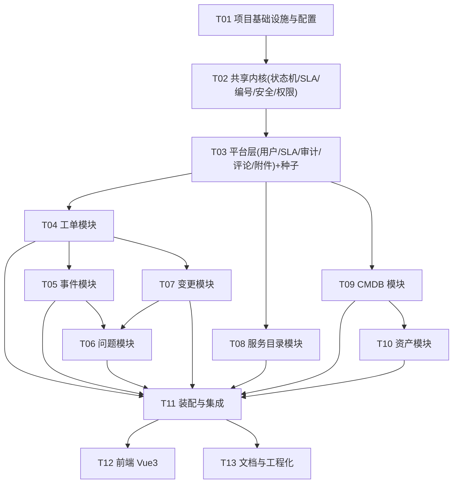

# itsm-core 任务分解（TASKS）

> 文档版本：v1.0　|　编写人：架构师 高见远　|　上游：`docs/PRD.md` + `docs/ARCHITECTURE.md`
> 说明：任务按**实现顺序**排列，每个任务 = 工程师一个 turn 可完成的相关文件集合（一个「批次」）。`依赖：Txx` 表示需在该任务完成后开始。
> **执行顺序原则**：先内核后业务；每个后端业务批次自带 `*_test.go`，`make test` 必须**零外部依赖全绿**。

---

## 依赖总览



> 批次共 **13** 个（含前端与文档批次）。后端业务批次（T04–T10）彼此尽量解耦：`T05/T07/T08/T09` 可由不同工程师并行（仅共同依赖 T03）。

---

## 后端批次

### T01 · 项目基础设施与配置
- **依赖**：无
- **产出文件**：
  - `go.mod`、`go.sum`
  - `cmd/server/main.go`
  - `internal/config/config.go`
  - `internal/pkg/logger/logger.go`
  - `internal/pkg/httpx/response.go`、`errors.go`、`pagination.go`、`bind.go`
  - `internal/pkg/database/database.go`、`database_test.go`
  - `configs/config.yaml`
  - `.env.example`
  - `Makefile`（`run/test/build/lint/frontend` 目标骨架）
- **要点**：
  - `go.mod` 严格采用 `docs/ARCHITECTURE.md §0.1` 版本矩阵，`go 1.22`，**不引 wire/dig/mockgen/testify 之外框架**。
  - `internal/pkg/database` 实现 Dialector 工厂（postgres/dameng 双分支），dameng 用 `dameng.New(dameng.Config{...})`。
  - `main.go`：加载配置 → 建 zap logger → 连库（失败仅告警，不 panic，保证无库也能编译/启动日志）→ 建 Gin（先挂中间件骨架）→ 优雅退出。
  - `httpx` 错误码与 HTTP 映射按 §8.2。
- **验收标准**：
  - `GOTOOLCHAIN=local GOPROXY=https://goproxy.cn,direct go build ./...` 通过；
  - `go vet ./...` 无错；
  - `database_test.go` 覆盖 Dialector 选择分支（不连库，仅构造 Dialector 并断言类型）通过。

### T02 · 共享内核（状态机 / SLA / 编号 / 安全 / 权限 / 平台模型）
- **依赖**：T01
- **产出文件**：
  - `internal/pkg/statemachine/statemachine.go`、`statemachine_test.go`
  - `internal/pkg/sla/calc.go`、`calc_test.go`
  - `internal/pkg/idgen/code.go`、`code_test.go`
  - `internal/pkg/security/password.go`、`jwt.go`、`security_test.go`
  - `internal/pkg/role/role.go`（7 角色常量 + 权限点常量 + 角色→权限点矩阵）
  - `internal/domain/platform/model.go`
- **要点**：
  - 状态机引擎 `Table/Transition/Guard/Resolve/Allows` 按 §6.1 原样实现。
  - SLA 纯函数按 §7.2：`Due/Elapsed/StatusOf/Evaluate`，20% 预警阈值、暂停回补。
  - 编号 `TKT-/INC-/PRB-/CHG-YYYYMMDD-0001`，按前缀+日期，先查最大序号 +1。
  - `role.go` 矩阵**逐条对齐 PRD §2.2**。
- **验收标准**：
  - 状态机单测（命中/未命中/角色）；SLA 单测 ≥95%（四优先级 due、暂停回补、三档边界、按期/超期）；编号格式与并发安全单测；bcrypt 往返 + JWT 签发/过期单测；全部通过。
  - `pkg` 下所有包覆盖率 ≥90%。

### T03 · 平台层（用户 / 角色 / SLA 策略 / 审计 / 评论 / 附件）+ 种子数据
- **依赖**：T02
- **产出文件**：
  - `internal/domain/platform/repository.go`、`repository_gorm.go`、`service.go`、`handler.go`、`routes.go`、`dto.go`
  - `internal/domain/platform/service_test.go`、`repository_fake_test.go`
  - `internal/domain/auth/service.go`、`handler.go`、`routes.go`、`dto.go`、`service_test.go`
  - `internal/pkg/middleware/requestid.go`、`logger.go`、`recovery.go`、`cors.go`、`auth.go`、`rbac.go`
  - `internal/bootstrap/seed.go`
  - `internal/pkg/database/migrate.go`（AutoMigrate 全量实体，含 T04–T10 实体前向声明占位注释）
- **要点**：
  - platform 提供：用户/角色 CRUD、SLA 策略 CRUD（`(priority)` 唯一，先查后写）、审计 `Append` + 查询、评论（多态）、附件（上传/下载/删除，≤20MB）。
  - auth：登录校验（bcrypt）→ 签发 JWT；`/auth/me`；错误密码/禁用账号 401。
  - 中间件：requestID、访问日志、panic 恢复、CORS、JWT 鉴权（白名单 `/auth/login`、`/healthz`）、RBAC `RequirePerm`。
  - `seed.go` 幂等（`FirstOrCreate`）：admin 账号、4 条 SLA 策略、服务分类示例、CI 类型示例、工单分类树。
- **验收标准**：
  - platform/auth 单测通过（用户 CRUD、SLA 唯一性、审计追加、登录成功/失败/禁用）；
  - `migrate.go` 编译通过；`make test` 全绿（无库）。

### T04 · 工单模块
- **依赖**：T03
- **产出文件**：
  - `internal/domain/ticket/model.go`、`repository.go`、`repository_gorm.go`、`service.go`、`machine.go`、`handler.go`、`routes.go`、`dto.go`
  - `internal/domain/ticket/service_test.go`、`repository_fake_test.go`
- **要点**：
  - 状态机按 §6.3.1 **全表**实现，含 guard：必填/指派有效/本人/暂停原因/解决方案/重开 7 天窗口。
  - 创建：编号、SLA `response_due_at/resolve_due_at` 落库、默认优先级 P4/分类映射。
  - 列表筛选：状态/优先级/分类/指派/时间范围/`sla_status` 超期/关键字（`LIKE`，应用层小写）。
  - 挂起累计 `paused_minutes`；恢复回补 due_at；解决写 `resolved_at`；关闭写 `closed_at`（只写一次）。
  - 满意度评价仅 requestor 且仅一次；重开（P1）。
- **验收标准**：
  - 覆盖 PRD 非法流转示例（`new→in_progress`、`closed→*`、`resolved→assigned`、`draft→resolved`）均 409；
  - `solution` 为空 resolve 返回 422；超 7 天重开 409；非本人 cancel 403；
  - 覆盖率 ≥70%。

### T05 · 事件模块
- **依赖**：T04（需 ticket 转单能力）
- **产出文件**：
  - `internal/domain/incident/model.go`、`repository.go`、`repository_gorm.go`、`service.go`、`machine.go`、`priority.go`、`handler.go`、`routes.go`、`dto.go`
  - `internal/domain/incident/service_test.go`、`priority_test.go`、`repository_fake_test.go`
- **要点**：
  - 优先级矩阵 `priority.go` 为纯函数，9 组合与 PRD §5.3.1 **完全一致**；人工覆盖写 `priority_overridden=true` + 审计。
  - 状态机 §6.3.2；升级 `escalation_level` 只能 +1（越级 409），写 `IncidentEscalation` 历史。
  - 转工单：通过 bootstrap 注入的 `TicketCreator` 接口调用 ticket service，写双向引用；重复转单 409。
  - 解决需 `solution`（P1/P2 加影响与恢复说明）；关闭 P1/P2 需复盘结论。
- **验收标准**：
  - 优先级矩阵 9 用例全过；越级升级 409；重复转单 409；无 solution 解决 422；覆盖率 ≥70%。

### T06 · 问题模块
- **依赖**：T05（消费 incident 读接口）、T07（消费 change 读接口）
- **产出文件**：
  - `internal/domain/problem/model.go`、`repository.go`、`repository_gorm.go`、`service.go`、`machine.go`、`handler.go`、`routes.go`、`dto.go`
  - `internal/domain/problem/service_test.go`、`repository_fake_test.go`
- **要点**：
  - 聚合创建：选择 ≥1 事件，写 `incidents.problem_id`；同一事件不可挂到多个未关闭问题（409）。
  - RCA 结构化字段；`known_error` 需 `root_cause`+`workaround` 非空（422）。
  - `resolved` 需关联 ≥1 个 `closed` 变更 或 `no_change_reason` 非空（422）——经 `ChangeReader` 消费接口查询。
  - 「建议聚合」提示查询（同 CI 30 天 ≥3 次 / 同根因关键词 ≥2）。
- **验收标准**：known_error 缺字段 422；resolve 约束 422/通过；重复聚合 409；覆盖率 ≥65%。

### T07 · 变更模块
- **依赖**：T04
- **产出文件**：
  - `internal/domain/change/model.go`、`repository.go`、`repository_gorm.go`、`service.go`、`machine.go`、`handler.go`、`routes.go`、`dto.go`
  - `internal/domain/change/service_test.go`、`repository_fake_test.go`
- **要点**：
  - 状态机 §6.3.4；标准变更 `draft→approved` 预授权（非 standard 409）。
  - CAB 会签 `EvaluateApprovals` 纯函数：普通/高风险（默认 2 人）全部通过才 approved；紧急变更 ECAB ≥1 人通过。
  - 提交审批前 `plan`/`rollback_plan` 非空（422）；`window_start<window_end`（422）；窗口强制开关（`config.change.enforce_window`）。
  - 类型在 `pending_approval` 后不可改（409）。
  - 实施成功/回滚需结论/原因；`rolled_back`/`rejected` 可回 draft 重提。
- **验收标准**：标准免审、会签判定、绕过审批实施 409、窗口校验、类型锁定；覆盖率 ≥70%。

### T08 · 服务目录模块
- **依赖**：T03
- **产出文件**：
  - `internal/domain/catalog/model.go`、`repository.go`、`repository_gorm.go`、`service.go`、`machine.go`、`formschema.go`、`handler.go`、`routes.go`、`dto.go`
  - `internal/domain/catalog/service_test.go`、`repository_fake_test.go`
- **要点**：
  - 分类树 CRUD + 排序；删除含子分类/含服务项 → 409。
  - 服务项状态机 §6.3.5；`published` 编辑退回 `draft`；发布/下线仅 admin；删除服务项按状态机（draft/offline→archived，否则 409）。
  - `form_schema` JSON 字符串解析与动态表单校验（必填缺失→400）。
  - 用户侧仅返回 `published`；下单经 `TicketCreator` 生成工单，继承分类/SLA 策略，快照 `form_data`。
- **验收标准**：非 published 下单被拒；必填缺失 400；删除含子分类 409；下单生成工单 `service_item_id` 非空；覆盖率 ≥65%。

### T09 · CMDB 模块
- **依赖**：T03
- **产出文件**：
  - `internal/domain/cmdb/model.go`、`repository.go`、`repository_gorm.go`、`service.go`、`graph.go`、`handler.go`、`routes.go`、`dto.go`
  - `internal/domain/cmdb/service_test.go`、`repository_fake_test.go`
- **要点**：
  - CI CRUD（类型枚举、`attrs` JSON 字符串、同类型 code 唯一）。
  - 关系增删：**自环 400**、**重复 409**。
  - 退役校验：CI 软删除/退役前存在未清理关系 → 409 并返回冲突关系清单。
  - 拓扑 `graph.go` BFS 展开 N 层（纯函数，默认 2 层）。
- **验收标准**：自环 400、重复 409、退役带关系 409、拓扑 2 层展开正确；覆盖率 ≥70%。

### T10 · 资产模块
- **依赖**：T09（绑定 CI）
- **产出文件**：
  - `internal/domain/asset/model.go`、`repository.go`、`repository_gorm.go`、`service.go`、`machine.go`、`handler.go`、`routes.go`、`dto.go`
  - `internal/domain/asset/service_test.go`、`repository_fake_test.go`
- **要点**：
  - 生命周期状态机 §6.3.6；每次流转写 `AssetHistory`。
  - 资产 1:1 绑定 CI（`ci_id` 唯一，可空）；同一 CI 不可被多个在用资产绑定（409）。
- **验收标准**：非法流转 409；重复绑定 409；历史记录完整；覆盖率 ≥65%。

### T11 · 装配与集成
- **依赖**：T04–T10
- **产出文件**：
  - `internal/bootstrap/bootstrap.go`、`routes.go`
  - `internal/bootstrap/integration_test.go`（`net/http/httptest` 冒烟）
  - `cmd/server/main.go`（补全装配调用与 graceful shutdown）
- **要点**：
  - 按拓扑序构造 repo→service→handler；注入 consumer 接口（`TicketCreator`、`IncidentReader`、`ChangeReader`）。
  - 注册全部路由到 `/api/v1`，挂中间件链与 RBAC。
  - `integration_test.go`：用内存 fake 装配完整 engine，断言关键路由状态码（200/401/403/404/409/422）。
- **验收标准**：`go build ./...`；`make test`（含集成冒烟）全绿；`/healthz` 返回 200。

---

## T12 · 前端（Vue 3 + TS + Vite + Pinia + Element Plus）
- **依赖**：T11（接口契约可用；也可与后端并行按 §5 契约开发）
- **产出文件**：
  - `frontend/package.json`、`vite.config.ts`、`tsconfig.json`、`index.html`、`.env.development`
  - `frontend/src/main.ts`、`App.vue`
  - `frontend/src/api/http.ts` 及各域 `api/*.ts`
  - `frontend/src/router/index.ts`
  - `frontend/src/stores/*.ts`（user/ticket/incident/problem/change/catalog/cmdb/asset）
  - `frontend/src/layouts/DefaultLayout.vue`
  - `frontend/src/components/{StatusTag,PriorityTag,SlaCountdown,Timeline,DynamicForm,CiTopology,PageTable}.vue`
  - `frontend/src/types/*.ts`
  - `frontend/src/views/**`（login/dashboard/ticket/incident/problem/change/catalog/cmdb/admin）
- **要点**：
  - `http.ts` 拦截器注入 JWT、统一 `{code,message,data}`、401 跳登录、错误提示。
  - 菜单与路由按角色显隐（`meta.roles`）；状态色板按 §14.6。
  - 详情页操作按钮组按状态机允许 action 渲染（**后端仍强校验**）。
  - 动态表单按 `form_schema` 渲染 `text/number/select/date/textarea`。
- **验收标准**：`npm run build` 通过；登录→建工单→指派→解决→关闭可走通；服务目录下单生成工单；变更 CAB 审批弹窗可用。

---

## T13 · 文档与工程化
- **依赖**：T11
- **产出文件**：
  - `README.md`（简介/环境要求/快速开始/配置说明/API 概览/双库切换/目录结构）
  - `LICENSE`（MIT）、`CONTRIBUTING.md`、`CHANGELOG.md`
  - `.gitignore`、`.golangci.yml`
  - `docker-compose.yml`（PostgreSQL 14）、`Dockerfile`（多阶段）
  - `.github/workflows/ci.yml`（go vet + go test + 前端 build）
  - `Makefile`（补全 `test-cover/test-race/seed` 等目标）
  - `docs/API.md`（由 ARCHITECTURE §5 导出）
- **要点**：
  - README 必含：`docker compose up -d` + `go run ./cmd/server` 30 分钟跑通路径；`DB_DRIVER` 双库切换；`GOPROXY=https://goproxy.cn,direct` 提示。
  - CI 使用 `GOTOOLCHAIN=local` + 中国镜像，禁止 `go get -u`。
- **验收标准**：README 按步骤可跑通；CI 配置语法正确；LICENSE 为 MIT。

---

## 依赖包清单（含精确版本，已实测可下载编译）

```text
# ===== 直接依赖（go.mod require）=====
github.com/gin-gonic/gin v1.10.0            # HTTP 框架
gorm.io/gorm v1.30.1                        # ORM（满足达梦驱动 ≥1.30.1 要求）
gorm.io/driver/postgres v1.6.0              # PostgreSQL Dialector
github.com/godoes/gorm-dameng v0.7.2        # 达梦 DM8 Dialector（纯 Go，无 CGO）
github.com/spf13/viper v1.19.0              # 配置管理
go.uber.org/zap v1.27.0                     # 结构化日志
github.com/golang-jwt/jwt/v5 v5.2.1         # JWT
github.com/google/uuid v1.6.0               # UUID
golang.org/x/crypto v0.31.0                 # bcrypt（锁定，勿升级到 ≥v0.32）
# ===== 间接依赖（示例）=====
gopkg.in/yaml.v3 v3.0.1                     # Viper YAML
github.com/jackc/pgx/v5                     # postgres 驱动底层
```

> **约束**：`go.mod` 设 `go 1.22`；**禁止** `go get -u`；新增依赖须过 `GOTOOLCHAIN=local go build ./...`。环境变量 `GOPROXY=https://goproxy.cn,direct`。

### 前端依赖（`frontend/package.json`）

```text
vue ^3.4.0
vue-router ^4.3.0
pinia ^2.1.7
element-plus ^2.7.0
axios ^1.7.0
typescript ^5.4.0
vite ^5.2.0
@vitejs/plugin-vue ^5.0.0
vue-tsc ^2.0.0
```

---

## 共享知识 / 跨文件约定

1. **统一响应体**：`{ "code": 0, "message": "ok", "data": ... }`；分页 `data = {total,page,page_size,items}`。
2. **错误码 ↔ HTTP**：`10001→400`、`10002→400`、`20001→401`、`20003→403`、`30001→404`、`40001→409`（非法流转/重复）、`40002→422`（前置条件不满足）、`50000→500`。
3. **状态/动作常量**：后端在各域 `model.go` 以常量声明，前端在 `src/types/*.ts` 以联合类型声明，两端**必须与 PRD §5 一致**。
4. **时间**：RFC3339，UTC 存储；DB 写入时间一律由 Go 传入，**禁用 `now()`**。
5. **编号格式**：`TKT-/INC-/PRB-/CHG-YYYYMMDD-0001`。
6. **主键**：`uint64` 自增（`primaryKey;autoIncrement`），**禁 SERIAL**。
7. **软删除**：业务实体 `gorm.DeletedAt`；审计日志不软删除。
8. **索引名 ≤30 字符**：手工指定短名（见 ARCHITECTURE §4.10）；迁移禁用 GORM 自动外键。
9. **双库约束（§8.6）**：禁 `JSONB/数组/ILIKE/ON CONFLICT/now()/SERIAL`；JSON 存 `TEXT`，`LIKE` 小写匹配，分页 `LIMIT/OFFSET`。
10. **Search 大小写**：关键字查询在 service 层 `strings.ToLower` 后 `LIKE`。
11. **层间铁律**：`*gorm.DB` 仅允许出现在 `repository_gorm.go` 与 `pkg/database`；service 只依赖接口。
12. **测试**：仅标准库 `testing` + `net/http/httptest`；内存 fake 置于 `repository_fake_test.go`；`go test ./...` 必须无外部依赖全绿。
13. **命名规范**：JSON `snake_case`；Go 导出 `PascalCase`；提交遵循 Conventional Commits。
14. **权限点**：以 `perm.<domain>.<action>` 命名，`role.go` 矩阵与 PRD §2.2 对齐。
